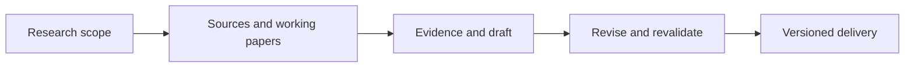
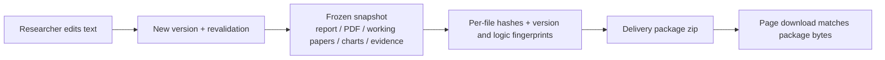
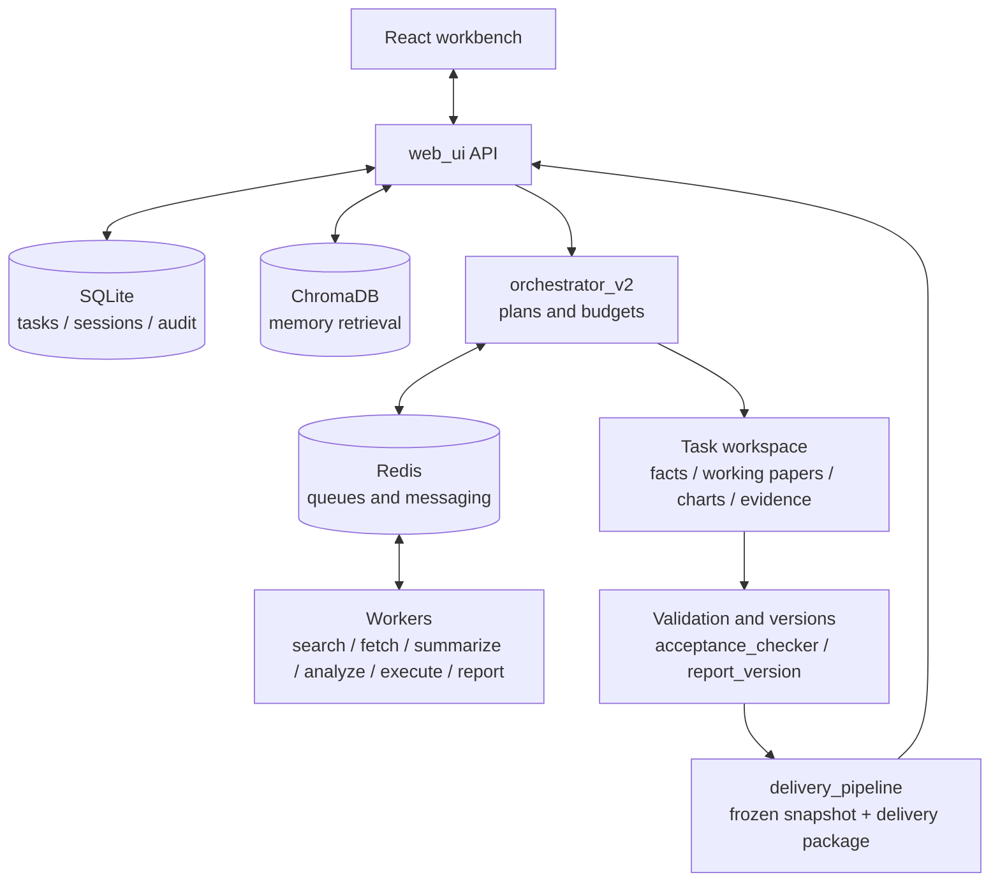

<div align="center">

# ZhiGuang 织光 · WeaveMind

**Turn company disclosures into research you can substantiate, recalculate, and revise.**

A listed-company research workbench for independent researchers and small investment research teams

[](https://github.com/momang85/weavemind/actions/workflows/ci.yml)
[](LICENSE)
[](#current-progress-and-validation-boundaries)

[中文](README.md) · English

[Features](#features) · [Use cases](#who-it-is-for) · [Quick start](#quick-start) · [Architecture](#architecture) · [Documentation](#documentation)

</div>

WeaveMind organizes work around a company research draft: define the company, reporting periods, and information cutoff date; assemble financial and operating facts; calculate checkable metrics; assess which questions the evidence can answer; and deliver the report, working papers, charts, and evidence package. Researchers can inspect sources, revise the text, rerun checks, and export the corresponding version.

The current focus is **operating performance research across two reporting periods for non-financial A-share listed companies**. The aim is to reduce the time spent assembling and repeatedly checking materials, leaving researchers more time for judgment. Bank investment research and corporate client research are later controlled-pilot applications of the same core capabilities.

> **This is a research preview.** Revision and delivery have been recorded on a real task. Cross-company reliability, value to human researchers, and production deployment at banks remain unverified. Passing machine checks, having a complete set of files, and answering the research questions are distinct states, shown separately in the workbench.

### At a glance

| Question | Answer today |
|---|---|
| What is it | Turns public disclosures into **checkable** research deliverables: report ＋ recalculable working papers ＋ source locations ＋ evidence package |
| Who it is for | Drafting and verification work by independent researchers, analysts, and small research teams |
| Why it can be checked | Numbers carry sources and formulas, gaps stay explicit, and the delivery package carries per-file hashes and version binding |
| Where it stands | Research preview: a real task has run end to end through revise → revalidate → same-version export; human scoring and cross-company repeatability are pending |
| What it does not do | Automated trading or credit decisions, target prices, or return promises |

## Features

| Feature | What it helps with |
|---|---|
| **Research scope carried through the workflow** | Company, ticker, periods, reporting basis, and cutoff date travel with the task, reducing the risk of mixing companies or years during retrieval and generation |
| **Facts stored separately from calculations** | Facts retain their entity, period, unit, and source; derived metrics retain formulas and inputs for recalculation in CSV / JSON working papers |
| **Evidence assessed question by question** | Distinguishes quantitative decomposition, the issuer's explanations, data observations, background, and hypotheses; relevant material does not automatically mean a question has been answered |
| **Gaps become a follow-up plan** | Identifies what is missing, which materials to obtain, and which judgment each gap affects; missing facts are not filled with zeros or turned into complete conclusions |
| **Researchers retain editorial control** | Revisions create a new version and rerun checks while preserving earlier versions; a review of an old version does not automatically apply to the new one |
| **Deliverables bound to the adopted version** | Reports, PDFs, working papers, and evidence are packaged from a snapshot with file hashes and version information, making delivery consistency easier to check |

Multi-Worker orchestration, memory retrieval, and model routing support this workflow. They are implementation mechanisms; the product's value ultimately depends on whether its research drafts are useful and easy to review.

### How this differs from “ask a model to write the report”

| Step | Common approach | What WeaveMind does | Where you can check it |
|---|---|---|---|
| Numbers | Written into the text as they are generated | Facts and formulas are stored **first** in working papers; the report cites them | `working_paper.csv/json`, appendix “field locations and calculation notes” |
| Sources | One link at the end of a sentence | Excerpt, section, and character range are recorded; jumps between excerpts are marked as non-continuous | `evidence/citation_evidence.json`, the “evidence” panel |
| Strength of claims | Uniform wording throughout | Quantitative decomposition / issuer statements / observations / background / hypotheses are kept apart | Per-question “support: …” lines and the header research status |
| Missing material | Skipped, or filled in with prose | Turned into a **list of materials to obtain** and which judgment each gap affects | Appendix “per-question material plan”, “risks and checks” |
| Researcher edits | Overwrite the text | New version, revalidation, earlier versions preserved | Version records, same-version notice in the export block |
| Delivery | A single Markdown file | Frozen snapshot ＋ per-file hashes ＋ in-package manifest | `PACKAGE_MANIFEST.json` |

Each row can be checked in the artifacts: whether a **claim** holds is the researcher's call, but “where does this number come from, does the formula work, is the material sufficient” does not require trusting the model.

### Gaps are a plan, not a footnote

For the same real task (Yanghe, 2026-09-24), three questions, the report does not answer “analyzed”; it gives per-question coverage and the materials to obtain:

| Research question | Evidence on hand | Still missing | How the judgment changes once obtained |
|---|---|---|---|
| What volume, price, or mix explains the revenue change | Partial decomposition: disclosed volume, channel, and regional revenue, each group **closing separately** | Volume/price split, major customers, changes in sales model | Volume down with price up → deliberate mix shift; volume and price both down with inventory up → demand and channel pressure |
| What decomposes the profit change | Observations only (coverage: none) | Gross-margin composition, period expenses, non-recurring items, minority interests | Mostly gross-margin side → product mix; mostly below gross margin → expenses, impairments, or non-recurring items |
| What drives the cash change relative to profit | No relevant material (coverage: none) | Cash-flow notes, working-capital changes, taxes and settlement terms | Driven by working capital → collection quality declined; driven by tax or settlement timing → short-term repayment view unchanged |

This structure appears in the report appendix (“per-question material plan”) and item by item in the UI; gaps are not rounded up into “essentially complete”.

## Who it is for

| Users | Work worth trying | Current scope |
|---|---|---|
| Independent researchers, analysts, and consultants | Annual-report reading, comparisons across two periods, research drafts, and checks of facts and formulas | Primary trial users; public information supports human research |
| Small investment research teams and private fund research teams | Handing over reports together with working papers, aligning reporting bases, and tracking open questions | Suitable for exploring a controlled trial; team permissions and collaboration outcomes need separate validation |
| Bank investment researchers and corporate client researchers | Reviewing client operating performance from public information, preparing interview questions, and listing additional materials needed | A later pilot direction; internal bank data and production deployment have not been accepted |
| Financial tool developers | Extending facts, sources, validation, and delivery; connecting their own models or data | MIT-licensed source code for local development and deployment |

The initial scope is assistance with company research. Automated trading, automated credit decisions, target-price generation, and promises of investment returns are outside the current product scope. Testing which metrics apply to a bank as a **research subject** does not validate deployment for a bank as a **customer**.

## From research question to deliverable



1. **Define the scope**: choose the company and periods, and specify the reporting basis, information cutoff date, audience, and questions to answer. Review and edit the plan before execution if needed.
2. **Inspect materials and working papers**: review key facts, calculation inputs, and evidence locations; check that entities, periods, and units match.
3. **Read the research status**: consider machine checks, question coverage, and human review together. Address evidence gaps when materials are insufficient.
4. **Revise the report**: use “Edit report and revalidate” (「修改正文并重验」) to submit the researcher's judgments and wording, then inspect the new version's results.
5. **Export the deliverables**: use “Re-export the current version” (「按当前版本重新导出」) to download Markdown, PDF, or the delivery package, and check the version notice.

Every step on that chain leaves a record, so a change anywhere in it can be detected:



### A first task to try

```text
Research the operating performance of Yanghe (002304.SZ) for 2023–2024.
Use consolidated statements, an information cutoff date of 2025-04-30,
and independent researchers as the intended audience.

Focus on these questions:
1. How far can changes in revenue be explained by sales volume, price, or mix?
2. Which direct disclosures or reproducible calculations explain changes in profit?
3. Which additional notes are needed to explain changes in operating cash flow?

Separate data observations, issuer statements, calculations, and judgments
that still need verification.
Deliver a research brief, recalculable working papers, source locations,
and a list of additional materials organized by question.
Keep evidence gaps explicit. Do not infer channel stuffing, end demand,
or debt-servicing safety when the supporting evidence is missing.
```

This is an example research request, not a guarantee that all materials will be available. New tasks use models and external data sources according to your configuration. Runtime and cost depend on source availability, models, retries, and task scope.

### Deliverables

| Artifact | Purpose |
|---|---|
| Research report and PDF | Key observations, supporting evidence, limits of interpretation, and follow-up research questions |
| `working_paper.csv` / `working_paper.json` | Financial and operating facts, derived calculations, requested reporting basis, and gaps for recalculation and further processing |
| Charts | Show comparable data and changes for review alongside the report |
| `evidence/citation_evidence.json` | Retrieved source excerpts, locations, and information about missing excerpt context |
| `PACKAGE_MANIFEST.json` | Package member hashes, report version, and binding information for checking file consistency |
| Version and audit records | Preserve traceable relationships between revisions, adoption, and historical drafts |

Artifacts depend on the task and available materials. Without structured financial data, the system does not present an empty working paper as a complete delivery. An evidence package does not necessarily contain every original document; a source location may refer to an API excerpt rather than a PDF page. Matching hashes prove that bytes match, not that a source or conclusion is correct.

Composition of one real delivery package (Yanghe task, 2026-09-24, 17 members):

| Member | Count | Purpose |
|---|---|---|
| `reports/report.md`, `reports/report.pdf` | 2 | Delivered report and typeset version (same report version) |
| `working_paper.json`, `working_paper.csv` | 2 | Recalculable working papers: facts, formulas, gaps |
| `charts/*.png` | 6 | Charts on the same reporting basis as the report |
| `audit/model_report_full_*.md` | 5 | Verbatim model drafts, named by content hash, never overwritten |
| `evidence/citation_evidence.json` | 1 | Source excerpts, locations, and missing-excerpt context |
| `PACKAGE_MANIFEST.json` | 1 | Per-member hashes, report version, binding, and drift record |

Within one export, the Markdown and PDF downloaded from the page are **byte-identical** to the members of the same name inside the package. Changes that did not make it into the package are recorded as `drift` rather than silently ignored.

## Current progress and validation boundaries

The following is a **sample snapshot dated 2026-09-24**. It describes the scope of validation, not a quality guarantee across tasks.

| Validation target | Recorded result | Still to validate |
|---|---|---|
| Revision and download on the real Yanghe task | Editing, revalidation, and re-export completed through the normal UI; hashes matched for all 16 frozen payloads among 17 package members | Review time and practical value for independent researchers |
| Numeric checks on the same version | Of 226 numeric items, 206 were classified as cited, 7 as calculated, and 13 as untraceable; numeric traceability was 94%, monetary-amount traceability 100% | These are machine-rule classifications, not factual accuracy or overall research quality |
| Research status by question | None of the three required questions was fully answered; the revenue question was partially covered, and the report remained a research draft | Sufficient evidence for questions such as profit drivers and cash-flow sources |
| PDF delivery | 14 pages; the record reported no characters outside page boundaries | The short-main-text reading target has not been met; this is not a full manual layout review |
| R4 fixed replay | 4/4 passed, covering relatively sufficient materials, insufficient materials, a bank as the research subject, and a user revision | Passing preconfigured scenario data does not replace ingestion validation using a real second company's annual report |

Evidence: [UI and download verification](docs/evidence/page_button_recheck_20260924.md) · [Operating facts and candidate selection](docs/evidence/r3_operating_facts_and_selection_20260924.md) · [Fixed replay](docs/evidence/r4_fixed_samples_20260924.md). Traceability rates from different dates, rule sets, or tasks are not combined into an average score.

Where those numbers fall (the same machine classification of 226 numeric items):

```text
cited      206  ██████████████████████████████   91%
calculated   7  █                                 3%
model knowledge 0                                 0%
untraceable 13  ██                                6%
────────────────────────────────────────────────────
traceable total 213 / 226 = 94%   monetary amounts 69 / 69 = 100%
```

Longer bar means a larger share: *cited* means the number resolves to a source location, *calculated* means it can be reproduced from a working-paper formula, *untraceable* means neither, and those items are listed one by one in the UI. This is **machine-rule traceability**, not factual accuracy.

Human researcher scoring and full validation with real Redis processes, multiple workers, and concurrent revision/export have not been completed. These results do not establish bank production readiness or a service-level commitment.

### Data and market coverage

| Coverage | Current status |
|---|---|
| Non-financial A-share listed companies | The primary research and validation path; real samples remain limited, and API availability and reporting-period completeness must be checked for each task |
| Hong Kong and US equities | Related adapters exist in the repository; their presence does not establish reliable live retrieval or research delivery, and live US-equity retrieval still lacks validation |
| Banks and other financial institutions | Boundary cases prevent inappropriate use of general corporate ratios; specialized metrics and analytical depth still need expansion |
| News, macroeconomics, and cryptoassets | Related adapters remain available as extensions, outside the current quality commitment for listed-company research |

## Quick start

| Path | Best for | Entry point |
|---|---|---|
| **Windows run package** (no dev environment) | Newcomers who just want to use it | Unzip `weavemind-<version>-win-x64.zip` → double-click `start.bat`. Bundles Python, dependencies, Redis and the built frontend: no system Python, Node or Docker required |
| Windows one-click (source) | Fastest local trial, code changes | `.\start.bat` (below) |
| Linux / macOS one-click | Fastest local trial | `bash start.sh` |
| Docker Compose | Servers, no local Python | `docker compose up --build -d` |
| Manual install | Custom environments, development, restricted networks | [Deployment guide](docs/部署指南.md) §5 (including [troubleshooting and offline install](docs/部署指南.md#53-依赖装不上时的排查与离线安装)) |

All four paths use the same backend and artifact layout; the sections below give the details and known limitations of each.

> Verification scope, stated honestly: the one-click path **has been run end to end in a scrubbed
> environment** (no system Python/Node/Docker, Chinese + spaces in the path), plus port-conflict and
> process-level network-cut drills. A separate truly clean machine, a physical network cut and a real
> Redis 5 install remain **unverified**. See [新人上手指南](docs/新人上手指南.md) (Chinese).

### Prerequisites

- **Models**: access to an OpenAI-compatible API or your own compatible service. Prepare the API endpoint, model name, and any required keys. Embeddings can be configured separately.
- **Local runtime**: Python 3.11 is recommended, matching the current backend CI / Docker environment. Redis 6+ is a required queue and messaging dependency.
- **Frontend**: the repository tracks the `frontend/dist` build. Node is not needed when using that build. Editing frontend source or rebuilding missing artifacts requires Node.js and npm; Node 22.6+ is recommended for development.
- **Docker runtime**: Docker Engine / Desktop and Compose. The image installs Python dependencies and builds the frontend; Compose starts Redis alongside the application.

The first installation may need to download dependencies, frontend packages, or Redis. Setup time depends on your environment and network.

```bash
git clone https://github.com/momang85/weavemind.git
cd weavemind
```

### Windows

Run in PowerShell:

```powershell
.\start.bat
```

The script checks and installs missing dependencies and can launch the configuration wizard on the first run. If Redis is missing, it attempts to obtain a portable version. To isolate Python dependencies, use a virtual environment and `launcher.py` as described in the [deployment guide](docs/部署指南.md).

### Linux / macOS

```bash
bash start.sh
```

Redis must already be installed or available as a local service. For a custom remote Redis instance, set the `REDIS_HOST` / `REDIS_PORT` environment variables **before startup**, then run `python launcher.py start` directly. Changing only the address in `config.json` may fail the early Redis check. The presence of platform scripts does not mean that all operating-system versions have received equivalent testing.

### Docker Compose

Copy [.env.example](.env.example) to `.env`, provide a real `LLM_API_KEY`, and check `LLM_BASE_URL`, `LLM_MODEL`, and the embedding configuration. Then run:

```bash
docker compose up --build -d
docker compose ps
```

The current Compose configuration exposes the workbench on host port `8080`; Redis is available only within the Compose network. The `app_data` and `redis_data` named volumes retain their mounted data. Three current limitations matter before using this configuration:

- `/app/config.json` is not separately persisted. Back up administrator and UI settings before recreating the container; the data volumes do not cover all configuration.
- The image does not provide a separate code-execution sandbox, so steps requiring `code_execution` are rejected. The workbench and workflows that do not require code execution can be used.
- Chinese PDFs require a compatible Chinese TrueType font. The current Dockerfile does not install one; custom deployments can configure `WEAVEMIND_PDF_FONT`.

See the [deployment guide](docs/部署指南.md) for details. The current image and mounts are defined in [Dockerfile](Dockerfile) and [docker-compose.yml](docker-compose.yml).

### Sign in, check status, and stop

Open **http://localhost:8080**. Create an administrator account through the page on the first visit, or preset it with `WEAVEMIND_ADMIN_PASSWORD` as described in the deployment guide. There is no fixed default administrator password.

For a local installation, run these commands in the same Python environment used to start the application:

```bash
python launcher.py status
python launcher.py deps
python launcher.py stop
```

`deps` only checks dependencies. Use `python launcher.py deps --fix` to install missing dependencies automatically. For Docker:

```bash
docker compose logs --tail=100 app
docker compose down
```

`docker compose down` retains named data volumes by default. The configuration persistence limitation described above still applies.

## Configuration and data destinations

| Configuration | Purpose |
|---|---|
| `llm` | Execution model used by Workers |
| `llm.model_roles` | Model mappings by role; these may take precedence over the general `llm.model`, so check that each mapped model is available from your service |
| `planner` | Planning model, configurable separately from the execution model |
| `backup` | Fallback model endpoint; confirm the service destination before use |
| `embedding` | Vector model for memory retrieval; inspect runtime status for the actual fallback behavior |
| `redis` | Message-queue connection settings |
| `system` | Runtime settings such as task time limits, step counts, retries, parallelism, plan confirmation, and iteration |

For the first local configuration, prefer the wizard:

```bash
python setup_wizard.py
```

Check role-specific models after completing the wizard. If copying [config.example.json](config.example.json) manually, review placeholder values for execution, planning, fallback, and embedding models; filling in a single key is not sufficient. Preserve existing configuration rather than overwriting it.

The local launcher uses `config.json` and does not automatically read `.env`. Compose uses the environment variables declared in [.env.example](.env.example). The application can run and save artifacts on your own machine, but remote LLMs, embedding services, search services, and data APIs still receive the relevant requests. **Local deployment does not mean offline operation or that all data stays on the machine.** Configure model roles, data destinations, and call costs for your use case.

Authentication, `admin` / `viewer` roles, operation auditing, and restricted report sharing are present. Multiple-project organization and these basic features do not replace the tenant isolation, fine-grained authorization, data-egress controls, and independent operational validation required for a bank deployment.

## Architecture

WeaveMind uses a modular Python application, separate Workers, and a React workbench. Redis handles messaging and queues, SQLite stores runtime records, the file workspace stores artifacts, and ChromaDB supports memory retrieval.



Reading the diagram: **facts and artifacts live in the file workspace**, which is why the report, working papers, charts, and evidence can be checked byte by byte; **validation and delivery are separate layers**, which is why “the files are complete” and “the research questions are answered” are two different conclusions.

| Layer | Main code | Responsibility |
|---|---|---|
| Workbench and API | [frontend/](frontend/), [web_ui.py](web_ui.py) | Tasks, plans, research status, revisions, downloads, and configuration; React / TypeScript / Vite / Zustand |
| Research scope and execution | [execution_contract.py](execution_contract.py), [orchestrator_v2.py](orchestrator_v2.py), [workers/](workers/) | Carry research constraints, plan steps with dependencies, and execute steps in parallel where possible |
| Sources and facts | [adapters/](adapters/), [narrative_evidence.py](narrative_evidence.py), [facts.py](facts.py) | Acquire materials, check applicability, and preserve facts, source locations, and continuity information |
| Working papers and question assessment | [working_paper.py](working_paper.py), [question_assessment.py](question_assessment.py) | Deterministic calculations, gap recording, and evidence assessment for each question |
| Report text and validation | [report_brief.py](report_brief.py), [acceptance_checker.py](acceptance_checker.py), [report_quality.py](report_quality.py) | Assemble research drafts, run machine checks, and compare candidate quality |
| Versions and delivery | [report_version.py](report_version.py), [delivery_pipeline.py](delivery_pipeline.py), [report_pdf.py](report_pdf.py) | Revisions and adoption, version binding, frozen snapshots, PDFs, and delivery packages |
| Models and runtime control | [llm_client.py](llm_client.py), [root_budget.py](root_budget.py), [launcher.py](launcher.py) | Model calls, usage and budget records, and service management |
| Memory and extensions | [memory_manager.py](memory_manager.py), [mcp_client.py](mcp_client.py), [tool_dispatch.py](tool_dispatch.py) | Historical retrieval and tool connections; capabilities such as strategy evolution remain extension research directions |

### Three distinct status indicators

| Status | Decided by | What it looks at | Passing does **not** mean |
|---|---|---|---|
| Machine validation | Fixed rules | Numbers, source claims, delivery completeness | That conclusions are correct or materials sufficient |
| Research status | Per-question evidence assessment | Whether required questions are answered and where the gaps are | That the wording is final |
| Human review | A researcher | Whether this specific version was reviewed and approved | That a plan review equals researcher approval |

A report with complete files and passing machine checks can still be a research draft. After editing the text, rerun validation and regenerate the delivery package.

## Development and validation

Frontend development:

```bash
npm ci --prefix frontend
npm run dev --prefix frontend
```

The development page is usually available at `http://localhost:5173` and still requires the backend service. To build the production frontend:

```bash
npm run build --prefix frontend
```

After installing backend dependencies, choose existing regressions relevant to your changes:

```bash
python test_facts.py
python test_working_paper.py
python test_question_assessment.py
python test_report_version.py
python test_delivery_chain.py
```

See the [CI workflow](.github/workflows/ci.yml) for the full check configuration. `requirements-runtime.lock` locks runtime dependencies for Linux x86_64 / Python 3.11 and is used by CI / Docker. `requirements.lock` is a full environment snapshot that includes training dependencies; it should not be the default installation list for ordinary runtime use. End-to-end tests with real models and data sources are recorded separately from offline tests. Passing preconfigured samples does not validate real source ingestion.

## Next phase

1. **Demonstrate research value**: obtain human researcher scores on the current version, recording review time, key revisions, and willingness to use it again.
2. **Demonstrate repeatability across companies**: use another company's real annual report to test ingestion, reporting basis, calculations, and question-level answers, retaining cases with both sufficient and insufficient evidence.
3. **Improve readability and runtime reliability**: shorten the main text, move evidence into appendices, and validate real multiprocess operation and concurrent revision/export.
4. **Enter a controlled bank pilot**: validate identity and authorization, data egress, audit and approval, deployment recovery, and business workflows before assessing internal data and production use.

Progress is governed by acceptance gates; completed code or test counts do not establish phase completion. See the [long-term plan for individuals and banks](docs/长期代码规划_个体与银行_20260915.md). Future capabilities in that plan are not claims of current implementation.

## Documentation

| Topic | Entry point |
|---|---|
| Installation, deployment, and operations | [Deployment guide](docs/部署指南.md) |
| Dependencies or Redis will not install | [Deployment guide 5.3](docs/部署指南.md#53-依赖装不上时的排查与离线安装) |
| Verified UI and delivery workflow | [2026-09-24 UI verification](docs/evidence/page_button_recheck_20260924.md) |
| Evidence classification and question coverage | [Unified question assessment](docs/evidence/r1_unified_assessment_20260923.md) |
| Version and delivery snapshots | [Export integrity](docs/evidence/r2_export_snapshot_integrity_20260923.md) |
| Scope of offline validation | [Fixed-sample record](docs/evidence/r4_fixed_samples_20260924.md) |
| How to evaluate a research draft | [Researcher scorecard](docs/研究员评分表_F3_20260920.md) |
| Standalone report-number checks | [Traceability-check API](docs/API_溯源体检_verify.md) |
| Architectural direction and implementation progress | [Chief architect instructions](docs/总架构师执行指令.md), [DeepSeek execution status](docs/DeepSeek执行状态.md) |

Historical test and planning documents remain in `docs/`. Check dates, code versions, and the distinction between “implemented,” “validated,” and “pending validation” when reading them. Most linked project documents are currently in Chinese.

## Contributing

Use [Issues](https://github.com/momang85/weavemind/issues) to submit reproducible problems, de-identified research samples, or usage feedback. Include the company and periods, expected judgment, actual result, and relevant version when reporting a problem. Do not include keys, personal information, or internal materials you are not authorized to share.

Contributions should prioritize fact and source quality, report readability, the revision experience, and repeatable validation. Run regressions relevant to your changes, and include build validation for frontend changes.

The code is released under the [MIT License](LICENSE). Third-party data and model services remain subject to their own terms.
