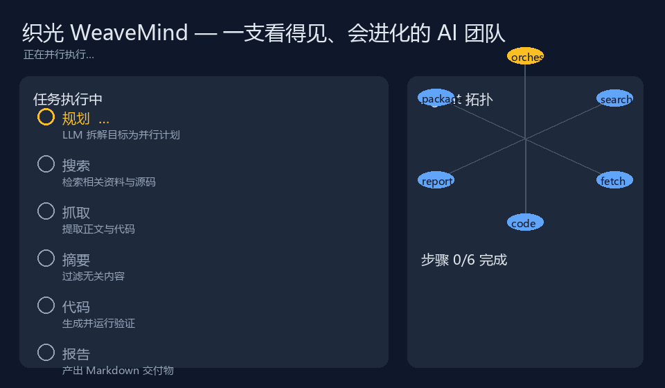

<div align="center">

# WeaveMind · ZhiGuang

**A visible, self-remembering, self-evolving AI team that runs on your own computer.**

[](https://github.com/momang85/weavemind/actions)
[](LICENSE)
[](https://www.python.org/)
[](docker-compose.yml)

English · [中文](README.md)

</div>



Type one goal → **a 10-worker AI team works in parallel** → a complete deliverable lands on disk.
This is not another chat window. It is a **visual multi-agent workshop**: editable plans,
reusable memory, and strategies that literally evolve. Every step is visible; every deliverable is real.

**The one-line difference**: other agents forget what they did — WeaveMind **sees, remembers, and evolves**.

> ⭐ If WeaveMind helps you, give it a **Star** so more people can see this AI team.

---

## ✨ Why WeaveMind

Agent frameworks make you assemble everything yourself. WeaveMind hands you a **ready-made AI team**:

- 🧑‍💼 **Out of the box**: clone → add one API key → start working (Windows / macOS / Linux / Docker)
- 👀 **See it happen**: live progress, task tree, agent topology, "what it remembers", evolution replay — all visualized
- 🧠 **It remembers**: ChromaDB long-term memory; new tasks automatically reuse past successful strategies
- 💬 **It converses**: keep asking in the same session, switch between historical sessions anytime
- ✏️ **It listens**: reorder / delete / add steps after planning, then confirm and execute
- 🔁 **It self-improves**: automatic acceptance review after tasks; gaps trigger extra iteration steps
- 🧬 **It self-evolves**: strategy mutation → tournament → safety red lines → human-approved deployment

## 🆚 Comparison

| Capability | **WeaveMind** | Single-agent chat | AutoGPT / Manus | DIY framework (CrewAI…) |
|---|---|---|---|---|
| Parallel DAG execution across workers | ✅ Built-in | ❌ | ⚠️ Partial | Build it yourself |
| Full visualization (task tree / topology / live) | ✅ Built-in | ❌ | ❌ | Build it yourself |
| Long-term memory + strategy reuse | ✅ ChromaDB | ❌ | ⚠️ Weak | Integrate yourself |
| Editable plan, confirm before execution | ✅ Built-in | ❌ | ❌ | Build it yourself |
| Self-iteration (review → add steps) | ✅ Built-in | ❌ | ⚠️ Partial | Build it yourself |
| **Strategy self-evolution (tournament)** | ✅ Unique | ❌ | ❌ | ❌ |
| One-command start (Win/macOS/Linux/Docker) | ✅ | — | ⚠️ | ❌ |
| Local execution, data stays private | ✅ | ❌ Cloud | ❌ Cloud | ✅ |
| Code sandbox (secret stripping / timeout / isolation) | ✅ Built-in | ❌ | ⚠️ | Build it yourself |

## 🚀 30-second quick start

```bash
# 1. Clone
git clone https://github.com/momang85/weavemind.git && cd weavemind

# 2. Configure
cp config.example.json config.json   # fill in your LLM API key

# 3. Start (pick one, see "Install & Run" below)
bash start.sh                        # or start.bat / docker compose up --build -d

# 4. Open http://localhost:5173 (8080 in production/Docker mode) and type:
#    "Research the 2026 global industrial AI vision market and write a board-level
#     report with architecture diagram and ROI estimates"
```

You will see: the plan tree generate in real time → multiple workers working in parallel →
every step turning green one by one → the reviewer finding gaps → the next iteration →
the final report. No coding required.

## 🎯 Core demos

### Self-iteration mode



Tasks flow through **execute → acceptance review → add steps** until accepted or
`max_iterations` is reached:

1. The planner generates a plan and executes it (independent steps run in parallel);
2. An LLM reviews the deliverable against the user goal;
3. On failure it outputs gaps and next steps, entering the next iteration automatically;
4. On acceptance the final report is produced, and the frontend shows an "Iteration N" badge per round.

### Editable plans

Check **"confirm plan first"** when submitting: the planner pauses and waits for you to
reorder / delete steps, or add new ones (pick a capability + instruction) at the bottom.
**Confirm & execute** runs your edited plan; **cancel** or a timeout
(`plan_confirm_timeout`, default 300 s) aborts it.

### Memory & evolution visualization

The "Memory & Evolution" page turns invisible accumulation into visible assets:

- **Memory store**: recent conversations (what it did) + successful strategies (what it learned, expandable)
- **System self-description**: an LLM writes a publishable self-description based on real memory, one-click copy
- **Evolution tournament replay**: winners, stability, leaderboard, per-task rankings and review scores

### Conversation & imported context

- Submitting a task creates a session; the next input is treated as an **additional
  requirement** for the same session, and the planner carries prior requirements/results.
- The **Import context** panel lets you paste background, references, URLs, or constraints
  that travel with the task and stay in the session.

## Feature highlights

- LLM planning → parallel multi-worker DAG → best-deliverable auto-selection as final report
- 10 dedicated workers: search, web fetch, content summary, code sandbox (secret stripping),
  data loading, EDA, model training, report generation, packaging, file I/O
- Long-term memory (ChromaDB): inject relevant experience before tasks, consolidate strategies after
- Conversation context, historical sessions, quick re-run
- Critic plan review, failure retry + single-step replanning, worker guardian self-healing
- Search fails → automatic fallback to direct LLM generation (generation-first orchestration)
- Dual-LLM failover (`backup` config), DuckDuckGo → Bing → mock search fallback
- Web console: live progress, task tree, agent topology, health, history, online config, LLM usage

## Install & Run

### Option A: Windows one-click

```bat
start.bat   :: start (Redis + all services + frontend, opens browser)
stop.bat    :: stop
```

On first run `start.bat` runs `pip install -r requirements.txt` and automatically builds
the frontend (`npm install && npm run build`) when `frontend/dist` is missing (Node.js 18+
required; without Node it starts with a built-in fallback page).

### Option B: Linux / macOS one-click

```bash
bash start.sh    # requires Python 3.10+ and Docker (for Redis)
bash stop.sh
```

> **Python versions**: 3.10–3.14 are supported. The official `pygame` package has no
> Python 3.14 wheel yet, but **pygame-ce 2.5.6+ fully supports 3.10–3.14** (drop-in
> replacement, import name is still `pygame`). Run
> `pip install -r requirements-games.txt` (optional) to enable pygame game execution.
> The system auto-detects: pygame when available, otherwise turtle / single-file HTML.

### Option C: Docker Compose (recommended, no local Python/Node)

```bash
cp .env.example .env        # at least set LLM_API_KEY
docker compose up --build -d
# open http://localhost:8080 · stop: docker compose down
```

### Option D: Manual install

```bash
python -m venv .venv && source .venv/bin/activate   # Windows: .venv\Scripts\activate
pip install -r requirements.txt
cd frontend && npm install && npm run build && cd .. # or npm run dev for dev mode
cp config.example.json config.json                   # fill in real API keys
python launcher.py                                   # start
python launcher.py stop                              # stop
python launcher.py status                            # status
```

> Dev mode: http://localhost:5173 · production/Docker: http://localhost:8080

## Configuration

Real config lives in `config.json` (gitignored, never committed):

```json
{
  "llm": { "api_key": "...", "base_url": "...", "model": "..." },
  "planner": { "model": "...", "base_url": "...", "api_key": "..." },
  "backup": { "api_key": "...", "base_url": "...", "model": "..." },
  "embedding": { "api_key": "...", "base_url": "...", "model": "BAAI/bge-large-zh-v1.5" },
  "redis": { "host": "localhost", "port": 6379 },
  "system": {
    "task_timeout": 300, "max_retry": 2, "replan_depth": 2,
    "critic": true, "critic_timeout": 30,
    "max_steps": 8, "max_parallel": 3, "max_iterations": 2,
    "stall_timeout": 300, "plan_confirm_timeout": 300, "scheduler": false
  }
}
```

Template: `config.example.json`; Docker mode uses `.env` (`LLM_API_KEY` etc.).

- **Model tiering**: `llm` = execution model (workers), `planner` = dedicated more stable model
- **Dual-source failover**: `backup` switches automatically when the main endpoint fails
- **Plan self-check**: a missing report/summary step gets auto-added (`report_generator`)
- **Task templates**: pick "data analysis pipeline / industry research / board report" in the
  console for deterministic steps that skip planning (`templates.json`)
- **Result caching**: submit the same goal with `cache_ttl_min` to hit cached successful results
- `scheduler=true` enables daily 03:00 auto-evolution

## Architecture

| Component | Role |
| --- | --- |
| `orchestrator_v2.py` | Orchestrator: plan → parallel DAG → self-iteration; retry/replan; plan confirmation |
| `common.py` | Redis messaging/queues, SQLite/Redis dual registry (thread-safe) |
| `llm_client.py` | LLM calls (sync/async, JSON tolerance, usage stats, failover) |
| `memory_manager.py` | ChromaDB long-term memory (inject + consolidate + visualize) |
| `worker_base.py` / `async_worker_base.py` | Sync/async worker base (heartbeat, kill listener) |
| `workers/` | 10 dedicated workers (incl. web fetch, code sandbox) |
| `web_ui.py` | Backend API: tasks/sessions/memory/evolution/metrics; serves frontend in production |
| `worker_guardian.py` | Worker guardian: heartbeat monitoring, process-level revival |
| `evolution_sandbox.py` | Strategy evolution: mutate → tournament → red lines → deployment request |
| `frontend/` | React + Vite + Tailwind console (tasks, chat, topology, health, memory & evolution, history, settings) |

## Data flow

```text
user goal -> plan (LLM + memory + critic) -> [optional] plan confirm/edit
        -> parallel DAG execution (Redis queues -> workers)
        -> acceptance review -> append steps if gaps -> iterate
        -> final deliverable report -> history + strategy consolidation + live frontend
```

## Testing

```bash
python smoke_test.py             # quick end-to-end smoke (services must be running)
python smoke_test.py --pipeline  # full data pipeline
python test_common.py            # base library unit tests (fakeredis)
python test_orchestrator_v2.py   # orchestrator regression (scheduling/iteration/capability)
python test_delivery_chain.py    # delivery chain regression (search/file/code/package)
python verification_suite.py     # edge-case verification suite
```

GitHub Actions CI runs backend compile/unit tests and the frontend build automatically.

## Roadmap

- [x] Parallel DAG execution, failure retry/replan, worker guardian
- [x] Conversation context, historical sessions, quick view/re-run
- [x] Self-iteration mode, editable plans
- [x] Memory & evolution visualization (self-description, tournament replay)
- [x] Plugin / MCP compatibility (mcp_lite built-in MCP server + mcp_client third-party MCP + tool_dispatch routing)
- [x] Scenario template library (4 handcrafted templates + auto-* consolidation from acceptance passes)
- [x] Multi-user auth & audit logs (admin/viewer roles, operation audit, initial admin bootstrap, deployment docs)
- [x] Container-level code-execution isolation (docker-first with automatic fallback) + one-click report sharing (read-only public links with optional password & expiry)

## Contributing

Any contribution is welcome: open issues, improve workers, add tests, write docs.
Before developing, run `python test_common.py` and `npm run build` to make sure nothing breaks.

## Known limitations

- Plan stability for complex goals depends on the chosen model; configure a stronger
  model in the `planner` section if needed.
- Logs rotate at 5 MB × 3 in `logs/`; `priority_router.py` and `auto_scaler.py` are kept
  but not yet wired into the main pipeline.
- Secrets and local data are never committed (`config.json`, `.env`, `agents.db*`,
  `chroma_memory*`, logs are all gitignored).

## License

[MIT](LICENSE)
