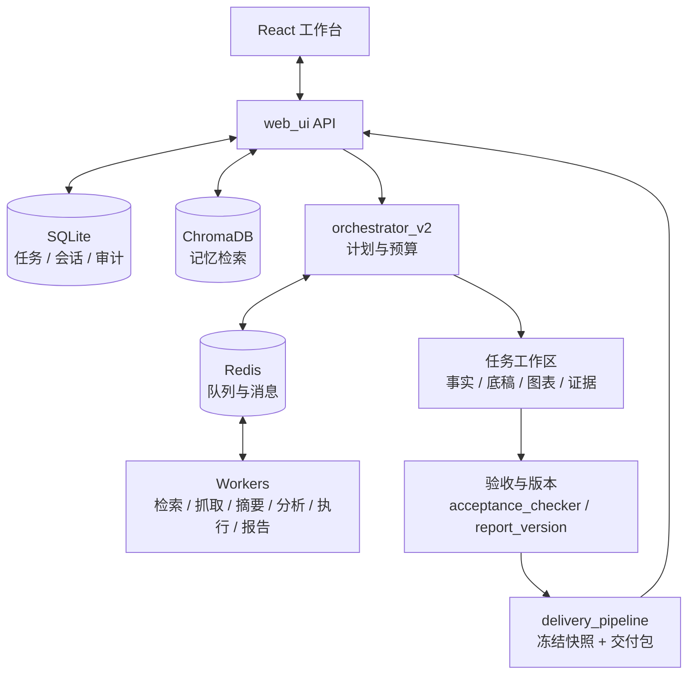

<div align="center">

# 织光 ZhiGuang · WeaveMind

**把公司资料变成有依据、可复算、可修改的研究交付。**

面向独立研究员与小型投研团队的上市公司研究工作台

[](https://github.com/momang85/weavemind/actions/workflows/ci.yml)
[](LICENSE)
[](#当前进展与验证边界)

中文 · [English](README.en.md)

[产品特点](#产品特点) · [使用场景](#适用人群与场景) · [快速开始](#快速开始) · [系统架构](#系统架构) · [文档](#文档导航)

</div>

织光围绕一份公司研究稿组织工作：明确公司、期间与资料截止日，整理财务和经营事实，计算可核对的指标，判断材料能回答哪些问题，再交付正文、底稿、图表与证据包。研究员可以检查来源、修改正文、重新验收并导出对应版本。

当前优先打磨 **A 股非金融上市公司的两期经营研究**。目标是减少资料整理与反复核对的工作，让研究员把时间用于判断。银行投研与对公客户研究沿同一核心能力进入后续受控试点。

> **当前为研究试用阶段。** 已有真实任务的修订与交付记录；跨公司稳定性、真人使用价值和银行生产部署仍待验证。机器验收通过、文件完整与研究问题已回答是不同状态，页面分别展示。

### 一页速览

| 问题 | 现在的答案 |
|---|---|
| 它是什么 | 把公开披露整理成**可复核**的研究交付：正文 ＋ 可复算底稿 ＋ 来源定位 ＋ 证据包 |
| 给谁用 | 独立研究员、分析师、小型投研团队的初稿与核查工作 |
| 凭什么能复核 | 数字带来源与算式、缺口如实标注、交付包内附逐文件哈希与版本绑定 |
| 现在到哪一步 | 研究试用阶段：真实任务已跑通「修订 → 重验 → 同版导出」；真人评分与跨公司稳定性待验 |
| 不做什么 | 自动交易、自动授信、目标价与收益承诺 |

## 产品特点

| 特点 | 在工作中解决什么问题 |
|---|---|
| **研究范围贯穿全流程** | 公司、代码、期间、报表口径和截止日随任务传递，降低检索与生成过程中混公司、混年份的风险 |
| **事实与计算分开保存** | 事实带主体、期间、单位和来源；派生指标保留算式及输入，支持在 CSV / JSON 底稿中复算 |
| **逐问题评估证据** | 区分定量分解、发行人归因、数据观察、背景及假设；材料相关不自动等于问题已回答 |
| **缺口成为下一步计划** | 列出缺什么、应补什么材料、缺口影响哪个判断；不把未取得的事实填成零或完整结论 |
| **研究员保留修改权** | 修改产生新版本并重验，保留旧版本；旧版评审不自动转移到新版 |
| **交付与采纳版本绑定** | 正文、PDF、底稿和证据按快照打包，附文件哈希与版本信息，便于复核交付一致性 |

多 Worker 编排、记忆检索和模型路由支撑上述流程。它们是实现机制；产品价值最终由研究稿是否有用、是否易于复核来衡量。

### 与「让模型直接写一份研报」的区别

| 环节 | 常见做法 | 织光的做法 | 你可以检查哪里 |
|---|---|---|---|
| 数字 | 生成时直接写进正文 | 先落**事实与算式**到底稿，正文引用底稿 | `working_paper.csv/json`、附录「字段位置与计算底稿」 |
| 来源 | 句尾标一个链接 | 记录**片段、小节与字符区间**，片段跳号处标为不连续 | `evidence/citation_evidence.json`、「证据」面板 |
| 结论强度 | 通篇同等措辞 | 区分定量分解 / 发行人说法 / 读数 / 背景 / 假设 | 逐问题的「支持：…」与头部研究状态 |
| 缺材料 | 略过，或补写一段 | 写成**补材料清单**并说明影响哪个判断 | 附录「逐问题资料计划」、「风险与核查」 |
| 研究员修改 | 覆盖原文 | 新建版本、重新验收、旧版保留 | 版本记录、导出块的同版提示 |
| 交付 | 一个 Markdown 文件 | 冻结快照 ＋ 逐文件哈希 ＋ 包内清单 | `PACKAGE_MANIFEST.json` |

每一条都能在交付物里逐项核对：**主张是否成立**由研究员判断，但"这个数字从哪来、算得对不对、材料够不够"三件事不需要信任模型。

### 缺口不是脚注，是下一步计划

同一次真实任务（洋河，2026-09-24）问三个问题，报告给出的不是"已分析"，而是逐问的覆盖程度与补材料清单：

| 研究问题 | 现有证据 | 缺什么 | 补到后判断怎么变 |
|---|---|---|---|
| 收入变化的量价与结构依据 | 分解覆盖（部分）：发行人披露的销量、渠道、分地区收入**各组分别闭合** | 量价拆分、主要客户与销售模式变化 | 量降价升 → 偏向主动结构调整；量价同降且库存上升 → 偏向需求与渠道压力 |
| 利润变化的分解 | 仅读数（覆盖：无） | 毛利率构成、期间费用与非经常性损益、少数股东损益 | 主要来自毛利端 → 产品结构驱动；主要来自毛利线以下 → 需查费用、减值或非经常性项目 |
| 现金变化与利润覆盖的关系 | 无相关材料（覆盖：无） | 现金流量表附注、营运资本变化、税费与结算条款 | 来自营运资本占用 → 回款质量下降；来自税费/结算节奏 → 短期偿付判断不变 |

这套结构写在正文附录『逐问题资料计划』里，也在页面上逐条显示；缺口没有被四舍五入成"基本完整"。

## 适用人群与场景

| 人群 | 适合尝试的工作 | 当前范围 |
|---|---|---|
| 独立研究员、分析师、顾问 | 年报阅读、两期经营比较、研究初稿、事实与公式核查 | 首要试用对象，以公开资料辅助人工研究 |
| 小型投研团队、私募研究团队 | 将研究正文与底稿一起交接，统一资料口径与待查事项 | 可探索受控试用；团队权限和协作效果需单独验证 |
| 银行投研、对公客户研究人员 | 公开资料下的客户经营梳理、访谈问题和材料补充清单 | 后续试点方向；银行内部资料与生产部署尚未验收 |
| 金融工具开发者 | 扩展事实、来源、验收和交付能力，接入自己的模型或数据 | MIT 开源代码，可本地开发与部署 |

首期聚焦公司研究辅助。自动交易、自动授信、目标价生成及投资收益承诺不属于当前产品范围。银行作为**研究对象**的指标适用性测试，也不代表银行作为**客户**的部署验收。

## 从研究问题到交付


1. **确定范围**：选择公司与期间，说明报表口径、资料截止日、读者和需要回答的问题；可先确认、编辑计划再执行。
2. **检查资料与底稿**：查看关键事实、计算依据和证据定位，确认主体、期间与单位匹配。
3. **阅读研究状态**：同时看机器验收、逐问题覆盖和人工复核状态；资料不足时先处理缺口。
4. **修订正文**：使用「修改正文并重验」提交研究员的判断与措辞，检查新版本的验收结果。
5. **导出交付**：使用「按当前版本重新导出」，下载 Markdown、PDF 或交付包，核对版本提示。

交付链上每一步都有对应记录，任一环变化都能被发现：


### 可以提交的首个任务

```text
研究洋河股份（002304.SZ）2023—2024 年度经营表现。
使用合并报表口径，资料截止日为 2025-04-30，读者为独立研究员。

重点回答：
1. 收入变化能从销量、价格或结构解释到哪一步？
2. 利润变化有哪些直接披露或可复算依据？
3. 经营现金流变化还需要哪些附注才能解释？

将数据观察、发行人说法、计算结果与待核查判断分开。
输出研究简报、可复算底稿、来源定位和按问题组织的补材料清单。
缺少证据时明确保留缺口，不推断渠道压货、终端需求或偿债安全。
```

这是研究请求示例，不保证本次能取得全部材料。新任务会按配置使用模型及外部数据源，耗时与费用取决于资料可用性、模型、重试和任务范围。

### 可以拿到哪些产物

| 产物 | 用途 |
|---|---|
| 研究正文与 PDF | 关键观察、依据、解释边界和下一步研究问题 |
| `working_paper.csv` / `working_paper.json` | 财务与经营事实、派生计算、请求口径及缺口，便于复算和后续处理 |
| 图表 | 展示同口径数据及变化，与正文一并核对 |
| `evidence/citation_evidence.json` | 已取得的来源摘录、定位与片段缺口信息 |
| `PACKAGE_MANIFEST.json` | 交付包成员哈希、报告版本及绑定信息，用于检查文件一致性 |
| 版本与审计材料 | 保留修订、采纳和历史稿的可追踪关系 |

产物随资料和任务而定。没有结构化财务数据时，系统不会用空底稿冒充完整交付；证据包也不保证包含全部原始文件，定位可能是 API 片段而非 PDF 页码。哈希一致证明字节一致，不证明来源或结论正确。

一次真实交付包的构成（洋河任务，2026-09-24，17 个成员）：

| 成员 | 数量 | 作用 |
|---|---|---|
| `reports/report.md`、`reports/report.pdf` | 2 | 交付正文与排版稿（同一版正文） |
| `working_paper.json`、`working_paper.csv` | 2 | 可复算底稿：事实、算式、缺口 |
| `charts/*.png` | 6 | 与正文同口径的图表 |
| `audit/model_report_full_*.md` | 5 | 模型原始稿逐字留档（按内容哈希命名，不覆盖历史） |
| `evidence/citation_evidence.json` | 1 | 来源摘录、定位与片段缺口 |
| `PACKAGE_MANIFEST.json` | 1 | 逐成员哈希、报告版本、绑定与漂移记录 |

同一次导出里，页面下载的 Markdown、PDF 与包内同名成员**逐字节一致**；包内没有跟上的变更会以 `drift` 记录，而不是被静默忽略。

## 当前进展与验证边界

以下是 **2026-09-24 的样本快照**，用于说明验证范围，不是跨任务质量保证。

| 验证对象 | 已记录的结果 | 仍需验证的部分 |
|---|---|---|
| 洋河真实任务的修订与下载 | 正常页面完成修改、重验、重导出；17 个包成员中 16 个冻结载荷哈希全部一致 | 独立研究员的复核耗时与使用价值 |
| 同一版本的数字验收 | 226 个数字中，206 个归为引用、7 个归为计算、13 个不可溯源；数字溯源率 94%、金额溯源率 100% | 这是机器规则口径，不等于事实准确率或完整研究质量 |
| 逐问题研究状态 | 三项必答问题无一项完全回答，其中收入一项部分覆盖；仍标为研究草稿 | 利润原因、现金来源等问题的充分证据 |
| PDF 交付 | 14 页，记录中未检测到页外字符 | 尚未达到简短主文的阅读目标；不等于全篇人工排版验收 |
| R4 固定回放 | 4/4 通过，覆盖资料较充分、资料不足、银行作为对象及用户修订 | 预置场景数据的通过不能替代真实第二家公司年报接入 |

证据入口：[页面与下载复核](docs/evidence/page_button_recheck_20260924.md) · [经营事实与候选选择](docs/evidence/r3_operating_facts_and_selection_20260924.md) · [固定回放](docs/evidence/r4_fixed_samples_20260924.md)。不同日期、规则和任务的溯源率不合并为平均成绩。

上面的数字分布（同一份 226 个数字的机器分类）：

```text
引用       206  ██████████████████████████████   91%
计算         7  █                                 3%
模型知识     0                                    0%
不可溯源    13  ██                                6%
────────────────────────────────────────────────────
可溯源合计 213 / 226 = 94%      金额溯源 69 / 69 = 100%
```

条越长占比越高：`引用` = 能对到来源位置，`计算` = 能按底稿算式复算，`不可溯源` = 两者都不满足，会在页面上逐条列出。这是**机器口径的可追溯性**，不是事实正确率。

当前还没有完成真人研究员评分、真实 Redis 多进程与并发修订/导出的完整验收，不能据此承诺银行生产可用性或服务等级。

### 数据与市场覆盖

| 范围 | 当前说明 |
|---|---|
| A 股非金融上市公司 | 当前主要研究与验收路径，真实样本仍有限；接口可用性和报告期完整度需要逐任务检查 |
| 港股、美股 | 仓库有相关适配器；不能由适配器存在推定真实抓取或研究交付已稳定，美股真实抓取仍缺验证 |
| 银行等金融机构 | 已有避免套用一般企业比率的边界用例，专用指标和分析深度仍待扩展 |
| 新闻、宏观、加密资产 | 保留相关适配器，属于扩展能力，尚不是当前上市公司研究主线的质量承诺 |

## 快速开始

| 方式 | 适合 | 入口 |
|---|---|---|
| Windows 一键 | 本机快速试用 | `.\start.bat`（见下文） |
| Linux / macOS 一键 | 本机快速试用 | `bash start.sh` |
| Docker Compose | 服务器、免本地 Python | `docker compose up --build -d` |
| 手动安装 | 自定义环境、二次开发、内网机器 | [部署指南](docs/部署指南.md) §5（含[依赖装不上时的排查与离线安装](docs/部署指南.md#53-依赖装不上时的排查与离线安装)） |

四种方式共用同一套后端与产物目录；下面的小节给出各自的细节与已知边界。

### 准备环境

- **模型**：可访问的 OpenAI 兼容 API，或自己的兼容服务；准备 API 地址、模型名称及必要的密钥。Embedding 可另行配置。
- **本地运行**：建议 Python 3.11，与当前后端 CI / Docker 一致。Redis 6+ 是必需的队列与消息依赖。
- **前端**：仓库跟踪 `frontend/dist` 构建产物；使用现成构建时无需 Node。修改源码或缺少产物时需要 Node.js 与 npm，开发建议 Node 22.6+。
- **Docker 运行**：Docker Engine / Desktop 与 Compose，在镜像内安装 Python、构建前端并启动 Redis。

首次安装可能需要下载依赖、前端包或 Redis，完成时间取决于环境与网络。

```bash
git clone https://github.com/momang85/weavemind.git
cd weavemind
```

### Windows

在 PowerShell 中运行：

```powershell
.\start.bat
```

脚本检查并补装依赖，首次运行可进入配置引导；缺少 Redis 时会尝试获取便携版本。需要隔离 Python 依赖时，可按[部署指南](docs/部署指南.md)使用虚拟环境与 `launcher.py`。

> 卡在依赖或 Redis 上（国内网络、装了安全软件的机器常见）：见部署指南
> 「5.3 依赖装不上时的排查与离线安装」——换 pip 镜像（`WM_PIP_INDEX_URL`）、
> 分小批安装、离线 wheels，以及把便携 Redis 的 zip 直接放进
> `.weavemind/downloads/` 免联网复用。

### Linux / macOS

```bash
bash start.sh
```

需要已安装的 Redis 或可用的本机 Redis 服务。自定义远程 Redis 时，先设置 `REDIS_HOST` / `REDIS_PORT` 环境变量，再直接运行 `python launcher.py start`；仅修改 `config.json` 中的地址，可能无法通过启动前的 Redis 检查。平台脚本存在不代表所有系统版本均已完成同等实测。

### Docker Compose

复制 [.env.example](.env.example) 为 `.env`，填写真实的 `LLM_API_KEY`，并核对 `LLM_BASE_URL`、`LLM_MODEL` 和 Embedding 配置，再执行：

```bash
docker compose up --build -d
docker compose ps
```

当前 Compose 将宿主机 `8080` 端口映射到工作台，Redis 仅在 Compose 网络中提供服务。`app_data` 与 `redis_data` 命名卷保存所挂载的数据。使用当前配置前需了解三个边界：

- `/app/config.json` 尚未单独持久化，容器重建前需备份管理员与界面设置；不能认为数据卷已经覆盖全部配置。
- 镜像未提供独立代码执行沙箱，涉及 `code_execution` 的步骤会被拒绝。工作台与不依赖代码执行的路径可以使用。
- 中文 PDF 需要兼容的中文 TrueType 字体；当前 Dockerfile 未安装该字体，可在自定义部署中配置 `WEAVEMIND_PDF_FONT`。

详细部署方式见[部署指南](docs/部署指南.md)，当前镜像与挂载以 [Dockerfile](Dockerfile)、[docker-compose.yml](docker-compose.yml) 为准。

### 登录、检查与停止

打开 **http://localhost:8080**。首次访问按页面创建管理员；也可按部署指南使用 `WEAVEMIND_ADMIN_PASSWORD` 预设。没有固定的默认管理员密码。

本地运行时，在与启动相同的 Python 环境中执行：

```bash
python launcher.py status
python launcher.py deps
python launcher.py stop
```

`deps` 只检查依赖；需要自动补装时使用 `python launcher.py deps --fix`。Docker 使用：

```bash
docker compose logs --tail=100 app
docker compose down
```

`docker compose down` 默认保留命名数据卷；配置文件的持久化边界见上文。

## 配置与数据去向

| 配置 | 作用 |
|---|---|
| `llm` | Worker 使用的执行模型 |
| `llm.model_roles` | 各角色的模型映射；可能优先于通用 `llm.model`，需逐项确认模型在所用服务上可用 |
| `planner` | 规划模型，可与执行模型分别配置 |
| `backup` | 备用模型端点，使用前核对服务目的地 |
| `embedding` | 记忆检索的向量模型；具体降级行为见运行状态 |
| `redis` | 消息队列的连接信息 |
| `system` | 任务时限、步骤数、重试、并行度、计划确认与迭代等运行设置 |

本地首次配置优先使用向导：

```bash
python setup_wizard.py
```

向导后仍需检查角色模型。手动复制 [config.example.json](config.example.json) 时，应检查执行、规划、备用和 Embedding 配置中的占位值，不能只填一个密钥。保留已有配置，不要直接覆盖。

本地 launcher 使用 `config.json`，不会自动读取 `.env`；Compose 使用 [.env.example](.env.example) 中声明的环境变量。应用支持在自己的机器运行并保存产物，但远程 LLM、Embedding、搜索及数据接口仍会接收相应请求。**本地部署不等于离线运行或数据不出本机。** 模型用途、资料目的地与调用费用应按使用场景配置。

已有登录、`admin` / `viewer` 角色、操作审计和受限报告分享。多项目组织与这些基础功能尚不能替代银行要求的租户隔离、细粒度授权、数据出域控制及独立运维验收。

## 系统架构

织光采用模块化 Python 应用、独立 Worker 和 React 工作台。Redis 负责消息与队列，SQLite 保存运行记录，文件工作区保存产物，ChromaDB 支撑记忆检索。



读图要点：**事实与产物落在文件工作区**，所以正文、底稿、图表、证据可以逐字节核对；**验收与交付各自独立成层**，因此"文件完整"与"研究已回答"是两条不同的结论。

| 层次 | 主要代码 | 职责 |
|---|---|---|
| 工作台与 API | [frontend/](frontend/)、[web_ui.py](web_ui.py) | 任务、计划、研究状态、修订、下载与配置；React / TypeScript / Vite / Zustand |
| 研究范围与执行 | [execution_contract.py](execution_contract.py)、[orchestrator_v2.py](orchestrator_v2.py)、[workers/](workers/) | 传递研究约束，规划和并行执行有依赖的步骤 |
| 来源与事实 | [adapters/](adapters/)、[narrative_evidence.py](narrative_evidence.py)、[facts.py](facts.py) | 获取资料，核对适用性，保留事实、来源定位和连续性信息 |
| 底稿与问题判断 | [working_paper.py](working_paper.py)、[question_assessment.py](question_assessment.py) | 确定性计算、缺口记录和逐问题证据评估 |
| 正文与验收 | [report_brief.py](report_brief.py)、[acceptance_checker.py](acceptance_checker.py)、[report_quality.py](report_quality.py) | 组织研究稿，运行机器检查，比较候选质量 |
| 版本与交付 | [report_version.py](report_version.py)、[delivery_pipeline.py](delivery_pipeline.py)、[report_pdf.py](report_pdf.py) | 修订与采纳、版本绑定、冻结快照、PDF 与交付包 |
| 模型与运行控制 | [llm_client.py](llm_client.py)、[root_budget.py](root_budget.py)、[launcher.py](launcher.py) | 模型调用、用量与预算记录、服务管理 |
| 记忆与扩展 | [memory_manager.py](memory_manager.py)、[mcp_client.py](mcp_client.py)、[tool_dispatch.py](tool_dispatch.py) | 历史检索与工具接入；策略进化等能力保留为扩展研究方向 |

### 三种状态需要分别理解

| 状态 | 谁判 | 看什么 | 通过**不代表** |
|---|---|---|---|
| 机器验收 | 固定规则 | 数字、来源声明、交付完整性 | 研究结论正确或材料充分 |
| 研究状态 | 逐问题证据评估 | 必答问题是否被材料回答、缺口在哪 | 正文措辞已定稿 |
| 人工复核 | 研究员 | 具体版本是否被审阅、批准 | 计划评审通过就等于人工复核 |

一份文件完整、机器验收通过的报告仍可能是研究草稿。修改正文后应重验，并重新生成交付包。

## 开发与验证

前端开发：

```bash
npm ci --prefix frontend
npm run dev --prefix frontend
```

开发页通常为 `http://localhost:5173`，仍需后端服务。构建生产前端：

```bash
npm run build --prefix frontend
```

安装后端依赖后，可按改动范围选择现有回归：

```bash
python test_facts.py
python test_working_paper.py
python test_question_assessment.py
python test_report_version.py
python test_delivery_chain.py
```

完整检查配置见 [CI 工作流](.github/workflows/ci.yml)。`requirements-runtime.lock` 是 Linux x86_64 / Python 3.11 的运行依赖锁，供 CI / Docker 使用；`requirements.lock` 是包含训练依赖的整机快照，不应作为普通运行环境的默认安装清单。真实模型/数据源端到端测试与离线测试分开记录，不能用预置样本通过代替真实资料接入验收。

## 下一阶段

1. **证明研究价值**：在当前版本上完成真人研究员评分，记录复核时间、关键修订和再次使用意愿。
2. **证明跨公司可重复**：用独立公司的真实年报检验资料接入、口径、计算及逐问题回答，保留充分与不足两类样本。
3. **改善报告阅读与运行可靠性**：压缩主文、证据进附录，补真实多进程、并发修订与导出验证。
4. **进入银行受控试点**：验证身份授权、资料出域、审计审批、部署恢复与业务流程，再评估内部资料和生产应用。

按验收关卡推进，不以代码完成或测试数量宣称阶段毕业。长期方向见[个体与银行代码规划](docs/长期代码规划_个体与银行_20260915.md)；其中未来能力不代表当前已实现。

## 文档导航

| 想了解什么 | 入口 |
|---|---|
| 安装、部署、运维 | [部署指南](docs/部署指南.md) |
| 依赖或 Redis 装不上 | [部署指南 5.3 排查与离线安装](docs/部署指南.md#53-依赖装不上时的排查与离线安装) |
| 已验证的页面与交付流程 | [2026-09-24 页面复核](docs/evidence/page_button_recheck_20260924.md) |
| 证据分类与问题覆盖 | [统一问题评估](docs/evidence/r1_unified_assessment_20260923.md) |
| 版本与交付快照 | [导出完整性](docs/evidence/r2_export_snapshot_integrity_20260923.md) |
| 离线验证范围 | [固定样本记录](docs/evidence/r4_fixed_samples_20260924.md) |
| 如何评价研究稿 | [研究员评分表](docs/研究员评分表_F3_20260920.md) |
| 单独检查报告数字 | [溯源体检 API](docs/API_溯源体检_verify.md) |
| 架构方向与实现进展 | [总架构师执行指令](docs/总架构师执行指令.md)、[DeepSeek 执行状态](docs/DeepSeek执行状态.md) |

历史实测与规划文档保留在 `docs/` 中；阅读时核对日期、代码版本及“已实现 / 已验证 / 待验”的区别。

## 参与项目

欢迎通过 [Issues](https://github.com/momang85/weavemind/issues) 提交可复现的问题、脱敏研究样本或使用反馈。报告问题时附公司与期间、预期判断、实际结果和相关版本；请勿附密钥、个人信息或未获授权的内部资料。

贡献优先考虑事实与来源质量、报告可读性、修订体验和可重复验证。按改动范围运行对应回归；修改前端时补充构建验证。

代码采用 [MIT License](LICENSE)。第三方数据和模型服务遵循各自的使用条件。
