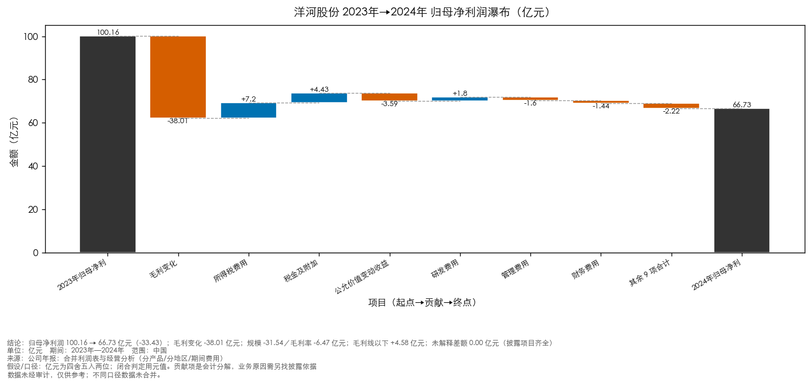
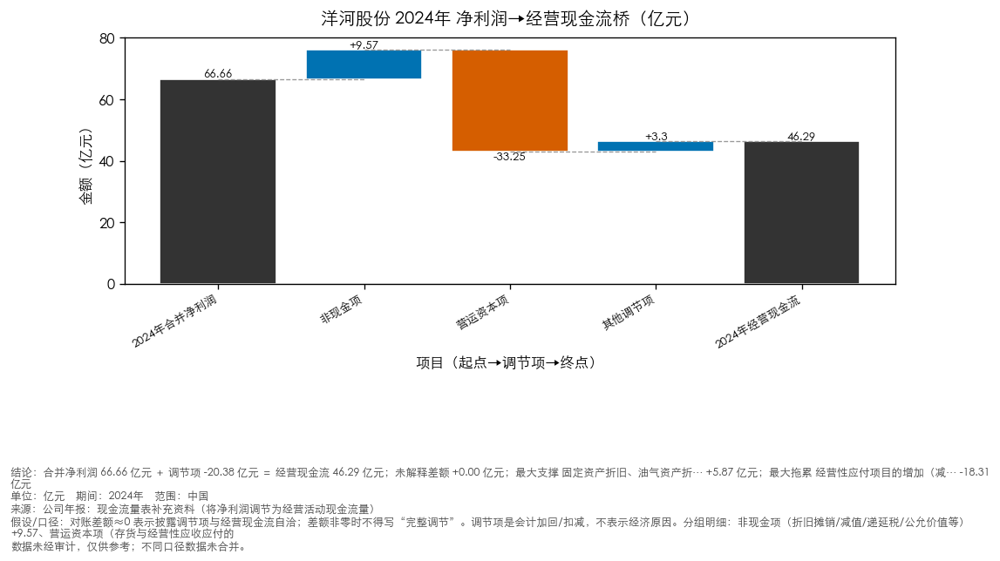
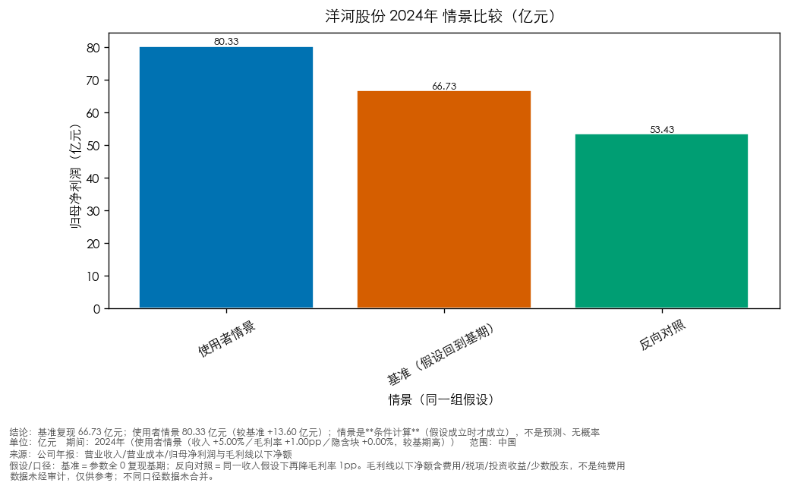

> **未验收草稿：验收未通过（overall=fail）**
> 本次交付没有取得针对该版正文的验收通过，不得视为已通过，也不得直接用于对外发布或审批。

> **研究状态：研究草稿／待补原始披露**——必答问题未完成（2/3）：收入变化的量价与结构依据、利润变化的分解（其中部分覆盖 2 项：收入变化的量价与结构依据[已取得部分构成]、利润变化的分解[已取得部分构成]）；1 条肯定结论处于未证实状态（未支持/部分支持/待核查）（数字与格式的机器验收不因此改变；本条说的是**研究**是否就绪）

> **评审状态：评审未完成（降级）** —— 未执行或未完成评审。
> 本交付物未取得绑定计划版本的评审 PASS，须经人工复核后方可使用。

---

# 洋河股份 经营分析简报（2023–2024 年度）

**主体**：洋河股份（002304.SZ）　**期间**：2023–2024 年度　**口径**：合并　**资料截止**：2025-04-30

> 报表口径：合并；数据时效：截至 2025-04-30；单位：元。
> 来源：正文引用 **1** 条（编号见『参考来源』）；另有 0 条候选材料未采用（不编号、不进正文，只留在内部审计）。

## 关键判断与下一步
- **营业收入同比下降 12.83%（2024 年 28876296993.56元）**
  - 意义：决定后续所有经营判断的分母：收入是量、价、结构三者共同作用的结果，不拆开就分不清是需求走弱、结构下移还是主动调整。
  - 依据：量价/结构数据（分解覆盖）；覆盖：部分；来源 [1]；小节：第三节 管理层讨论与分析 > 二、报告期内公司从事的主要业务 > 1、主要产品的生产量、销售量、库存量（字符 9536-9573）；证据性质：发行人口径的量化分解（未独立验证）
  - 边界：量价/结构数据来自发行人披露的收入构成与产量销量表（各组与表内「营业收入合计」分别闭合）；各因素（量、价、结构）的**贡献度**未拆分，管理层的定量说明也未给出；吨价为推算、不等于披露价格，也不能单独证明提价
  - 下一步：确认研究对象类型（金融 / 非金融）、收入构成与量价拆分、主要客户与销售模式变化（补到后会怎样改变判断见附录『逐问题资料计划』）
- **归母净利润同比下降 33.37%（2024 年 6673388602.12元）；金额变化：归母净利润变化 -3.34254e+09元、毛利润变化 -3.80095e+09元、毛利线以下净额变化 +4.58412e+08元（= Δ归母净利润 − Δ毛利；含费用、税项、非经营性项目与少数股东等，未取得明细前不拆解到具体科目）**
  - 意义：决定盈利质量与可持续性：降幅是否由毛利端造成、还是被费用/税项/非经营性项目放大，直接改变对客户偿债与分红能力的看法。
  - 依据：量价/结构数据（分解覆盖）；覆盖：部分；来源 [1]；第 11 页 · 小节：第三节 管理层讨论与分析 > 二、报告期内公司从事的主要业务 > 1、按不同类型披露主营业务构成（字符 7532-7601）；证据性质：发行人口径的量化分解（未独立验证）
  - 边界：毛利端与期间费用取自发行人毛利率表与费用明细（各自有定位）：毛利额为**推导量**（上期由披露同比反推），各分组是同一笔收入的不同切法、不做跨组合计；已取得 毛利端、期间费用；缺 税项与非经常性损益；税项与非经常性损益未取得前，不把差额归到任何一项；披露按销售模式/产品等分组的毛利额与合并利润表毛利是**两个切法**（金额会有小幅差异），金额分解统一用合并口径，不把两个切法的数混算
  - 下一步：确认研究对象类型（金融 / 非金融）、毛利率构成、期间费用与非经常性损益（补到后会怎样改变判断见附录『逐问题资料计划』）
- **经营活动现金流净额同比下降 24.49%（2024 年 4628711237.28元）。经营现金流对归母净利润的覆盖 2024 年为 69.36%（2023 年 61.2%，上升）**
  - 意义：决定利润的现金含量与短期偿付基础：利润率与覆盖率的机械关系容易被读成「回款改善」，需要现金来源结构才能判断。
  - 依据：两期事实的关系可复算（计算自披露数值）；覆盖：完整；见『研究问题与下一步』的逐问明细；证据性质：计算自披露数值（非独立核实）
  - 边界：覆盖率上升系分母（归母净利润）降得更快造成的被动结果，**不表示回款改善**；单期比率不构成趋势判断；来源结构未核实前，不判断现金流质量
  - 下一步：确认研究对象类型（金融 / 非金融）、现金流量表附注、营运资本变化（应收/应付/存货）（补到后会怎样改变判断见附录『逐问题资料计划』）

## 关键发现
- 营业收入 2024 年为 28876296993.56元（2023 年 33126277551.51元），同比 -12.83%
- 归母净利润 2024 年为 6673388602.12元（2023 年 10015930040.27元），同比 -33.37%
- 经营活动现金流净额 2024 年为 4628711237.28元（2023 年 6130220867.96元），同比 -24.49%
- 其余 1 项读数与全部同比/比率见『财务对照』与『同比与比率（可复算）』（本节不重复）。

## 研究问题与下一步
- **收入变化的量价与结构依据**：营业收入同比下降 12.83%（完整读数见『关键发现』）
  - 材料：**分解覆盖（部分）**：量（销售量/生产量/库存量）与结构（分行业/分产品/分地区/分销售模式）已取得（每组含表内「其他」行，与营业收入合计闭合）；价无披露口径（吨价为推算，非披露价格）（来源 [1]；小节：第三节 管理层讨论与分析 > 二、报告期内公司从事的主要业务 > 1、主要产品的生产量、销售量、库存量（字符 9536-9573））；证据性质：发行人口径的量化分解（未独立验证）；边界：量价/结构数据来自发行人披露的收入构成与产量销量表（各组与表内「营业收入合计」分别闭合）；各因素（量、价、结构）的**贡献度**未拆分，管理层的定量说明也未给出；吨价为推算、不等于披露价格，也不能单独证明提价；下一步：确认研究对象类型（金融 / 非金融）、收入构成与量价拆分、主要客户与销售模式变化
- **利润变化的分解**：归母净利润同比下降 33.37%（完整读数见『关键发现』）
  - 材料：**分解覆盖（部分）**：毛利额（按销售模式分组合计）：2023 年 247.28 亿元 → 2024 年 209.20 亿元（-38.08 亿元）；期间费用合计：2023 年 66.82 亿元 → 2024 年 69.35 亿元（+2.53 亿元）（来源 [1]；第 11 页 · 小节：第三节 管理层讨论与分析 > 二、报告期内公司从事的主要业务 > 1、按不同类型披露主营业务构成（字符 7532-7601））；证据性质：发行人口径的量化分解（未独立验证）；边界：毛利端与期间费用取自发行人毛利率表与费用明细（各自有定位）：毛利额为**推导量**（上期由披露同比反推），各分组是同一笔收入的不同切法、不做跨组合计；已取得 毛利端、期间费用；缺 税项与非经常性损益；税项与非经常性损益未取得前，不把差额归到任何一项；披露按销售模式/产品等分组的毛利额与合并利润表毛利是**两个切法**（金额会有小幅差异），金额分解统一用合并口径，不把两个切法的数混算；下一步：确认研究对象类型（金融 / 非金融）、毛利率构成、期间费用与非经常性损益、少数股东损益
- **现金变化与利润覆盖的关系**：经营活动现金流净额同比下降 24.49%（完整读数见『关键发现』）
  - 材料：未取得对应披露，**观察成立、原因待证**；证据性质：计算自披露数值（非独立核实）；边界：覆盖率上升系分母（归母净利润）降得更快造成的被动结果，**不表示回款改善**；单期比率不构成趋势判断；来源结构未核实前，不判断现金流质量；下一步：确认研究对象类型（金融 / 非金融）、现金流量表附注、营运资本变化（应收/应付/存货）、税费与结算条款

## 量价与结构（发行人披露）
| 实物量 | 2024 | 2023 | 同比 |
|---|---|---|---|
| 白酒销售量 | 139,076.05 | 166,154.73 | -16.3% |
| 白酒生产量 | 145,494.73 | 158,834.29 | -8.4% |
| 白酒库存量 | 45,594.72 | 39,176.04 | +16.38% |

| 收入构成（发行人披露） | 2024（元） | 2023（元） | 同比 | 2024 占比 |
|---|---|---|---|---|
| 分行业·酒类行业 | 28,248,295,829.62 | 32,489,436,696.05 | -13.05% | 97.83% |
| 分行业·其他业务 | 628,001,163.94 | 636,840,855.46 | -1.39% | 2.17% |
| 分产品·白酒 | 28,175,707,878.18 | 32,389,581,931.71 | -13.01% | 97.57% |
| 分产品·红酒 | 72,587,951.44 | 99,854,764.34 | -27.31% | 0.26% |
| 分产品·其他 | 628,001,163.94 | 636,840,855.46 | -1.39% | 2.17% |
| 分地区·省内 | 13,031,872,833.19 | 14,675,188,393.55 | -11.2% | 45.13% |
| 分地区·省外 | 15,844,424,160.37 | 18,451,089,157.96 | -14.13% | 54.87% |
| 分销售模式·批发经销 | 27,854,167,407.45 | 32,052,628,760.26 | -13.1% | 96.46% |
| 分销售模式·线上直销 | 394,128,422.17 | 436,807,935.79 | -9.77% | 1.37% |
| 分销售模式·其他 | 628,001,163.94 | 636,840,855.46 | -1.39% | 2.17% |

- 各组**分别闭合**：每组含表内「其他」行，与「营业收入合计」逐组校验；未闭合的组按表格口径展示、不并入合计（本材料四组均闭合）。
- **白酒吨价（推算）**：202,592元/吨（上期 194,936元/吨），同比 +3.93%（算式：(28175707878.18 / 139076.05)，上期 (32389581931.71 / 166154.73)）——发行人未直接披露吨价，这是用分产品收入与销量推算的口径
- **省外与省内收入降幅差**：-2.93个百分点——省外 -14.13% vs 省内 -11.2%
- **线上直销与批发经销降幅差**：3.33个百分点——线上直销 -9.77% vs 批发经销 -13.1%

- 白酒收入降幅（-13.01%）小于销售量降幅（-16.3%），差额指向吨价变动（推算见上）
- 库存量上升（16.38%）与销售量下降并存，渠道与成品库存的消化需要后续期间数据检验

**边界**：吨价为**推算**（分子为分产品白酒收入、分母为白酒销售量）；发行人未直接披露吨价，也未拆分量、价、结构各自的贡献；销售量为**实物量（吨）**，收入还含红酒与其他业务：收入降幅与销量降幅的差不能全额当作价格效应；分行业/分产品/分地区/分销售模式为发行人披露的收入构成，`占比`为 2024 年结构；各组**分别**与表内「营业收入合计」闭合（本材料四组均闭合），跨组不相加；两期比较未含价格口径（含税/不含税）说明；以上事实来自公告接口片段（api_chunk）；片段跳号处为未取得的原文区间，跨缺口摘录按分段拼接标注。

- 出处：小节：第三节 管理层讨论与分析 > 二、报告期内公司从事的主要业务 > 1、主要产品的生产量、销售量、库存量（字符 9536-9573）

## 业务背景
- 统一社会信用代码 9132000074557990XP 公司上市以来主营业务的变化情况（如有） 无变更 历次控股股东的变更情况（如有） 无变更 江苏洋河酒厂股份有限公司 2024 年年度报告全文 7[1]
  - 出处：第 6 页 · 小节：第二节 公司简介和主要财务指标 > 四、注册变更情况（字符 3650-3765）
- 报告期内，白酒行业存量竞争态势持续演进，市场竞争愈发激烈，逐步由多元分化竞争转向头部企业集中，强集中、 强分化特征更为显著，马太效应愈发凸显。根据国家统计局数据，2024 年全国规模以上企业白酒产量（折 65 度，商品 量）414.5万千升，同比下降 1.80%。……（节选，原文见出处定位）[1]
  - 出处：第 10 页 · 小节：第三节 管理层讨论与分析 > 一、报告期内公司所处行业情况（字符 6437-6714）
- 公司需遵守《深圳证券交易所上市公司自律监管指引第 3 号——行业信息披露》中食品及酒制造相关业的披露要求 从事的主要业务 公司从事的主要业务为白酒的生产与销售，白酒生产采用固态发酵方式，白酒销售主要采用线下经销和线上直销两 种模式，报告期内公司的主营业务和经营模式没有发生变化。……（节选，原文见出处定位）[1]
  - 出处：第 10 页 · 小节：第三节 管理层讨论与分析 > 二、报告期内公司从事的主要业务（字符 6714-7374）

## 财务对照
| 指标 | 2023 | 2024 | 口径 | 来源 |
|---|---|---|---|---|
| 营业收入 | 33126277551.51元 | 28876296993.56元 | 合并 | [1] |
| 归母净利润 | 10015930040.27元 | 6673388602.12元 | 合并 | [1] |
| 经营活动现金流净额 | 6130220867.96元 | 4628711237.28元 | 合并 | [1] |
| 总资产 | 69792287455.91元 | 67345265219.62元 | 合并 | [1] |
| 总负债 | 17742423481.05元 | 15652219365.74元 | 合并 | [1] |
| 白酒销售量（吨） | 166154.73吨 | 139076.05吨 | 合并 | [1] |
| 白酒生产量（吨） | 158834.29吨 | 145494.73吨 | 合并 | [1] |
| 白酒库存量（吨） | 39176.04吨 | 45594.72吨 | 合并 | [1] |
| 分行业·酒类行业收入 | 32489436696.05元 | 28248295829.62元 | 合并 | [1] |
| 分行业·其他业务收入 | 636840855.46元 | 628001163.94元 | 合并 | [1] |
| 分产品·白酒收入 | 32389581931.71元 | 28175707878.18元 | 合并 | [1] |
| 分产品·红酒收入 | 99854764.34元 | 72587951.44元 | 合并 | [1] |
| 分产品·其他收入 | 636840855.46元 | 628001163.94元 | 合并 | [1] |
| 分地区·省内收入 | 14675188393.55元 | 13031872833.19元 | 合并 | [1] |
| 分地区·省外收入 | 18451089157.96元 | 15844424160.37元 | 合并 | [1] |
| 分销售模式·批发经销收入 | 32052628760.26元 | 27854167407.45元 | 合并 | [1] |
| 分销售模式·线上直销收入 | 436807935.79元 | 394128422.17元 | 合并 | [1] |
| 分销售模式·其他收入 | 636840855.46元 | 628001163.94元 | 合并 | [1] |
| 营业收入合计（表内） | — | 28876296993.56元 | 合并 | [1] |
| 白酒吨价（推算，非披露价格） | — | 202592.09元/吨 | 合并 | [1] |

**同比与比率（可复算）**：
- 营业收入同比 2024年同比：-12.83%（(28876296993.56 - 33126277551.51) / 33126277551.51 * 100）
- 归母净利润同比 2024年同比：-33.37%（(6673388602.12 - 10015930040.27) / 10015930040.27 * 100）
- 经营活动现金流净额同比 2024年同比：-24.49%（(4628711237.28 - 6130220867.96) / 6130220867.96 * 100）
- 归母净利率 2023年：30.24%
- 归母净利率 2024年：23.11%
- 经营现金流对归母净利润的覆盖 2023年：61.2%
- 经营现金流对归母净利润的覆盖 2024年：69.36%
- 资产负债率 2023年：25.42%
- 资产负债率 2024年：23.24%
- gross_profit_revenue_scale_effect 2024年较2023年：-3153542030.82元
- gross_profit_margin_effect 2024年较2023年：-647411628.37元
- 金额变化（与利润率变化分开呈现）见附录『金额变化（可复算）』。

- 比率适用条件与适用范围见附录（主文不重复口径说明）。

## 图表

图 1：归母净利润同比变化由哪些金额构成？；归母净利润 100.16 → 66.73 亿元（-33.43）；毛利变化 -38.01 亿元；规模 -31.54／毛利率 -6.47 亿元；毛利线以下 +4.58 亿元；未解释差额 0.00 亿元（披露项目齐全）（数据同『财务对照』表与底稿）

图 2：合并净利润到经营现金流之间的调节桥在哪里？；合并净利润 66.66 亿元 ＋ 调节项 -20.38 亿元 ＝ 经营现金流 46.29 亿元；未解释差额 +0.00 亿元；最大支撑 固定资产折旧、油气资产折… +5.87 亿元；最大拖累 经营性应付项目的增加（减… -18.31 亿元；经营现金流变化 -15.02 亿元，最大构成 合并净利润变化 -33.54 亿元（数据同『财务对照』表与底稿）

图 3：同一组假设下，基期、使用者情景与反向对照差多少？；基准复现 66.73 亿元；使用者情景 80.33 亿元（较基准 +13.60 亿元）；情景是**条件计算**（假设成立时才成立），不是预测、无概率（数据同『财务对照』表与底稿）

## 分析
本报告由确定性分析链装配：利润、现金与情景三段见『分析摘要』与『经营驱动分析正文』；底稿与来源随包提供。

## 分析摘要
- **利润**：2023年→2024年 归母净利润变化 -33.43 亿元；其中毛利变化 -38.01 亿元（收入规模 -31.54／毛利率 -6.47 亿元），毛利线以下 +4.58 亿元；毛利率 75.25% → 73.16%（-2.09pp）
- **结构**：分产品切法：白酒毛利变化（含推算输入） -37.96 亿元；未分类差额 -0.05 亿元；分地区切法：省外毛利变化（含推算输入） -25.21 亿元、省内毛利变化（含推算输入） -12.87 亿元；未分类差额 +0.08 亿元；量价分解（分产品:白酒量价分解）：销量效应 -53.82 亿元、单位价格效应 +11.68 亿元
- **现金**：2024年 合并净利润 66.66 亿元经调节项 -20.38 亿元后为经营现金流 46.29 亿元（未解释差额 +0.00 亿元）；现金变化 -15.02 亿元，最大构成 合并净利润变化 -33.54 亿元；最大支撑 固定资产折旧、油气资产折耗、生产性生物资产折旧 +5.87 亿元、最大拖累 经营性应付项目的增加（减少以“－”号填列） -18.31 亿元

### 分析摘要选择说明
- 说明：本版没有人工选择记录，默认采用**经营研究组合**（经营驱动／现金调节桥／条件情景）各一条已验证运行；可在分析工作台显式选择某一条

- 完整分析卡（每个读数带 run/output/component_id 与规则）见 `analysis/analysis_cards.md`；运行记录、数据集与计划在包内 `analysis/`。

## 经营驱动分析正文（洋河股份 2023年→2024年）

> 本节由 `financial_analysis` 从**已验证运行**装配：每个数字都能回查到运行与输出标识（见文末『附：底稿索引』），图、卡、底稿共用同一次运行。未取到的披露项留在「未解释差额」，既不摊派也不当零。

### 研究判断（可检验）
> 每条判断都由**已验证运行**与**已准入披露**驱动；「反转条件」写的是什么读数会削弱它——写不出反转条件的不是判断。
1. 销量收缩是收入下降的重要「数量」观察（不是需求结论）（已发生（读数））
   - 数字与贡献：量价分解：销量效应 -53.82 亿元、单位价格效应 +11.68 亿元（含结构混合）
   - 支持边界：销量与收入都来自发行人披露，只能说明**数量在收缩**；需求量、渠道库存与终端动销不在本次材料里，不能由销量推断
   - 本公司替代解释：发货与确认节奏调整（时点）、产品结构与统计口径变化、公司主动控货/去库存
   - 后续指标与反转条件：下一期同口径销售量（与生产量对照）；收入降幅是否小于销量降幅（结构/价格是否在托底）
   - 缺口（不臆造）：渠道库存与终端动销材料未取得（机制缺口，不臆造）
2. 单位收入上升不足以证明「提价能力」（已发生（读数））
   - 数字与贡献：单位价格效应 +11.68 亿元（量价分解，含产品结构混合）
   - 支持边界：均价由「该口径收入 ÷ 销量」算出，含产品结构混合；价无披露口径时不得命名「提价效果」，也不能把结构上移读成提价
   - 本公司替代解释：产品结构上移（高档占比提高）、渠道/销售模式结构变化、并表范围或口径变化
   - 后续指标与反转条件：分产品收入与销量（同口径）；公司对价格调整的披露原文（若有）
   - 缺口（不臆造）：吨价推算所需的同口径收入/销量未取全
3. 现金变化主要由**营运资本（占用与时点）**解释，其持续性是关键（已发生（读数））
   - 数字与贡献：经营现金流变化 -15.02 亿元：营运资本项 +11.04 亿元（占 73.6%）、合并净利润项 -33.54 亿元
   - 运行读数：ΔOCF 分项（经营驱动/现金桥同一次运行）
     - 位置：底稿 `analysis/analysis_runs.json`
   - 已准入段落：2024 年度,公司前五名经销客户的合计销售金额为 235,177.00 万元，占本年度销售总额 8.15%，其中前五名经销客 户销售额中关联方销售额为 0万元，占本年度销售总额 0%；前五名经销客户期末应收账款总金额为0 万元。 门店销售终端占比超过 10% □适用 不适用 线上直销销售 适用 □不适用 单位：元
     - 位置：第 11 页 · 小节：第三节 管理层讨论与分析 > 二、报告期内公司从事的主要业务 > 4、前五名经销客户的销售金额、销售占比、期末应收账款总金额（字符 8426-9486）
   - 支持边界：营运资本项变化可能只是结算节奏、票据或时点；**不直接证明**账期延长，也不等同于经营改善
   - 本公司替代解释：客户回款节奏与票据结算变化、备货/采购节奏（时点）、收入规模变化带来的自然占用变化
   - 后续指标与反转条件：下一期经营/投资活动现金流与应收/应付/存货绝对额；票据、账龄与结算政策披露；采购付现是否反弹、销售收现是否继续改善
   - 缺口（不臆造）：结算条款与账龄明细未取得时不推断账期
4. 产品/区域结构是**同一个口径的不同切法**：降幅差说明结构在起作用（已发生（读数））
   - 数字与贡献：分产品切法：白酒 -37.96 亿元
   - 数字与贡献：分地区切法：省外 -25.21 亿元、省内 -12.87 亿元
   - 已准入段落：适用 □不适用 主要研发项目名称 项目目的 项目进展 拟达到的目标 预计对公司未来发展 的影响 中国白酒宿迁产区生 态与酿造微生态研究 分析中国白酒宿迁产 区自然生态情况，解 析环境微生态与酿造 微生态结构，阐述绵 柔型白酒生态酿造特 色。 2024 年6 月完成
     - 位置：第 18 页 · 小节：第三节 管理层讨论与分析 > 四、主营业务分析 > （2）广告费用构成情况 > 4、研发投入（字符 17054-17201）
   - 支持边界：分产品/分地区/分销售模式是**不同切法**，覆盖同一笔收入，**不可相加**；结构差异也可能来自发货与确认节奏，不能直接读成「某类需求更好」
   - 本公司替代解释：渠道与发货节奏差异、统计口径或并表范围变化、价格与促销政策在不同品类上的差异
   - 后续指标与反转条件：下一期分产品/分地区收入的降幅差是否收敛；同口径销量与吨价（结构混合）；公司对区域/产品策略的披露原句
   - 缺口（不臆造）：渠道库存与终端动销未取得时不判断「结构性需求」；另有按出厂价分的中高档酒/普通酒「产品类别」表（第 10 页，架构文件给出 −14.79%／−0.49%）：该表是**单期+同比**形状，本次抽取层未取到 → 只作缺口列出，不并入上面的切法

### 一、结论（先看这三条）
1. **利润**：2023年→2024年 归母净利润变化 -33.43 亿元；其中毛利变化 -38.01 亿元（收入规模 -31.54／毛利率 -6.47 亿元），毛利线以下 +4.58 亿元；毛利率 75.25% → 73.16%（-2.09pp）
2. **结构**：分产品切法：白酒毛利变化（含推算输入） -37.96 亿元；未分类差额 -0.05 亿元；分地区切法：省外毛利变化（含推算输入） -25.21 亿元、省内毛利变化（含推算输入） -12.87 亿元；未分类差额 +0.08 亿元；量价分解（分产品:白酒量价分解）：销量效应 -53.82 亿元、单位价格效应 +11.68 亿元
3. **现金**：2024年 合并净利润 66.66 亿元经调节项 -20.38 亿元后为经营现金流 46.29 亿元（未解释差额 +0.00 亿元）；现金变化 -15.02 亿元，最大构成 合并净利润变化 -33.54 亿元；最大支撑 固定资产折旧、油气资产折耗、生产性生物资产折旧 +5.87 亿元、最大拖累 经营性应付项目的增加（减少以“－”号填列） -18.31 亿元
4. **反向情景**（单因素反推，两把杠杆同一目标；不表示可达）：（目标归母净利 100.16 亿元）收入侧需 15.8226%、毛利率侧需 84.7325%（较基期 +11.58pp）

### 二、利润变化：金额分解
| 项目 | 金额（亿元） | 占归母净利变化 |
|---|---:|---:|
| 所得税费用 | +7.20 | -21.6% |
| 税金及附加 | +4.43 | -13.3% |
| 公允价值变动收益 | -3.59 | 10.7% |
| 研发费用 | +1.80 | -5.4% |
| 管理费用 | -1.60 | 4.8% |
| 财务费用 | -1.44 | 4.3% |
| 其余 10 项合计（未单列） | -2.22 | 6.6% |

- 占比 ＝ 该项目 ÷ 归母净利变化：变化为负时，**正贡献显示为负占比**（符号是算术结果，不是方向判断）。
- 对称分解（交互项均分，代入顺序无关）：毛利变化 -38.01 亿元 ＝ 规模效应 -31.54 ＋ 毛利率效应 -6.47 亿元
- 分产品切法：白酒毛利变化（含推算输入） -37.96 亿元；未分类差额 -0.05 亿元；每种切法各自覆盖同一口径，**不可跨切法相加**
- 分地区切法：省外毛利变化（含推算输入） -25.21 亿元、省内毛利变化（含推算输入） -12.87 亿元；未分类差额 +0.08 亿元；每种切法各自覆盖同一口径，**不可跨切法相加**
- 量价分解（分产品:白酒量价分解）：销量效应 -53.82 亿元、单位价格效应 +11.68 亿元；均价含产品结构混合，不得命名「提价效果」

### 三、披露支持与来源定位
| 读数 | 期间 | 披露值 | 来源位置（原件） |
|---|---|---:|---|
| 营业收入 | 2024年 | 28,876,296,993.56元 | [PDF 第 7 页 · 主要会计数据和财务指标 · 行「营业收入(元) 28,876,296,993.56 33,126,277,551」](http://static.cninfo.com.cn/finalpage/2025-04-29/1223370519.PDF#page=7) |
| 营业收入 | 2023年 | 33,126,277,551.51元 | [PDF 第 7 页 · 主要会计数据和财务指标 · 行「营业收入(元) 28,876,296,993.56 33,126,277,551」](http://static.cninfo.com.cn/finalpage/2025-04-29/1223370519.PDF#page=7) |
| 营业成本 | 2024年 | 7,751,218,356.66元 | [PDF 第 76 页 · 合并利润表 · 行「其中：营业成本 7,751,218,356.66 8,200,245,255.4」](http://static.cninfo.com.cn/finalpage/2025-04-29/1223370519.PDF#page=76) |
| 营业成本 | 2023年 | 8,200,245,255.42元 | [PDF 第 76 页 · 合并利润表 · 行「其中：营业成本 7,751,218,356.66 8,200,245,255.4」](http://static.cninfo.com.cn/finalpage/2025-04-29/1223370519.PDF#page=76) |
| 归母净利润 | 2024年 | 6,673,388,602.12元 | [PDF 第 77 页 · 合并利润表 · 行「1.归属于母公司股东的净利润 6,673,388,602.12 10,015,9」](http://static.cninfo.com.cn/finalpage/2025-04-29/1223370519.PDF#page=77) |
| 归母净利润 | 2023年 | 10,015,930,040.27元 | [PDF 第 77 页 · 合并利润表 · 行「1.归属于母公司股东的净利润 6,673,388,602.12 10,015,9」](http://static.cninfo.com.cn/finalpage/2025-04-29/1223370519.PDF#page=77) |
| 净利润（合并） | 2024年 | 6,666,455,819.96元 | [PDF 第 76 页 · 合并利润表 · 行「五、净利润(净亏损以“-”号填」（标签折行，金额在下一行）](http://static.cninfo.com.cn/finalpage/2025-04-29/1223370519.PDF#page=76) |
| 净利润（合并） | 2023年 | 10,020,768,556.47元 | [PDF 第 76 页 · 合并利润表 · 行「五、净利润(净亏损以“-”号填」（标签折行，金额在下一行）](http://static.cninfo.com.cn/finalpage/2025-04-29/1223370519.PDF#page=76) |
| 经营活动现金流净额 | 2024年 | 4,628,711,237.28元 | [PDF 第 20 页 · 合并现金流量表 · 行「经营活动产生的现金流量净额 4,628,711,237.28 6,130,220」](http://static.cninfo.com.cn/finalpage/2025-04-29/1223370519.PDF#page=20) |
| 经营活动现金流净额 | 2023年 | 6,130,220,867.96元 | [PDF 第 20 页 · 合并现金流量表 · 行「经营活动产生的现金流量净额 4,628,711,237.28 6,130,220」](http://static.cninfo.com.cn/finalpage/2025-04-29/1223370519.PDF#page=20) |
| 毛利润 | 2024年 | 21,125,078,636.90元 | [2024年 合并：营业收入 − 营业成本](http://static.cninfo.com.cn/finalpage/2025-04-29/1223370519.PDF) |

- 上表是**用于计算的关键读数**及其原件位置；完整事实身份清单（fact_id → 表/页/行）见文末『附：底稿索引』与包内 `analysis/` 目录。

### 四、替代解释（会改变判断）
- **实际税率**：24.19% → 27.09%（+2.90pp）。本年所得税 24.77 亿元；按上年实际税率折算为 22.11 亿元——税率上升本身让税负多吃掉 2.65 亿元。这是**被动结果**（利润变化会改变税基），既不表示经营改善，也不能直接当成业务原因
- **公允价值变动收益** -3.59 亿元：需按公司披露的**非经常性损益/扣非归母净利**与业务实质判断是否经常性：不按指标名统一剔除，也不据此制造“正常化利润”
- **投资收益** -1.09 亿元：需按公司披露的**非经常性损益/扣非归母净利**与业务实质判断是否经常性：不按指标名统一剔除，也不据此制造“正常化利润”
- **结构 vs 价格**：分段与均价都是**同一口径的分解**：均价由「该口径收入/销量」算出，含产品结构混合，不能直接命名“提价效果”；分产品/分行业/分地区/分销售模式是不同切法，不可相加
- **口径提醒**：以上都是会计分解；要说成「业务原因」必须另有披露依据（管理层讨论、分部附注、销量与结算条款），否则只能写「观察成立、原因待证」。
- **非经常性损益对照**：判断投资收益/公允价值这类项目是否经常性，以公司披露的**非经常性损益明细与扣非归母净利**为准（分类取决于事项经济性质、行业与业务模式，并考虑持续性）；本报告**不按指标名统一剔除**，也不据此构造「正常化利润」。
  - 本次材料里未取到非经常性损益明细/扣非归母净利：该对照留待补料后再做

### 四之二、主要贡献的披露支持（原句＋边界＋反证＋观察指标）
- **营运资本项变化（存货/经营性应收/经营性应付） +11.04 亿元**（会计分解）
  - 披露原句：2024 年度,公司前五名经销客户的合计销售金额为 235,177.00 万元，占本年度销售总额 8.15%，其中前五名经销客 户销售额中关联方销售额为 0万元，占本年度销售总额 0%；前五名经销客户期末应收账款总金额为0 万元。 门店销售终端占比超过 10% □适用 不适用 
  - 出处：第 11 页 · 小节：第三节 管理层讨论与分析 > 二、报告期内公司从事的主要业务 > 4、前五名经销客户的销售金额、销售占比、期末应收账款总金额（字符 8426-9486）
  - 支持到哪里：该披露与这项金额**方向一致或同期出现**；金额来自调节表、段落来自管理层讨论，**不构成因果已证明**
  - 反证/替代解释：占用与时点口径：应付增加可能只是结算节奏或票据
  - 后续观察指标：下期应付/应收/存货绝对额与周转天数、票据与预收变动
- **所得税费用 +7.20 亿元**（会计分解）
  - 披露支持：本次材料里**没有**与「所得税/税率/递延所得税」相关的段落（未取到或未准入）：这一项只作金额分解
  - 反证/替代解释：税率变化只是对照，不是税率变化的原因；原因见税率调节附注
  - 后续观察指标：下期实际税率与税率调节表、非经常性损益的税务影响
- **其他调节项变化 +5.05 亿元**（会计分解）
  - 披露支持：本次材料里**没有**与「其他调节项变」相关的段落（未取到或未准入）：这一项只作金额分解
  - 反证/替代解释：该金额是会计分解，业务原因需要对应披露
  - 后续观察指标：下期同一项目的金额与披露说明

### 五、现金形成与反向情景
- **经营现金流变化**：-15.02 亿元 ＝ 合并净利润变化 -33.54 亿元、非现金项变化（折旧摊销/减值/递延税/公允价值等） +2.43 亿元、营运资本项变化（存货/经营性应收/经营性应付） +11.04 亿元、其他调节项变化 +5.05 亿元、对账差额变化（未取得的披露调节项） +0.00 亿元
  - 这是**会计构成**：营运资本项变化可能只是时点与资金占用，能不能持续须看应付/应收/存货明细与结算条款；投资收益等是否非经常要看公司非经常性损益披露，不按指标名剔除
- **2024年调节表**：合并净利润 +66.66 亿元、非现金项（折旧摊销/减值/递延税/公允价值等） +9.57 亿元、营运资本项（存货/经营性应收/经营性应付） -33.25 亿元、其他调节项 +3.30 亿元、未解释差额（未取得的披露调节项） +0.00 亿元
- **2023年调节表**：合并净利润 +100.21 亿元、非现金项（折旧摊销/减值/递延税/公允价值等） +7.14 亿元、营运资本项（存货/经营性应收/经营性应付） -44.30 亿元、其他调节项 -1.75 亿元、未解释差额（未取得的披露调节项） +0.00 亿元
- **辅助观察：现金缺口变化**（经营现金流−合并净利润）：+18.53 亿元 ＝ 经营现金流变化（ΔOCF） -15.02 亿元、合并净利润变化（取负：利润少→缺口小） +33.54 亿元；缺口缩小不等于现金变好
- **现金改善的可持续性（按组拆到单项）**
- **营运资本项（存货/经营性应收/经营性应付）**：合计 +11.04 亿元（抵消现金下降 73.6%）；主要单项：经营性应付项目的增加（减少以“－”号填列） +17.52 亿元、经营性应收项目的减少（增加以“－”号填列） -10.31 亿元、存货的减少（增加以“－”号填列） +3.84 亿元
  - 读法：这三项是**占用与时点**口径：应付增加可能只是结算节奏或票据，不等于账期延长；应收/存货的减少也可能是备货或确认节奏
  - 后续观察指标：下期存货、应收账款、应付账款的绝对额与周转天数；现金流量表附注里的票据与预收变动
- **非现金项（折旧摊销/减值/递延税等）**：合计 +2.43 亿元（抵消现金下降 16.2%）；主要单项：公允价值变动损失 +3.59 亿元、递延所得税负债增加 -1.31 亿元、投资损失（调节项） +1.09 亿元
  - 读法：非现金项是**会计加回**：减值计提与转回、递延税确认都会让这一组变大或变小，不直接代表现金改善
  - 后续观察指标：下期折旧摊销与减值明细、递延所得税附注；资产减值准备余额变化
- 对账差额≈0 表示披露调节项与经营现金流自洽；差额非零说明有调节项没取到，报告不得写“完整调节”
- **情景归母净利（收入 +5.00%／毛利率 +1.00pp）**：+80.33 亿元；基准复现 +66.73 亿元（差 +13.59 亿元）
- **毛利率侧反推**（收入固定基期；目标归母净利 100.16 亿元（上一期（2023年）归母净利：回到上年水平））：所需毛利率 84.7325%，与基期之差 +11.58pp
  - 收入侧反推（毛利率固定基期）：收入需变化 15.8226% 才能达到同一目标（单因素反推，不表示可达）
  - 若先接受该档收入假设，则所需毛利率为 80.6977%（较基期 +7.54pp）——这是**两因素条件计算**，不是同一把杠杆

### 六、待核查问题（按影响排序）
1. 分段缺成本或收入：分产品:其他:两期收入/成本不全
2. 分段缺成本或收入：分产品:红酒:两期收入/成本不全
3. 分段缺成本或收入：分行业:其他业务:两期收入/成本不全
4. 现金调节项未取到：信用减值损失（补充资料）（`credit_impairment_provision`）
5. 对「固定资产折旧、油气资产折耗、生产性生物资产折旧」找一条披露依据（明细表/附注/结算条款）做旁证

### 七、口径与限制
- 亿元为显示换算（两位小数）；闭合判定与占比用运行里的**元**值。
- 逐项贡献是**会计分解**：说明金额构成，不等于业务原因。
- 分产品/分行业/分地区/分销售模式是同一口径的**不同切法**，不可相加；每种切法的未分类差额单独列出。
- 均价由「该口径收入/销量」算出，含产品结构混合，不得命名「提价效果」。
- 现金桥起点是**合并净利润**（不是归母净利）；调节项是会计加回/扣减，不表示经济原因；资产负债表期末差只作旁证、不用于补桥。
- 反向阈值是**单因素反推**：给出「需要什么」，不表示可达、不是预测、无概率。
- 本节数字全部来自 `validated` 运行；某模型未通过验证时，本节不出现它的结论。

### 附：底稿索引（run / output / component_id）
> 正文与图的所有数字都能在这里回查；包内 `analysis/` 目录含数据集、计划、契约与全部运行记录。
- `operating_drivers`：run `9b0d03d102989d632a2cf3d9e473cf7311b3688627a2282df9f75c9ce576954f`（数据集 `73a332ba7851`，规则 `validation/1.1.0`）
  - net_profit_change → `9b0d03d10298-00-net_profit_change`；分项 gross_profit_change、below_gross_line_change
  - gross_profit_change → `9b0d03d10298-01-gross_profit_change`；分项 revenue_scale_effect、gross_margin_effect
  - revenue_scale_effect → `9b0d03d10298-02-revenue_scale_effect`
  - gross_margin_effect → `9b0d03d10298-03-gross_margin_effect`
  - below_gross_line_change → `9b0d03d10298-04-below_gross_line_change`
  - net_profit_change_detail → `9b0d03d10298-05-net_profit_change_detail`；分项 income_tax_expense、taxes_and_surcharges、fair_value_change、rd_expense、admin_expense、finance_expense、selling_expense、investment_income、non_operating_income、minority_interest、asset_impairment、non_operating_expense、other_income、asset_disposal_income、credit_impairment、unexplained_residual
  - gross_profit_change_by_segment → `9b0d03d10298-06-gross_profit_change_by_segment`；分项 segment:分产品:白酒、unclassified_gross_profit_change
  - gross_profit_change_by_segment → `9b0d03d10298-07-gross_profit_change_by_segment`；分项 segment:分地区:省内、segment:分地区:省外、unclassified_gross_profit_change
  - gross_profit_change_by_segment → `9b0d03d10298-08-gross_profit_change_by_segment`；分项 segment:分行业:酒类行业、unclassified_gross_profit_change
  - gross_profit_change_by_segment → `9b0d03d10298-09-gross_profit_change_by_segment`；分项 segment:分销售模式:批发经销、segment:分销售模式:线上直销、unclassified_gross_profit_change
  - volume_price_decomposition → `9b0d03d10298-10-volume_price_decomposition`；分项 volume_effect、price_effect
- `cash_reconciliation`：run `967bc9bff97ac90d5c762779d4e33369b1a776e8fce534d77458d251a6be5b5b`（数据集 `73a332ba7851`，规则 `validation/1.1.0`）
  - operating_cashflow_reconciliation_cur → `967bc9bff97a-00-operating_cashflow_reconciliation_cur`；分项 consolidated_net_profit、non_cash_adjustments、working_capital_adjustments、other_adjustments、unexplained_residual
  - operating_cashflow_reconciliation_prev → `967bc9bff97a-01-operating_cashflow_reconciliation_prev`；分项 consolidated_net_profit、non_cash_adjustments、working_capital_adjustments、other_adjustments、unexplained_residual
  - operating_cashflow_change → `967bc9bff97a-02-operating_cashflow_change`；分项 change_in_net_profit、change_in_non_cash、change_in_working_capital、change_in_other、change_in_residual
  - cash_gap_change → `967bc9bff97a-03-cash_gap_change`；分项 change_in_operating_cashflow、change_in_net_profit_negated
  - largest_support → `967bc9bff97a-04-largest_support`
  - largest_drag → `967bc9bff97a-05-largest_drag`
- `scenario_sensitivity`：run `7e5e83cbc7d0a119095b0f8e1fb6bd146029b964aeb5c4516182592d77c33503`（数据集 `73a332ba7851`，规则 `validation/1.1.0`）
  - scenario_net_profit → `7e5e83cbc7d0-00-scenario_net_profit`；分项 base、user、counter
  - scenario_sensitivity → `7e5e83cbc7d0-01-scenario_sensitivity`；分项 gross_margin_p1pp、revenue_p1pp、expense_m1pp
  - collection_days_capital_per_day → `7e5e83cbc7d0-02-collection_days_capital_per_day`
  - collection_days_sensitivity_10d → `7e5e83cbc7d0-03-collection_days_sensitivity_10d`
  - margin_threshold_to_hold_base_profit → `7e5e83cbc7d0-04-margin_threshold_to_hold_base_profit`
  - margin_gap_to_threshold_pp → `7e5e83cbc7d0-05-margin_gap_to_threshold_pp`
  - revenue_growth_to_hold_target → `7e5e83cbc7d0-06-revenue_growth_to_hold_target`

## 变化解释
**发生了什么（数据观察）**：
- 变化读数见开头『关键判断与下一步』与『关键发现』（本节只讲解释与边界，不重复数字）。

**管理层/附注的解释**：
- 报告期初，公司规划 2024 年力争营业收入同比增长 5%-10%。报告期内，白酒行业进入存量竞争阶段，市场竞争更 加白热化，公司主力产品集中的中端和次高端价位段承压较大，本着科学发展和可持续发展的原则，公司积极调整经营 策略，应对外部环境的变化和发展中存在的问题，2024 年实现营业收入 288.76 亿元，同比下降 12.83%；……（节选，原文见出处定位）[1]
  - 出处：第 13 页 · 小节：第三节 管理层讨论与分析 > 四、主营业务分析 > 1、概述（字符 11162-12396）
  - 归属：该段只提供 营业收入 的行业/市场背景，不构成原因支持；是否算「原因已取得」以『研究问题与下一步』逐问支持为准。
- 单位：元 项目 期初余额 本期增加 本期减少 期末余额 资本溢价（股本溢 价） 930,494,463.31 378,003.53 930,116,459.78 其他资本公积 30,000.00 30,000.00 合计 930,524,463.31 378,003.53 930,146,459.78 其他说明，包括本期增减变动情况、变动原因说明： 本期资本公积减少378,003.53元，系控股子……（节选，原文见出处定位）[1]
  - 出处：第 139 页 · 小节：第十节 财务报告 > 三、辞退福利  3,083,372.23 3,083,372.23 > （1） 专项应付款 > 33、资本公积（字符 143575-143818）
  - 归属：该段未单独解释上述变化的哪一项（不构成原因支持）；是否算「原因已取得」以『研究问题与下一步』逐问支持为准。
- 适用 □不适用 主要研发项目名称 项目目的 项目进展 拟达到的目标 预计对公司未来发展 的影响 中国白酒宿迁产区生 态与酿造微生态研究 分析中国白酒宿迁产 区自然生态情况，解 析环境微生态与酿造 微生态结构，阐述绵 柔型白酒生态酿造特 色。 2024 年6 月完成[1]
  - 出处：第 18 页 · 小节：第三节 管理层讨论与分析 > 四、主营业务分析 > （2）广告费用构成情况 > 4、研发投入（字符 17054-17201）
  - 归属：该段未单独解释上述变化的哪一项（不构成原因支持）；是否算「原因已取得」以『研究问题与下一步』逐问支持为准。

**推断边界**：
- 两期数据只能说明这两期的变化，不能据此声称长期趋势；未取得同业、行情与关键假设资料，本简报不给出估值或目标价。

- 尚未证明的部分（需补材料）见『风险与核查』，本处不重复。

## 风险与核查
- **1、外部环境不确定风险。当前我国经济整体回升向好，但仍然面临复杂严峻的外部环境，给白酒行业发展带来较大 不确定性。 2、行业竞争加剧风险。当前白酒行业挤压式竞争态势正在加速演进，白酒企业竞争尤其是头部名酒企业之间的市场 竞争进一步加剧，各名酒在同一区域开展直接竞争。 3、消费者需求变迁风险。……（节选，原文见出处定位）**
  - 证据：来源 [1] 第 26 页 · 小节：第三节 管理层讨论与分析 > 十一、公司未来发展的展望 > （三）可能面对的风险（字符 26408-26629）；改变判断的观察条件：若该风险出现缓释或加剧的公开证据（年报/公告更新），需修订判断；需补材料：最新年报/公告中的风险因素章节、相关事项的进展公告
- **公司金融工具面临的主要风险有信用风险、流动性风险、市场风险等。公司管理层全面负责风险管理目标和政策的 制定，并对风险管理目标和政策承担最终责任。公司风险管理的基本策略是确认和分析本公司面临的各种风险，在不过 度影响公司竞争力和应变力的情况下，制定尽可能降低风险的风险管理政策。**
  - 证据：来源 [1] 第 157 页 · 小节：第十节 财务报告 > 十二、与金融工具相关的风险 > 1、金融工具产生的各类风险（字符 162189-162344）；改变判断的观察条件：若该风险出现缓释或加剧的公开证据（年报/公告更新），需修订判断；需补材料：最新年报/公告中的风险因素章节、相关事项的进展公告
- **归母净利润：已取得量价/结构数据（第 11 页 · 小节：第三节 管理层讨论与分析 > 二、报告期内公司从事的主要业务 > 1、按不同类型披露主营业务构成（字符 7532-7601）），分解覆盖：部分（毛利额（按销售模式分组合计）：2023 年 247.28 亿元 → 2024 年 209.20 亿元（-38.08 亿**
  - 证据：发行人披露的量价与结构数据已准入；各因素贡献度未拆分；改变判断的观察条件：取得毛利率构成、期间费用与非经常性损益、少数股东损益后，若显示的原因与本期变化方向不一致，需修订解释；需补材料：毛利率构成、期间费用与非经常性损益、少数股东损益
- **经营活动现金流净额的变化原因尚不能证明**
  - 证据：未取得对应附注/管理层讨论证据；改变判断的观察条件：取得现金流量表附注、营运资本变化（应收/应付/存货）、税费与结算条款后，若显示的原因与本期变化方向不一致，需修订解释；需补材料：现金流量表附注、营运资本变化（应收/应付/存货）、税费与结算条款
- **营业收入：已取得量价/结构数据（小节：第三节 管理层讨论与分析 > 二、报告期内公司从事的主要业务 > 1、主要产品的生产量、销售量、库存量（字符 9536-9573）），分解覆盖：部分（量（销售量/生产量/库存量）与结构（分行业/分产品/分地区/分销售模式）已取得（每组含表内「其他」行，与营业收入合计闭合）；价无披露**
  - 证据：发行人披露的量价与结构数据已准入；各因素贡献度未拆分；改变判断的观察条件：取得收入构成与量价拆分、主要客户与销售模式变化后，若显示的原因与本期变化方向不一致，需修订解释；需补材料：收入构成与量价拆分、主要客户与销售模式变化
- **1. 分段缺成本或收入：分产品:其他:两期收入/成本不全**
  - 证据：由模型提出，尚未与底稿或年报证据绑定；改变判断的观察条件：取得对应证据后方可改变判断；无证据时不得据此行动；需补材料：支持该判断的年报/公告段落或数据
- 另有 6 条同类核查项（底稿审计/材料清单）见附录。

- **结论边界**：本简报只覆盖上述期间的变化与缺口，不构成趋势判断、评级或投资建议。

**待核查主张（未与底稿事实绑定）**：
- 量价/结构数据来自发行人披露的收入构成与产量销量表（各组与表内「营业收入合计」分别闭合）；各因素（量、价、结构）的**贡献度**未拆分，管理层的定量说明也未给出；吨价为推算、不等于披露价格，也不能单独证明提价
- 毛利端与期间费用取自发行人毛利率表与费用明细（各自有定位）：毛利额为**推导量**（上期由披露同比反推），各分组是同一笔收入的不同切法、不做跨组合计；已取得 毛利端、期间费用；缺 税项与非经常性损益；税项与非经常性损益未取得前，不把差额归到任何一项；披露按销售模式/产品等分组的毛利额与合并利润表毛利是**两个切法**（金额会有小幅差异），金额分解统一用合并口径，不把两个切法的数混算
- 覆盖率上升系分母（归母净利润）降得更快造成的被动结果，**不表示回款改善**；单期比率不构成趋势判断；来源结构未核实前，不判断现金流质量

## 附录

## 参考来源
1. [cninfo_annual_report_tables](http://static.cninfo.com.cn/finalpage/2025-04-29/1223370519.PDF)
   - 来源类型：发行人年报/官方披露
   - 用于：财务事实、业务背景、变化解释、财务附注、风险因素、正文引用

### 资料范围与口径
- 研究期间：2023、2024
- 报表口径：合并（归母净利润属合并报表中归属母公司的部分；经营现金流为合并口径）
- 资料截至：2025-04-30
- 主体：洋河股份（002304.SZ）
- 阅读视角：投研视角（增长来源与盈利质量）（由用户在表单声明；不按公司名或机构名推断）
- 研究对象类型：未确定（与阅读视角无关）

### 字段位置与计算底稿
- 营业收入：结构化字段：年报.cninfo_annual_report_tables.revenue[1]
- 归母净利润：结构化字段：年报.cninfo_annual_report_tables.net_profit[1]
- 经营活动现金流净额：结构化字段：年报.cninfo_annual_report_tables.operating_cashflow[1]
- 总资产：结构化字段：年报.cninfo_annual_report_tables.total_assets[1]
- 总负债：结构化字段：年报.cninfo_annual_report_tables.total_liabilities[1]
- 计算底稿：working_paper.json（底稿（事实、同比/比率与算式））
- 计算底稿：financials.json（结构化取数原始载荷）
- 计算底稿：narrative_evidence.json（年报/公告正文的证据与定位）
- 计算底稿：report_structure.json（本简报的结构化对象）
- 定位说明：网页来源按小节与字符区间定位；年报 PDF 的页码待后续支持

### 逐问题资料计划
- **收入变化的量价与结构依据**：想确认 确认收入降幅的**量、价、结构**来源，以及各来源对降幅的贡献；现有证据分解覆盖充分（覆盖：部分）；缺 确认研究对象类型（金融 / 非金融）、收入构成与量价拆分、主要客户与销售模式变化；下一步补 确认研究对象类型（金融 / 非金融）、收入构成与量价拆分、主要客户与销售模式变化；补到后的影响：若量降价升，则判断偏向主动结构调整；若量价同降且库存上升，则偏向需求与渠道压力，风险语境随之改变
- **利润变化的分解**：想确认 确认利润降幅中**毛利端与毛利线以下**各占多少；现有证据分解覆盖充分（覆盖：部分）；缺 确认研究对象类型（金融 / 非金融）、毛利率构成、期间费用与非经常性损益、少数股东损益；下一步补 确认研究对象类型（金融 / 非金融）、毛利率构成、期间费用与非经常性损益、少数股东损益；补到后的影响：若主要是毛利端，客户盈利受产品结构驱动；若主要是毛利线以下，则需要查费用、减值或非经常性项目，'暂时性'判断要改写
- **现金变化与利润覆盖的关系**：想确认 确认经营现金流变化的**来源结构**（收现、营运资本、税费）；现有证据两期事实的关系可复算（计算自披露数值）（覆盖：完整）；缺 确认研究对象类型（金融 / 非金融）、现金流量表附注、营运资本变化（应收/应付/存货）、税费与结算条款；下一步补 确认研究对象类型（金融 / 非金融）、现金流量表附注、营运资本变化（应收/应付/存货）、税费与结算条款；补到后的影响：若现金下降来自营运资本占用增加，回款质量下降；若来自税费/结算节奏，短期偿付判断不变

### 金额变化（可复算）
- 营业收入变化 2024年较2023年：-4249980557.95元（28876296993.56 - 33126277551.51）
- 归母净利润变化 2024年较2023年：-3342541438.15元（6673388602.12 - 10015930040.27）
- 经营活动现金流净额变化 2024年较2023年：-1501509630.68元（4628711237.28 - 6130220867.96）
- gross_profit_change 2024年较2023年：-3800953659.19元
- net_profit_gross_gap_change 2024年较2023年：458412221.04元

### 比率适用条件
- 营业收入同比、归母净利润同比、经营活动现金流净额同比：两期均为正且基期不为零；基期为负时同比不具可比含义
- 营业收入变化、归母净利润变化、经营活动现金流净额变化、gross_profit_change：两期须同币种、同单位、同报表口径；任一不满足则不生成该变化值
- 归母净利率：分子为归母净利润、分母为营业收入（合并口径）；金融机构利润表结构不同，不适用
- 经营现金流对归母净利润的覆盖：分子分母**同为正**时才按数值判断『低于/相当/高于』（相当 = 相差 0.5 个百分点以内）；任一为负（亏损或经营净流出）或分母为零时**不套覆盖解释**——既不表示利润有现金支撑，也不表示高于或低于
- 资产负债率：总负债 ÷ 总资产；金融机构负债以存款为主，与其经营模式不可比
- net_profit_gross_gap_change：Δ归母净利（归母口径）− Δ毛利（合并口径）：两者归属层不同，差额还含费用、税项、非经营性项目与少数股东等，**只能作机械核对**（Δ归母净利 = Δ毛利 + Δ(归母净利 − 毛利)），不能据此判断某项费用或损益改善
- 适用范围：以上比率与同比适用于**非金融企业**的经营简报；金融机构作为研究对象时需要独立的指标配置，不得机械套用工业企业的比率。

### 图表元数据（内部标识）
| 图 | chart_id | 绑定指标 | 单位 | 期间 | 口径 |
|---|---|---|---|---|---|
| 1 | `9b0d03d10298-profit-waterfall` |  |  |  |  |
| 2 | `967bc9bff97a-cash-bridge-cur` |  |  |  |  |
| 3 | `7e5e83cbc7d0-scenario-outcome` |  |  |  |  |

### 其他核查项
- **2. 分段缺成本或收入：分产品:红酒:两期收入/成本不全**（证据：由模型提出，尚未与底稿或年报证据绑定）
- **3. 分段缺成本或收入：分行业:其他业务:两期收入/成本不全**（证据：由模型提出，尚未与底稿或年报证据绑定）
- **4. 现金调节项未取到：信用减值损失（补充资料）（`credit_impairment_provision`）**（证据：由模型提出，尚未与底稿或年报证据绑定）
- **5. 对「固定资产折旧、油气资产折耗、生产性生物资产折旧」找一条披露依据（明细表/附注/结算条款）做旁证**（证据：由模型提出，尚未与底稿或年报证据绑定）
- **按投研视角（增长来源与盈利质量）还需要核查的事项**（证据：视角由用户声明（不按公司名或机构名推断））
- **分析未达最低要求：至少一项实际数据观察（指标 + 数值 + 期间）、该观察的意义或推断边界（标题、口径声明不计）**（证据：分析一节 52 字，可核验观察 0 条）

### 版本与验收状态
> 关键数据与来源清单由底稿生成（可复算）；『分析』一节为模型撰写。交付状态与验收结论见任务页与导出清单（未验收时按草稿处理）。

### 免责声明
本报告由织光 WeaveMind AI 自动生成，仅供参考，不构成任何投资建议；本报告未引用外部数据源，结论仅为模型知识，未经检索验证；据此操作风险自担。
