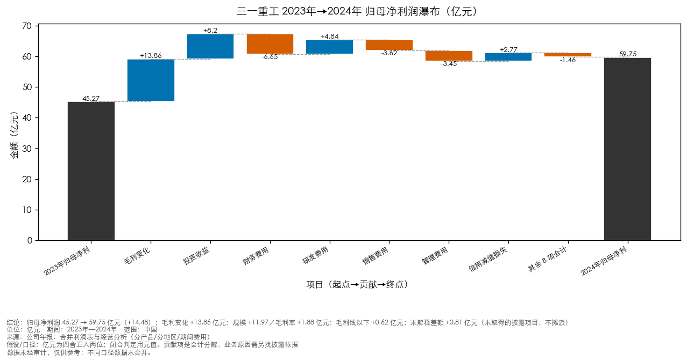
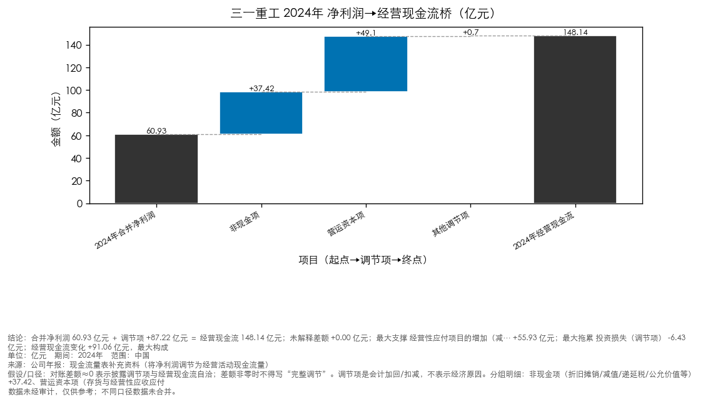
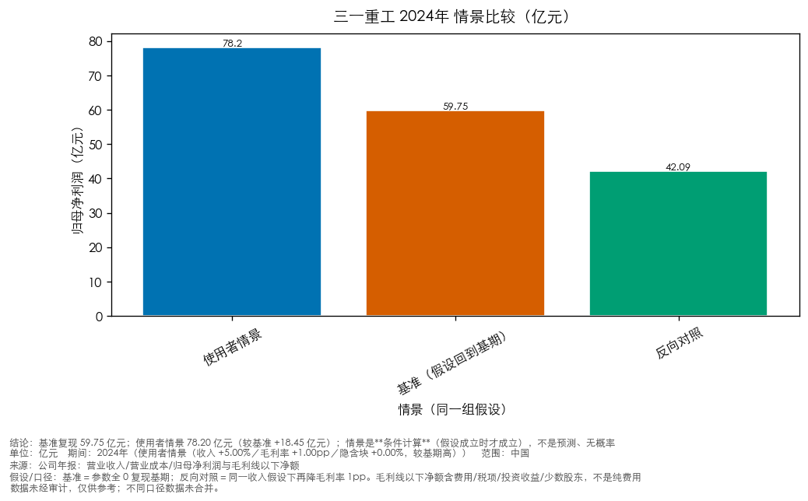

> **未验收草稿：验收未通过（overall=fail）**
> 本次交付没有取得针对该版正文的验收通过，不得视为已通过，也不得直接用于对外发布或审批。

> **研究状态：研究草稿／待补原始披露**——必答问题未完成（2/3）：收入变化的量价与结构依据、利润变化的分解（其中部分覆盖 2 项：收入变化的量价与结构依据[已取得部分构成]、利润变化的分解[已取得部分构成]）；1 条肯定结论处于未证实状态（未支持/部分支持/待核查）（数字与格式的机器验收不因此改变；本条说的是**研究**是否就绪）

> **评审状态：评审未完成（降级）** —— 未执行或未完成评审。
> 本交付物未取得绑定计划版本的评审 PASS，须经人工复核后方可使用。

---

# 三一重工 经营分析简报（2023–2024 年度）

**主体**：三一重工（600031.SH）　**期间**：2023–2024 年度　**口径**：合并　**资料截止**：2025-04-30

> 报表口径：合并；数据时效：截至 2025-04-30；单位：元。
> 来源：正文引用 **1** 条（编号见『参考来源』）；另有 0 条候选材料未采用（不编号、不进正文，只留在内部审计）。

## 三项主判断（先看这里）

> 以下三条由**已验证运行**与**已准入披露**驱动；每条都写明了「什么读数会削弱它」。完整七段式（原句/位置/替代解释/缺口）见`analysis/analysis_detail.md`。

1. 现金变化**主要由营运资本（占用与时点）构成**，其持续性是关键（已发生（读数））
   - 关键读数：经营现金流变化（**间接法**：净利润＋调节项，独立对账）+91.06 亿元：合并净利润项 +14.86 亿元（推动）；营运资本项 +79.77 亿元（推动）；其他调节项 -4.10 亿元（拖累）
   - 关键读数：方向：现金改善**主要由营运资本（占用与时点）构成**（营运资本项 +79.77 亿元）；合并净利润项 +14.86 亿元**同向推动**；其他调节项 -4.10 亿元是**拖累**
   - 依据：发行人归因（原句）·第 19 页 · 小节：第三节 管理层讨论与分析 > 五、报告期内主要经营情况 > (4).研发人员构成发生重大变化的原因及对公司未来发展的影响 > 5、 现金流（字符 17571-17836）
   - 会削弱它的读数：下一期经营/投资活动现金流与应收/应付/存货绝对额
2. 产品/区域结构是**同一个口径的不同切法**：降幅差说明结构在起作用（已发生（读数））
   - 关键读数：分产品切法：混凝土机械 -3.69 亿元、桩工机械 -0.00 亿元、其他 +0.12 亿元、路面机械 +1.19 亿元、起重机械 +5.81 亿元、挖掘机械 +11.39 亿元
   - 关键读数：分地区切法：国内 -1.95 亿元、国际 +16.74 亿元
   - 会削弱它的读数：下一期分产品/分地区收入的降幅差是否收敛
3. 现金跃升有**真实收支**支撑，但主要不来自利润增长（已发生（读数））
   - 关键读数：**直接法**（收付实现）：销售收现变化 +44.22 － 采购付现变化 -73.90 ＝ 两行净贡献 +118.12 亿元；其余经营活动收支 -27.06 亿元（＝ΔOCF −两行净贡献，含税费/薪酬/其他经营收支，**不含**利润口径的净利项）
   - 关键读数：**间接法**（净利润＋调节项，独立对账、**不与直接法相加**）：ΔOCF +91.06 亿元 ＝ 合并净利润项 +14.86 亿元 ＋ 营运资本项 +79.77 亿元 ＋ 其他调节项 -3.57 亿元；现金跃升主要不是利润带来的
   - 依据：披露原句·PDF 第 97 页 · 合并现金流量表 · 行「销售商品、提供劳务收到的现金 82,694,250 78,272,597」
   - 会削弱它的读数：下一期采购付现是否反弹（反弹**且**销售收现增量不足抵消，才削弱现金改善的持续性；单独反弹不足以作必然结论）

## 关键判断与下一步
- **营业收入同比增长 6.22%（2024 年 77773391000.0元）**
  - 意义：决定后续所有经营判断的分母：收入是量、价、结构三者共同作用的结果，不拆开就分不清是需求走弱、结构下移还是主动调整。
  - 依据：量价/结构数据（分解覆盖）；覆盖：部分；来源 [1]；经营驱动运行：利润表明细；经营驱动运行：分段切法；证据性质：发行人口径的量化分解（未独立验证）
  - 边界：量价/结构数据来自发行人披露的收入构成与产量销量表（各组与表内「营业收入合计」分别闭合）；各因素（量、价、结构）的**贡献度**未拆分，管理层的定量说明也未给出；吨价为推算、不等于披露价格，也不能单独证明提价
  - 下一步：确认研究对象类型（金融 / 非金融）、收入构成与量价拆分、主要客户与销售模式变化（补到后会怎样改变判断见附录『逐问题资料计划』）
- **归母净利润同比增长 31.98%（2024 年 5975451000.0元）；金额变化：归母净利润变化 +1.448e+09元、毛利润变化 +1.38576e+09元、毛利线以下净额变化 +6.224e+07元（= Δ归母净利润 − Δ毛利；含费用、税项、非经营性项目与少数股东等，未取得明细前不拆解到具体科目）**
  - 意义：决定盈利质量与可持续性：增幅是否由毛利端造成、还是被费用/税项/非经营性项目放大，直接改变对客户偿债与分红能力的看法。
  - 依据：量价/结构数据（分解覆盖）；覆盖：部分；来源 [1]；经营驱动运行：利润表明细；经营驱动运行：分段切法；证据性质：发行人口径的量化分解（未独立验证）
  - 边界：毛利端与期间费用取自发行人毛利率表与费用明细（各自有定位）：毛利额为**推导量**（上期由披露同比反推），各分组是同一笔收入的不同切法、不做跨组合计；已取得 毛利端（金额变化与规模/毛利率两效应）、毛利线以下科目明细；缺 利润表明细未取到：fair_value_change、利润表明细未取到：asset_disposal_income；税项与非经常性损益未取得前，不把差额归到任何一项；披露按销售模式/产品等分组的毛利额与合并利润表毛利是**两个切法**（金额会有小幅差异），金额分解统一用合并口径，不把两个切法的数混算
  - 下一步：确认研究对象类型（金融 / 非金融）、毛利率构成、期间费用与非经常性损益（补到后会怎样改变判断见附录『逐问题资料计划』）
- **经营活动现金流净额同比增长 159.53%（2024 年 14814278000.0元）。经营现金流对归母净利润的覆盖 2024 年为 247.92%（2023 年 126.08%，上升）**
  - 意义：决定利润的现金含量与短期偿付基础：利润率与覆盖率的机械关系容易被读成「回款改善」，需要现金来源结构才能判断。
  - 依据：两期事实的关系可复算（计算自披露数值）；覆盖：完整；来源 [1]；第 15 页 · 小节：第三节 管理层讨论与分析 > 五、报告期内主要经营情况 > (一) 主营业务分析 > 1、 利润表及现金流量表相关科目变动分析表（字符 14305-14891）；证据性质：计算自披露数值（非独立核实）
  - 边界：覆盖率上升系经营现金流增长快于归母净利润；单期比率不构成趋势判断；来源结构未核实前，不判断现金流质量
  - 下一步：确认研究对象类型（金融 / 非金融）、现金流量表附注、营运资本变化（应收/应付/存货）（补到后会怎样改变判断见附录『逐问题资料计划』）

## 关键发现
- 营业收入 2024 年为 77773391000.0元（2023 年 73221725000.0元），同比 6.22%
- 归母净利润 2024 年为 5975451000.0元（2023 年 4527451000.0元），同比 31.98%
- 经营活动现金流净额 2024 年为 14814278000.0元（2023 年 5708220000.0元），同比 159.53%
- 其余 1 项读数与全部同比/比率见『财务对照』与『同比与比率（可复算）』（本节不重复）。

## 研究问题与下一步
- **收入变化的量价与结构依据**：营业收入同比增长 6.22%（完整读数见『关键发现』）
  - 材料：**分解覆盖（部分）**：2024年较2023年：分产品毛利变化（切法：分产品） +13.86 亿元；2024年较2023年：分地区毛利变化（切法：分地区） +13.86 亿元（来源 [1]；经营驱动运行：利润表明细；经营驱动运行：分段切法）；证据性质：发行人口径的量化分解（未独立验证）；边界：量价/结构数据来自发行人披露的收入构成与产量销量表（各组与表内「营业收入合计」分别闭合）；各因素（量、价、结构）的**贡献度**未拆分，管理层的定量说明也未给出；吨价为推算、不等于披露价格，也不能单独证明提价；下一步：确认研究对象类型（金融 / 非金融）、收入构成与量价拆分、主要客户与销售模式变化
- **利润变化的分解**：归母净利润同比增长 31.98%（完整读数见『关键发现』）
  - 材料：**分解覆盖（部分）**（来源 [1]；经营驱动运行：利润表明细；经营驱动运行：分段切法）；证据性质：发行人口径的量化分解（未独立验证）；边界：毛利端与期间费用取自发行人毛利率表与费用明细（各自有定位）：毛利额为**推导量**（上期由披露同比反推），各分组是同一笔收入的不同切法、不做跨组合计；已取得 毛利端（金额变化与规模/毛利率两效应）、毛利线以下科目明细；缺 利润表明细未取到：fair_value_change、利润表明细未取到：asset_disposal_income；税项与非经常性损益未取得前，不把差额归到任何一项；披露按销售模式/产品等分组的毛利额与合并利润表毛利是**两个切法**（金额会有小幅差异），金额分解统一用合并口径，不把两个切法的数混算；下一步：确认研究对象类型（金融 / 非金融）、毛利率构成、期间费用与非经常性损益、少数股东损益
- **现金变化与利润覆盖的关系**：经营活动现金流净额同比增长 159.53%（完整读数见『关键发现』）
  - 材料：未取得对应披露，**观察成立、原因待证**（已取材料：第 15 页 · 小节：第三节 管理层讨论与分析 > 五、报告期内主要经营情况 > (一) 主营业务分析 > 1、 利润表及现金流量表相关科目变动分析表（字符 14305-14891） 只含读数/背景，不构成原因支持）；证据性质：计算自披露数值（非独立核实）；边界：覆盖率上升系经营现金流增长快于归母净利润；单期比率不构成趋势判断；来源结构未核实前，不判断现金流质量；下一步：确认研究对象类型（金融 / 非金融）、现金流量表附注、营运资本变化（应收/应付/存货）、税费与结算条款

## 量价与结构（发行人披露）

- 出处：经营驱动运行：利润表明细；经营驱动运行：分段切法

## 业务背景
- □适用 √不适用 三一重工股份有限公司 2024 年年度报告 3 / 255 目录 第一节 释义 ...............................................................................................................……（节选，原文见出处定位）[1]
  - 出处：第 2 页 · 小节：十一、 其他（字符 788-2282）
- 报告期内，公司产品竞争力持续增强，市场份额持续提升。 挖掘机械：销售收入303.74亿元，国内市场上连续14 年蝉联销量冠军。 混凝土机械：销售收入143.68亿元，连续14年蝉联全球第一品牌。电动搅拌车连续四年保 持国内市占率第一,销售额首次超过燃油搅拌车。 起重机械：销售收入131.15亿元，全球市占率大幅上升。……（节选，原文见出处定位）[1]
  - 出处：第 8 页 · 小节：第三节 管理层讨论与分析 > 一、经营情况讨论与分析 > （一）核心竞争力持续提升（字符 6859-7101）
- 公司推行“集团主导、本土经营、服务先行”的海外经营策略，国际竞争力持续提升，国际 市场连续多年实现高速增长。报告期内，公司实现国际主营业务收入485.13亿元，同比增长[1]
  - 出处：第 9 页 · 小节：第三节 管理层讨论与分析 > 一、经营情况讨论与分析 > （三）全球化提质加速（字符 7356-7453）

## 财务对照
| 指标 | 2023 | 2024 | 口径 | 来源 |
|---|---|---|---|---|
| 营业收入 | 73221725000.0元 | 77773391000.0元 | 合并 | [1] |
| 归母净利润 | 4527451000.0元 | 5975451000.0元 | 合并 | [1] |
| 经营活动现金流净额 | 5708220000.0元 | 14814278000.0元 | 合并 | [1] |
| 总资产 | 151203358000.0元 | 152145076000.0元 | 合并 | [1] |
| 总负债 | 82041325000.0元 | 79143477000.0元 | 合并 | [1] |

**同比与比率（可复算）**：
- 营业收入同比 2024年同比：6.22%（(77773391000.0 - 73221725000.0) / 73221725000.0 * 100）
- 归母净利润同比 2024年同比：31.98%（(5975451000.0 - 4527451000.0) / 4527451000.0 * 100）
- 经营活动现金流净额同比 2024年同比：159.53%（(14814278000.0 - 5708220000.0) / 5708220000.0 * 100）
- 归母净利率 2023年：6.18%
- 归母净利率 2024年：7.68%
- 经营现金流对归母净利润的覆盖 2023年：126.08%
- 经营现金流对归母净利润的覆盖 2024年：247.92%
- 资产负债率 2023年：54.26%
- 资产负债率 2024年：52.02%
- gross_profit_revenue_scale_effect 2024年较2023年：1197380857.82元
- gross_profit_margin_effect 2024年较2023年：188379142.18元
- 金额变化（与利润率变化分开呈现）见附录『金额变化（可复算）』。

- 比率适用条件与适用范围见附录（主文不重复口径说明）。

## 图表

图 1：归母净利润同比变化由哪些金额构成？；归母净利润 45.27 → 59.75 亿元（+14.48）；毛利变化 +13.86 亿元；规模 +11.97／毛利率 +1.88 亿元；毛利线以下 +0.62 亿元；未解释差额 +0.81 亿元（未取得的披露项目，不摊派）（数据同『财务对照』表与底稿）

图 2：合并净利润到经营现金流之间的调节桥在哪里？；合并净利润 60.93 亿元 ＋ 调节项 +87.22 亿元 ＝ 经营现金流 148.14 亿元；未解释差额 +0.00 亿元；最大支撑 经营性应付项目的增加（减… +55.93 亿元；最大拖累 投资损失（调节项） -6.43 亿元；经营现金流变化 +91.06 亿元，最大构成 营运资本项变化（存货/经营性应收… +79.77 亿元（数据同『财务对照』表与底稿）

图 3：同一组假设下，基期、使用者情景与反向对照差多少？；基准复现 59.75 亿元；使用者情景 78.20 亿元（较基准 +18.45 亿元）；情景是**条件计算**（假设成立时才成立），不是预测、无概率（数据同『财务对照』表与底稿）

## 分析
本报告由确定性分析链装配：利润、现金与情景三段见『分析摘要』与『经营驱动分析正文』；底稿与来源随包提供。

## 分析摘要
- **利润**：2023年→2024年 归母净利润变化 +14.48 亿元；其中毛利变化 +13.86 亿元（收入规模 +11.97／毛利率 +1.88 亿元），毛利线以下 +0.62 亿元；毛利率 26.18% → 26.43%（+0.25pp）
- **结构**：分产品切法：挖掘机械毛利变化（含推算输入） +11.39 亿元、起重机械毛利变化（含推算输入） +5.81 亿元；其余 4 项 -2.39 亿元；未分类差额 -0.96 亿元；分地区切法：国际毛利变化（含推算输入） +16.74 亿元、国内毛利变化（含推算输入） -1.95 亿元；未分类差额 -0.93 亿元
- **现金**：2024年 合并净利润 60.93 亿元经调节项 +87.22 亿元后为经营现金流 148.14 亿元（未解释差额 +0.00 亿元）；现金变化 +91.06 亿元，最大构成 营运资本项变化（存货/经营性应收/经营性应付） +79.77 亿元；最大支撑 经营性应付项目的增加（减少以“－”号填列） +55.93 亿元、最大拖累 投资损失（调节项） -6.43 亿元

### 分析摘要选择说明
- 说明：本版没有人工选择记录，默认采用**经营研究组合**（经营驱动／现金调节桥／条件情景）各一条已验证运行；可在分析工作台显式选择某一条

- 完整分析卡（每个读数带 run/output/component_id 与规则）见 `analysis/analysis_cards.md`；运行记录、数据集与计划在包内 `analysis/`。

## 经营驱动分析正文（三一重工 2023年→2024年）

> 本节由 `financial_analysis` 从**已验证运行**装配：每个数字都能回查到运行与输出标识（见文末『附：底稿索引』），图、卡、底稿共用同一次运行。未取到的披露项留在「未解释差额」，既不摊派也不当零。

- 完整七段式研究判断（全部原句/位置/替代解释/缺口）见 `analysis/analysis_detail.md`（随交付包提供）；主文只给三项主判断。

### 一、结论（先看这三条）
1. **利润**：2023年→2024年 归母净利润变化 +14.48 亿元；其中毛利变化 +13.86 亿元（收入规模 +11.97／毛利率 +1.88 亿元），毛利线以下 +0.62 亿元；毛利率 26.18% → 26.43%（+0.25pp）
2. **结构**：分产品切法：挖掘机械毛利变化（含推算输入） +11.39 亿元、起重机械毛利变化（含推算输入） +5.81 亿元；其余 4 项 -2.39 亿元；未分类差额 -0.96 亿元；分地区切法：国际毛利变化（含推算输入） +16.74 亿元、国内毛利变化（含推算输入） -1.95 亿元；未分类差额 -0.93 亿元
3. **现金**：2024年 合并净利润 60.93 亿元经调节项 +87.22 亿元后为经营现金流 148.14 亿元（未解释差额 +0.00 亿元）；现金变化 +91.06 亿元，最大构成 营运资本项变化（存货/经营性应收/经营性应付） +79.77 亿元；最大支撑 经营性应付项目的增加（减少以“－”号填列） +55.93 亿元、最大拖累 投资损失（调节项） -6.43 亿元
4. **反向情景**（单因素反推，两把杠杆同一目标；不表示可达）：（目标归母净利 45.27 亿元）收入侧需 -7.0440%、毛利率侧需 24.5694%（较基期 -1.86pp）

### 二、利润变化：金额分解
| 项目 | 金额（亿元） | 占归母净利变化 |
|---|---:|---:|
| 投资收益 | +8.20 | 56.6% |
| 财务费用 | -6.65 | -45.9% |
| 研发费用 | +4.84 | 33.4% |
| 销售费用 | -3.62 | -25.0% |
| 管理费用 | -3.45 | -23.9% |
| 信用减值损失 | +2.77 | 19.1% |
| 其余 8 项合计（未单列） | -1.46 | -10.1% |

- 占比 ＝ 该项目 ÷ 归母净利变化：变化为负时，**正贡献显示为负占比**（符号是算术结果，不是方向判断）。
- 对称分解（交互项均分，代入顺序无关）：毛利变化 +13.86 亿元 ＝ 规模效应 +11.97 ＋ 毛利率效应 +1.88 亿元
- 分产品切法：挖掘机械毛利变化（含推算输入） +11.39 亿元、起重机械毛利变化（含推算输入） +5.81 亿元、混凝土机械毛利变化（含推算输入） -3.69 亿元；其余 3 项 +1.31 亿元；未分类差额 -0.96 亿元；每种切法各自覆盖同一口径，**不可跨切法相加**
- 分地区切法：国际毛利变化（含推算输入） +16.74 亿元、国内毛利变化（含推算输入） -1.95 亿元；未分类差额 -0.93 亿元；每种切法各自覆盖同一口径，**不可跨切法相加**

### 三、披露支持与来源定位
| 读数 | 期间 | 披露值 | 来源位置（原件） |
|---|---|---:|---|
| 营业收入 | 2024年 | 77,773,391,000.00元 | [PDF 第 94 页 · 合并利润表 · 行「其中：营业收入 七、54 77,773,391 73,221,725」](http://static.cninfo.com.cn/finalpage/2025-04-18/1223129214.PDF#page=94) |
| 营业收入 | 2023年 | 73,221,725,000.00元 | [PDF 第 94 页 · 合并利润表 · 行「其中：营业收入 七、54 77,773,391 73,221,725」](http://static.cninfo.com.cn/finalpage/2025-04-18/1223129214.PDF#page=94) |
| 营业成本 | 2024年 | 57,216,959,000.00元 | [PDF 第 94 页 · 合并利润表 · 行「其中：营业成本 七、54 57,216,959 54,051,053」](http://static.cninfo.com.cn/finalpage/2025-04-18/1223129214.PDF#page=94) |
| 营业成本 | 2023年 | 54,051,053,000.00元 | [PDF 第 94 页 · 合并利润表 · 行「其中：营业成本 七、54 57,216,959 54,051,053」](http://static.cninfo.com.cn/finalpage/2025-04-18/1223129214.PDF#page=94) |
| 归母净利润 | 2024年 | 5,975,451,000.00元 | [PDF 第 95 页 · 合并利润表 · 行「1.归属于母公司股东的净利润(净亏损」（标签折行，金额在下一行）](http://static.cninfo.com.cn/finalpage/2025-04-18/1223129214.PDF#page=95) |
| 归母净利润 | 2023年 | 4,527,451,000.00元 | [PDF 第 95 页 · 合并利润表 · 行「1.归属于母公司股东的净利润(净亏损」（标签折行，金额在下一行）](http://static.cninfo.com.cn/finalpage/2025-04-18/1223129214.PDF#page=95) |
| 净利润（合并） | 2024年 | 6,092,538,000.00元 | [PDF 第 95 页 · 合并利润表 · 行「五、净利润(净亏损以“-”号填列) 6,092,538 4,606,110」](http://static.cninfo.com.cn/finalpage/2025-04-18/1223129214.PDF#page=95) |
| 净利润（合并） | 2023年 | 4,606,110,000.00元 | [PDF 第 95 页 · 合并利润表 · 行「五、净利润(净亏损以“-”号填列) 6,092,538 4,606,110」](http://static.cninfo.com.cn/finalpage/2025-04-18/1223129214.PDF#page=95) |
| 经营活动现金流净额 | 2024年 | 14,814,278,000.00元 | [PDF 第 5 页 · 合并现金流量表 · 行「经营活动产生的现金流量净额 14,814,278 5,708,220」](http://static.cninfo.com.cn/finalpage/2025-04-18/1223129214.PDF#page=5) |
| 经营活动现金流净额 | 2023年 | 5,708,220,000.00元 | [PDF 第 5 页 · 合并现金流量表 · 行「经营活动产生的现金流量净额 14,814,278 5,708,220」](http://static.cninfo.com.cn/finalpage/2025-04-18/1223129214.PDF#page=5) |
| 毛利润 | 2024年 | 20,556,432,000.00元 | [2024年 合并：营业收入 − 营业成本](http://static.cninfo.com.cn/finalpage/2025-04-18/1223129214.PDF) |

- 上表是**用于计算的关键读数**及其原件位置；完整事实身份清单（fact_id → 表/页/行）见`analysis/analysis_detail.md` 的『附：底稿索引』与包内 `analysis/` 目录。

### 四、替代解释（会改变判断）
- **实际税率**：13.36% → 11.80%（-1.56pp）。本年所得税 8.15 亿元；按上年实际税率折算为 9.23 亿元——税率下降本身让税负少吃掉 1.08 亿元。这是**被动结果**（利润变化会改变税基），既不表示经营改善，也不能直接当成业务原因
- **投资收益** +8.20 亿元：需按公司披露的**非经常性损益/扣非归母净利**与业务实质判断是否经常性：不按指标名统一剔除，也不据此制造“正常化利润”
- **结构 vs 价格**：分段与均价都是**同一口径的分解**：均价由「该口径收入/销量」算出，含产品结构混合，不能直接命名“提价效果”；分产品/分行业/分地区/分销售模式是不同切法，不可相加
- **口径提醒**：以上都是会计分解；要说成「业务原因」必须另有披露依据（管理层讨论、分部附注、销量与结算条款），否则只能写「观察成立、原因待证」。
- **非经常性损益对照**：判断投资收益/公允价值这类项目是否经常性，以公司披露的**非经常性损益明细与扣非归母净利**为准（分类取决于事项经济性质、行业与业务模式，并考虑持续性）；本报告**不按指标名统一剔除**，也不据此构造「正常化利润」。
  - 本次材料里未取到非经常性损益明细/扣非归母净利：该对照留待补料后再做

### 四之二、主要贡献的披露支持（原句＋边界＋反证＋观察指标）
- **营运资本项变化（存货/经营性应收/经营性应付） +79.77 亿元**（会计分解）
  - 披露原句：公司始终坚持“高质量发展”经营原则，坚持“三服从”，即规模服从效益、效益服从品 牌、品牌服从价值观。加强存货与货款管理，鼓励研发创新，提升产品竞争力，进一步改善盈利 能力。
  - 出处：第 29 页 · 小节：第三节 管理层讨论与分析 > 六、公司关于公司未来发展的讨论与分析 > (三)经营计划 > 1、坚持高质量发展（字符 27375-27474）
  - 支持到哪里：该披露与这项金额**方向一致或同期出现**；金额来自调节表、段落来自管理层讨论，**不构成因果已证明**
  - 反证/替代解释：占用与时点口径：应付增加可能只是结算节奏或票据
  - 后续观察指标：下期应付/应收/存货绝对额与周转天数、票据与预收变动
- **投资收益 +8.20 亿元**（会计分解）
  - 披露支持：本次材料里**没有**与「投资收益/联营/合营」相关的段落（未取到或未准入）：这一项只作金额分解
  - 反证/替代解释：是否经常性要看公司非经常性损益披露与业务实质，不按指标名剔除
  - 后续观察指标：下期投资收益构成（联营/合营/理财）、非经常性损益与扣非归母净利
- **财务费用 -6.65 亿元**（会计分解）
  - 披露原句：√适用 □不适用 单位：千元 币种：人民币 项目 本期金额 上年同期金 额 同比增 加（%） 变动原因 财务费用 201,776 -462,936 143.59 主要系汇兑损益影响。 投资收益 643,008 -177,082 463.11 主要系处置远期外汇合约收益增加。 公允
  - 出处：第 18 页 · 小节：第三节 管理层讨论与分析 > 五、报告期内主要经营情况 > (6). 主要销售客户及主要供应商情况 > 3、 费用（字符 16775-17075）
  - 支持到哪里：该披露与这项金额**方向一致或同期出现**；金额来自调节表、段落来自管理层讨论，**不构成因果已证明**
  - 反证/替代解释：财务费用含利息收支、汇兑损益与手续费：原因以披露原句为准（三一 2024 年披露为汇兑损益），不默认套利息口径
  - 后续观察指标：下期财务费用明细附注（利息/汇兑/手续费各自金额）、外币敞口与远期外汇合约、有息负债与利率环境

### 五、现金形成与反向情景
- **经营现金流变化**：+91.06 亿元 ＝ 合并净利润变化 +14.86 亿元、非现金项变化（折旧摊销/减值/递延税/公允价值等） -4.10 亿元、营运资本项变化（存货/经营性应收/经营性应付） +79.77 亿元、其他调节项变化 +0.53 亿元、对账差额变化（未取得的披露调节项） +0.00 亿元
  - **方向**：现金改善**主要由营运资本（占用与时点）构成**（营运资本项 +79.77 亿元）；合并净利润项 +14.86 亿元**同向推动**
  - 这是**会计构成**：营运资本项变化可能只是时点与资金占用，能不能持续须看应付/应收/存货明细与结算条款；投资收益等是否非经常要看公司非经常性损益披露，不按指标名剔除
- **2024年调节表**：合并净利润 +60.93 亿元、非现金项（折旧摊销/减值/递延税/公允价值等） +37.42 亿元、营运资本项（存货/经营性应收/经营性应付） +49.10 亿元、其他调节项 +0.70 亿元、未解释差额（未取得的披露调节项） +0.00 亿元
- **2023年调节表**：合并净利润 +46.06 亿元、非现金项（折旧摊销/减值/递延税/公允价值等） +41.52 亿元、营运资本项（存货/经营性应收/经营性应付） -30.67 亿元、其他调节项 +0.17 亿元、未解释差额（未取得的披露调节项） +0.00 亿元
- **辅助观察：现金缺口变化**（经营现金流−合并净利润）：+76.20 亿元 ＝ 经营现金流变化（ΔOCF） +91.06 亿元、合并净利润变化（取负：利润少→缺口小） -14.86 亿元；缺口缩小不等于现金变好
- **现金改善的可持续性（按组拆到单项）**
- **营运资本项（存货/经营性应收/经营性应付）**：合计 +79.77 亿元（占现金变化 87.6%）；主要单项：经营性应付项目的增加（减少以“－”号填列） +116.13 亿元、经营性应收项目的减少（增加以“－”号填列） -33.94 亿元、存货的减少（增加以“－”号填列） -2.42 亿元
  - 读法：这三项是**占用与时点**口径：应付增加可能只是结算节奏或票据，不等于账期延长；应收/存货的减少也可能是备货或确认节奏
  - 后续观察指标：下期存货、应收账款、应付账款的绝对额与周转天数；现金流量表附注里的票据与预收变动
- **非现金项（折旧摊销/减值/递延税等）**：合计 -4.10 亿元（占现金变化 -4.5%）；主要单项：投资损失（调节项） -8.20 亿元、财务费用（调节项） +5.42 亿元、信用减值损失（调节项） -4.36 亿元
  - 读法：非现金项是**会计加回**：减值计提与转回、递延税确认都会让这一组变大或变小，不直接代表现金改善
  - 后续观察指标：下期折旧摊销与减值明细、递延所得税附注；资产减值准备余额变化
- 对账差额≈0 表示披露调节项与经营现金流自洽；差额非零说明有调节项没取到，报告不得写“完整调节”
- **情景归母净利（收入 +5.00%／毛利率 +1.00pp）**：+78.20 亿元；基准复现 +59.75 亿元（差 +18.44 亿元）
- **毛利率侧反推**（收入固定基期；目标归母净利 45.27 亿元（上一期（2023年）归母净利：回到上年水平））：所需毛利率 24.5694%，与基期之差 -1.86pp
  - 收入侧反推（毛利率固定基期）：收入需变化 -7.0440% 才能达到同一目标（单因素反推，不表示可达）
  - 若先接受该档收入假设，则所需毛利率为 23.3994%（较基期 -3.03pp）——这是**两因素条件计算**，不是同一把杠杆

### 六、待核查问题（按影响排序）
1. 分段缺成本或收入：合并:与母公司报表同口径（不是分段切法）
2. 分段缺成本或收入：母公司:报表范围而不是分段维度（并表范围另有其表）
3. 利润表明细未取到：公允价值变动收益（`fair_value_change`）
4. 利润表明细未取到：资产处置收益（`asset_disposal_income`）
5. 未解释差额 +0.81 亿元：先补对应披露项目，不得摊到已列项目上

### 七、口径与限制
- 亿元为显示换算（两位小数）；闭合判定与占比用运行里的**元**值。
- 逐项贡献是**会计分解**：说明金额构成，不等于业务原因。
- 分产品/分行业/分地区/分销售模式是同一口径的**不同切法**，不可相加；每种切法的未分类差额单独列出。
- 均价由「该口径收入/销量」算出，含产品结构混合，不得命名「提价效果」。
- 现金桥起点是**合并净利润**（不是归母净利）；调节项是会计加回/扣减，不表示经济原因；资产负债表期末差只作旁证、不用于补桥。
- 反向阈值是**单因素反推**：给出「需要什么」，不表示可达、不是预测、无概率。
- 本节数字全部来自 `validated` 运行；某模型未通过验证时，本节不出现它的结论。

## 变化解释
**发生了什么（数据观察）**：
- 变化读数见开头『关键判断与下一步』与『关键发现』（本节只讲解释与边界，不重复数字）。

**管理层/附注的解释**：
- 单位：千元 币种：人民币 科目 本期数 上年同期数 变动比例（%） 营业收入 77,773,391 73,221,725 6.22 营业成本 57,216,959 54,051,053 5.86 财务费用 201,776 -462,936 143.59 经营活动产生的现金流量净额 14,814,278 5,708,220 159.53 投资活动产生的现金流量净额 -1,157,848 -……（节选，原文见出处定位）[1]
  - 出处：第 15 页 · 小节：第三节 管理层讨论与分析 > 五、报告期内主要经营情况 > (一) 主营业务分析 > 1、 利润表及现金流量表相关科目变动分析表（字符 14305-14891）
  - 归属：该段未单独解释上述变化的哪一项（不构成原因支持）；是否算「原因已取得」以『研究问题与下一步』逐问支持为准。
- √适用 □不适用 单位：千元 币种：人民币 项目 本期金额 上年同期金 额 同比增 加（%） 变动原因 财务费用 201,776 -462,936 143.59 主要系汇兑损益影响。 投资收益 643,008 -177,082 463.11 主要系处置远期外汇合约收益增加。 公允价值变动收益 109,558 21,149 418.03 主要系远期外汇合约公允价值变动。……（节选，原文见出处定位）[1]
  - 出处：第 18 页 · 小节：第三节 管理层讨论与分析 > 五、报告期内主要经营情况 > (6). 主要销售客户及主要供应商情况 > 3、 费用（字符 16775-17075）
  - 归属：该段未单独解释上述变化的哪一项（不构成原因支持）；是否算「原因已取得」以『研究问题与下一步』逐问支持为准。

**推断边界**：
- 两期数据只能说明这两期的变化，不能据此声称长期趋势；未取得同业、行情与关键假设资料，本简报不给出估值或目标价。

- 尚未证明的部分（需补材料）见『风险与核查』，本处不重复。

## 风险与核查
- **公司已在本报告中详细描述存在的风险事项，敬请查阅第三节管理层讨论与分析中公司关于 公司未来发展的讨论与分析中可能面对的风险因素及对策部分的内容。**
  - 证据：来源 [1] 第 2 页 · 小节：十、 重大风险提示（字符 702-788）；改变判断的观察条件：若该风险出现缓释或加剧的公开证据（年报/公告更新），需修订判断；需补材料：最新年报/公告中的风险因素章节、相关事项的进展公告
- **报告期内，公司坚持高质量发展，经营质量进一步改善。 现金流大幅改善：2024年，公司经营活动产生的现金流量净额 148.14亿元，同比大幅增长 159.53%。 盈利能力大幅回升：由于国内外市场结构与产品结构的改善、降本增效措施的推进，公司报 告期间实现归属母公司净利润59.75亿元，同比增长31.98%。……（节选，**
  - 证据：来源 [1] 第 8 页 · 小节：第三节 管理层讨论与分析 > 一、经营情况讨论与分析 > （二）高质量发展卓有成效（字符 7101-7356）；改变判断的观察条件：若该风险出现缓释或加剧的公开证据（年报/公告更新），需修订判断；需补材料：最新年报/公告中的风险因素章节、相关事项的进展公告
- **√适用 □不适用**
  - 证据：来源 [1] 第 30 页 · 小节：第三节 管理层讨论与分析 > 六、公司关于公司未来发展的讨论与分析 > (四)可能面对的风险（字符 28511-28534）；改变判断的观察条件：若该风险出现缓释或加剧的公开证据（年报/公告更新），需修订判断；需补材料：最新年报/公告中的风险因素章节、相关事项的进展公告
- **经营活动现金流净额的变化原因尚不能证明**
  - 证据：未取得对应附注/管理层讨论证据；改变判断的观察条件：取得现金流量表附注、营运资本变化（应收/应付/存货）、税费与结算条款后，若显示的原因与本期变化方向不一致，需修订解释；需补材料：现金流量表附注、营运资本变化（应收/应付/存货）、税费与结算条款
- **归母净利润：已取得量价/结构数据（经营驱动运行：利润表明细；经营驱动运行：分段切法），分解覆盖：部分**
  - 证据：发行人披露的量价与结构数据已准入；各因素贡献度未拆分；改变判断的观察条件：取得毛利率构成、期间费用与非经常性损益、少数股东损益后，若显示的原因与本期变化方向不一致，需修订解释；需补材料：毛利率构成、期间费用与非经常性损益、少数股东损益
- **营业收入：已取得量价/结构数据（经营驱动运行：利润表明细；经营驱动运行：分段切法），分解覆盖：部分（2024年较2023年：分产品毛利变化（切法：分产品） +13.86 亿元；2024年较2023年：分地区毛利变化（切法：分地区） +13.86 亿元）**
  - 证据：发行人披露的量价与结构数据已准入；各因素贡献度未拆分；改变判断的观察条件：取得收入构成与量价拆分、主要客户与销售模式变化后，若显示的原因与本期变化方向不一致，需修订解释；需补材料：收入构成与量价拆分、主要客户与销售模式变化
- 另有 6 条同类核查项（底稿审计/材料清单）见附录。

- **结论边界**：本简报只覆盖上述期间的变化与缺口，不构成趋势判断、评级或投资建议。

**待核查主张（未与底稿事实绑定）**：
- 量价/结构数据来自发行人披露的收入构成与产量销量表（各组与表内「营业收入合计」分别闭合）；各因素（量、价、结构）的**贡献度**未拆分，管理层的定量说明也未给出；吨价为推算、不等于披露价格，也不能单独证明提价
- 毛利端与期间费用取自发行人毛利率表与费用明细（各自有定位）：毛利额为**推导量**（上期由披露同比反推），各分组是同一笔收入的不同切法、不做跨组合计；已取得 毛利端（金额变化与规模/毛利率两效应）、毛利线以下科目明细；缺 利润表明细未取到：fair_value_change、利润表明细未取到：asset_disposal_income；税项与非经常性损益未取得前，不把差额归到任何一项；披露按销售模
- 覆盖率上升系经营现金流增长快于归母净利润；单期比率不构成趋势判断；来源结构未核实前，不判断现金流质量

## 附录

## 参考来源
1. [cninfo_annual_report_tables](http://static.cninfo.com.cn/finalpage/2025-04-18/1223129214.PDF)
   - 来源类型：发行人年报/官方披露
   - 用于：财务事实、业务背景、变化解释、财务附注、风险因素、正文引用

### 资料范围与口径
- 研究期间：2023、2024
- 报表口径：合并（归母净利润属合并报表中归属母公司的部分；经营现金流为合并口径）
- 资料截至：2025-04-30
- 主体：三一重工（600031.SH）
- 阅读视角：投研视角（增长来源与盈利质量）（由用户在表单声明；不按公司名或机构名推断）
- 研究对象类型：未确定（与阅读视角无关）

### 字段位置与计算底稿
- 营业收入：结构化字段：年报.cninfo_annual_report_tables.revenue[1]
- 归母净利润：结构化字段：年报.cninfo_annual_report_tables.net_profit[1]
- 经营活动现金流净额：结构化字段：年报.cninfo_annual_report_tables.operating_cashflow[1]
- 总资产：结构化字段：年报.cninfo_annual_report_tables.total_assets[1]
- 总负债：结构化字段：年报.cninfo_annual_report_tables.total_liabilities[1]
- 计算底稿：working_paper.json（底稿（事实、同比/比率与算式））
- 计算底稿：financials.json（结构化取数原始载荷）
- 计算底稿：narrative_evidence.json（年报/公告正文的证据与定位）
- 计算底稿：report_structure.json（本简报的结构化对象）
- 定位说明：网页来源按小节与字符区间定位；年报 PDF 的页码待后续支持

### 逐问题资料计划
- **收入变化的量价与结构依据**：想确认 确认收入增幅的**量、价、结构**来源，以及各来源对增幅的贡献；现有证据分解覆盖充分（覆盖：部分）；缺 确认研究对象类型（金融 / 非金融）、收入构成与量价拆分、主要客户与销售模式变化；下一步补 确认研究对象类型（金融 / 非金融）、收入构成与量价拆分、主要客户与销售模式变化；补到后的影响：若量降价升，则判断偏向主动结构调整；若量价同降且库存上升，则偏向需求与渠道压力，风险语境随之改变
- **利润变化的分解**：想确认 确认利润增幅中**毛利端与毛利线以下**各占多少；现有证据分解覆盖充分（覆盖：部分）；缺 确认研究对象类型（金融 / 非金融）、毛利率构成、期间费用与非经常性损益、少数股东损益；下一步补 确认研究对象类型（金融 / 非金融）、毛利率构成、期间费用与非经常性损益、少数股东损益；补到后的影响：若主要是毛利端，客户盈利受产品结构驱动；若主要是毛利线以下，则需要查费用、减值或非经常性项目，'暂时性'判断要改写
- **现金变化与利润覆盖的关系**：想确认 确认经营现金流变化的**来源结构**（收现、营运资本、税费）；现有证据两期事实的关系可复算（计算自披露数值）（覆盖：完整）；缺 确认研究对象类型（金融 / 非金融）、现金流量表附注、营运资本变化（应收/应付/存货）、税费与结算条款；下一步补 确认研究对象类型（金融 / 非金融）、现金流量表附注、营运资本变化（应收/应付/存货）、税费与结算条款；补到后的影响：若现金下降来自营运资本占用增加，回款质量下降；若来自税费/结算节奏，短期偿付判断不变

### 金额变化（可复算）
- 营业收入变化 2024年较2023年：4551666000.0元（77773391000.0 - 73221725000.0）
- 归母净利润变化 2024年较2023年：1448000000.0元（5975451000.0 - 4527451000.0）
- 经营活动现金流净额变化 2024年较2023年：9106058000.0元（14814278000.0 - 5708220000.0）
- gross_profit_change 2024年较2023年：1385760000.0元
- net_profit_gross_gap_change 2024年较2023年：62240000.0元

### 比率适用条件
- 营业收入同比、归母净利润同比、经营活动现金流净额同比：两期均为正且基期不为零；基期为负时同比不具可比含义
- 营业收入变化、归母净利润变化、经营活动现金流净额变化、gross_profit_change：两期须同币种、同单位、同报表口径；任一不满足则不生成该变化值
- 归母净利率：分子为归母净利润、分母为营业收入（合并口径）；金融机构利润表结构不同，不适用
- 经营现金流对归母净利润的覆盖：分子分母**同为正**时才按数值判断『低于/相当/高于』（相当 = 相差 0.5 个百分点以内）；任一为负（亏损或经营净流出）或分母为零时**不套覆盖解释**——既不表示利润有现金支撑，也不表示高于或低于
- 资产负债率：总负债 ÷ 总资产；金融机构负债以存款为主，与其经营模式不可比
- net_profit_gross_gap_change：Δ归母净利（归母口径）− Δ毛利（合并口径）：两者归属层不同，差额还含费用、税项、非经营性项目与少数股东等，**只能作机械核对**（Δ归母净利 = Δ毛利 + Δ(归母净利 − 毛利)），不能据此判断某项费用或损益改善
- 适用范围：以上比率与同比适用于**非金融企业**的经营简报；金融机构作为研究对象时需要独立的指标配置，不得机械套用工业企业的比率。

### 图表元数据（内部标识）
| 图 | chart_id | 绑定指标 | 单位 | 期间 | 口径 |
|---|---|---|---|---|---|
| 1 | `aaa7455e1489-profit-waterfall` |  |  |  |  |
| 2 | `d89440e109b2-cash-bridge-cur` |  |  |  |  |
| 3 | `870551333d3d-scenario-outcome` |  |  |  |  |

### 其他核查项
- **1. 分段缺成本或收入：合并:与母公司报表同口径（不是分段切法）**（证据：由模型提出，尚未与底稿或年报证据绑定）
- **2. 分段缺成本或收入：母公司:报表范围而不是分段维度（并表范围另有其表）**（证据：由模型提出，尚未与底稿或年报证据绑定）
- **3. 利润表明细未取到：公允价值变动收益（`fair_value_change`）**（证据：由模型提出，尚未与底稿或年报证据绑定）
- **4. 利润表明细未取到：资产处置收益（`asset_disposal_income`）**（证据：由模型提出，尚未与底稿或年报证据绑定）
- **5. 未解释差额 +0.81 亿元：先补对应披露项目，不得摊到已列项目上**（证据：由模型提出，尚未与底稿或年报证据绑定）
- **按投研视角（增长来源与盈利质量）还需要核查的事项**（证据：视角由用户声明（不按公司名或机构名推断））

### 版本与验收状态
> 关键数据与来源清单由底稿生成（可复算）；『分析』一节为模型撰写。交付状态与验收结论见任务页与导出清单（未验收时按草稿处理）。

### 免责声明
本报告由织光 WeaveMind AI 自动生成，仅供参考，不构成任何投资建议；本报告未引用外部数据源，结论仅为模型知识，未经检索验证；据此操作风险自担。
