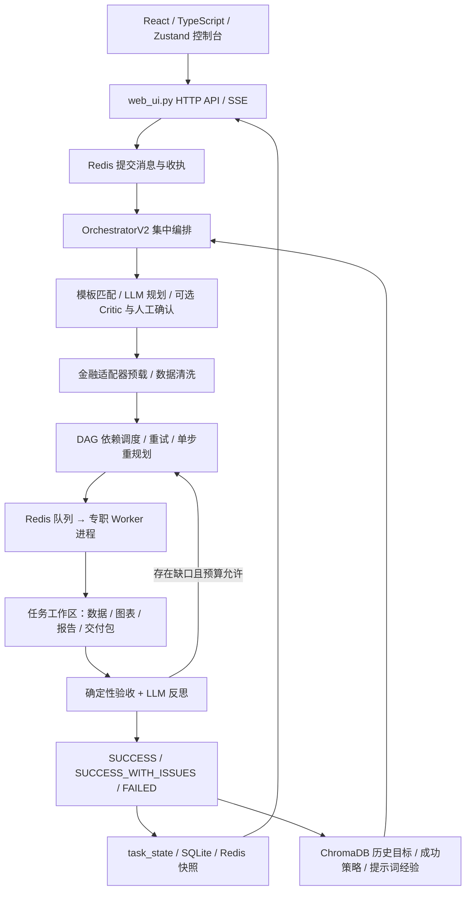

# 织光架构与代码审查（2026-09-14）

## 结论

织光的实际形态是**本地优先、集中编排、多进程执行的 AI 投研工作台**。它已有从目标输入、计划确认、数据获取、报告生成、质量验收到经验复用的完整产品链路，适合继续打磨个人与受信任团队的投研交付场景。

最值得保留的设计是“结构化金融数据预载 + 确定性验收 + 定向反思重做”。当前主要短板是这条链路的事实语义、持久化和任务身份还没有完全贯通。现阶段不宜把数字溯源率当作事实正确率，也不宜把项目分组当作多租户隔离。

本报告基于当前代码、部署文件、既有回归测试及本次定向复现；历史文档中的成功率和产品比较没有作为本次实测结果。

## 1. 系统实际如何运行



| 层次 | 关键实现 | 架构特点 |
|---|---|---|
| 交互层 | `frontend/src/App.tsx`、`stores/useTaskLive.ts` | React 18、Vite、TypeScript、Zustand；SSE 推送失败后降级为 2 秒轮询，共用快照合并逻辑 |
| API 层 | `web_ui.py` | Python 标准库 `ThreadingHTTPServer`；承担认证、任务、分享、配置、指标与报告渲染等功能 |
| 编排层 | `orchestrator_v2.py` | 自研集中编排器；模板与 LLM 规划结合；依赖步骤并行；失败重试、重规划、人工确认和反思迭代 |
| 执行层 | `worker_base.py`、`async_worker_base.py`、`workers/` | 启动器配置 11 个 Worker 进程；搜索、抓取、摘要、代码、文件、数据、训练、报告、打包及 ReAct 等职责 |
| 通信与状态 | `common.py`、`task_state.py`、`checkpointer.py` | Redis Pub/Sub 用于通知和提交，List 用于派发与结果；SQLite 存历史与检查点，Redis 存实时快照 |
| 金融领域层 | `adapters/`、`finance_plugin.py`、`structured_pipeline/` | 公司与市场解析、报告期选择、行情和财务适配、数据源健康与回退、金融工具目录 |
| 交付质量层 | `acceptance_checker.py`、`tool_contracts.py`、`validators/`、`chart_qa.py` | 工具返回契约、数字与主体检查、来源声明检查、交付完整性、报告规则版本及指纹 |
| 记忆与优化层 | `memory_manager.py`、`templates_pipeline.py`、`prompt_refinery.py`、`evolution_sandbox.py` | 经验检索、成功路径沉淀、提示词改进、搜索策略变体评测与审批 |
| 模型与运维层 | `llm_client.py`、`lora_client.py`、`launcher.py`、`worker_guardian.py` | 规划/执行/评测模型分工、主备切换、本地 LoRA 回退、进程监护、健康与成本记录 |

这是共享代码、配置、SQLite 与本地文件系统的多进程应用。Worker 已按职责分进程，但目前并不具备独立部署、统一任务租约和租户边界意义上的微服务架构。

## 2. 有价值的架构特点

1. **数据先落盘，再进入交付链。** 结构化财务与行情适配器减少对搜索片段的依赖，`financials.json`、清洗数据和图表文件可供验收复查。对投研产品，这是比单纯增加 Agent 数量更重要的积累。
2. **执行完成与质量达标分开。** `SUCCESS_WITH_ISSUES`、验收缺口、验收事件与规则指纹，使系统可以保留交付物并诚实表达不足。
3. **确定性规则与模型判断分工。** 规则负责可机械检查的交付要求，模型负责规划、解释与补缺口；模板又为重复任务提供更稳定的执行路径。
4. **故障降级做得较细。** 代码包含 Embedding 故障时的关键词检索、待写记忆补录、模型主备切换、行情回退、快照读取与检查点保存。需要逐项区分“便利性降级”和“安全边界降级”。
5. **交付物和过程都可观察。** 前端不仅展示最终报告，还能看计划、步骤、验收、图表、成本与历史。项目已有较强的产品工作流意识。
6. **优化机制有明确边界。** 当前“进化”主要是搜索策略的温度、过滤规则和摘要提示词变体，经评测、红线检查与审批后应用；LoRA 蒸馏训练是另一条显式管线。应分别衡量收益，避免把两者笼统描述为整个系统自动变聪明。

## 3. 优先修复的问题

### P1-1：数值出现即可命中，无法证明年份和指标归属正确

位置：`acceptance_checker.py:612` 的数字匹配循环、`acceptance_checker.py:814` 的主体检查。

本次用合成数据直接复现：

| 内容 | 文本 |
|---|---|
| 来源 | 贵州茅台 **2024 年营收 100 亿元、净利润 50 亿元、毛利率 80%** |
| 待验报告 | 贵州茅台 **2025 年营收 50 亿元、净利润 100 亿元、毛利率 80%** |
| 实际结果 | 数字检查 `pass=true`、溯源率 **100%（3/3）**；主体检查也 `pass=true` |

年份被改动，营收与净利润互换，仍能通过这两项检查。这里复现的是数字和主体检查，不代表所有报告检查都必然通过。

原因是主要匹配依据为数值与单位在来源文本中是否出现，未强制绑定“证券主体、报告期、指标、币种、统计口径”。同公司、同数值不能证明同一事实。

建议建立结构化事实记录：`entity_id + period + metric + currency + unit + basis + value + source_id`。报告中的数字引用具体事实 ID；计算值引用输入事实与计算表达式。补充错期、指标互换、同比/环比混淆、单季/累计混淆等反例。修复前应明确展示“数值匹配覆盖率”的局限。

### P1-2：数据库写入失败仍可返回“已接收”，数据库路径也不统一

位置：`task_state.py:39`、`task_state.py:107`、`task_state.py:162`、`orchestrator_v2.py:5502`。

`mark_queued()` 和 `record_completion()` 捕获所有异常后静默返回；调用者无法判断写入成功。`accept_task_request()` 依靠捕获异常区分 accepted/rejected，因此实际落库失败时也可能写入 accepted 收执。

本次把状态存储替换为没有任务表的内存数据库，结果为：`accepted=true`、收执 `accepted`，但读回任务为空。

此外，`web_ui.py:26` 与检查点使用 `REGISTRY_DB`，`task_state.py:39` 使用 `AGENTS_DB` 或源码目录下的 `agents.db`。Docker 仅设置 `REGISTRY_DB=/data/agents.db`，会让状态写者与 Web 历史表指向不同数据库；当前测试大多显式传临时路径，未覆盖这个部署默认值组合。

建议统一配置入口；关键持久化失败应返回明确失败或抛出异常；数据库事务提交成功后才发接收收执。终态落库成功后才能加入 `_finalized_tasks`。增加真实 SQLite 故障注入和环境变量集成测试。

### P1-3：应用镜像漏装本地模块，当前 Docker 路径无法完整启动

位置：`Dockerfile:15`、`orchestrator_v2.py:35`。

镜像仅复制顶层 Python 文件与 `workers/`，没有复制 `charts_pipeline/`、`structured_pipeline/`、`adapters/` 等必要包，也遗漏 `skills/`、`validators/`、`evals/` 等运行资源。

按 Dockerfile 的 Python 文件布局建立隔离目录并导入编排器，复现：

```text
ModuleNotFoundError: No module named 'charts_pipeline'
```

另一个部署边界是持久化：Compose 仅挂载 `/data`，但任务产物默认位于临时目录，配置和分享记录默认在应用目录。即使补全镜像模块，容器重建后仍可能出现历史记录保留、附件或配置丢失。

建议明确运行文件与资源清单，统一可变数据根目录；将配置、工作区、分享与审计等需要保留的内容纳入持久卷。CI 应增加镜像导入、服务就绪和容器重建后的产物读取检查。此次未构建或运行实际 Docker 镜像。

### P1-4：显式 Docker 沙箱失败后仍自动执行宿主 Python

位置：`code_sandbox.py:217`，特别是 Docker 失败后的本机 `subprocess.run` 分支。

即使显式设置 `CODE_EXECUTION_SANDBOX=docker`，Docker 不可用或镜像缺失时，代码仍降级为 `restricted` 并执行本机 Python。本次模拟 Docker 不可用，结果确认为 `sandbox_mode=restricted`、`sandbox_degraded=true`，调用目标为本机解释器。

`restricted` 的主要措施是剥离敏感环境变量，没有操作系统级文件和网络隔离。生成代码仍继承服务进程的文件访问能力，因此不能把它当作不可信代码的安全隔离边界。

建议将自动探测模式与强制隔离模式分开。强制 Docker 时不可降级，失败应中止代码执行；受信任本地模式则明确其权限边界。同步与异步执行入口需要一致处理。

### P1-5：任务身份未贯穿调用链，预算与用量统计不完整

位置：`llm_client.py:778`、`llm_client.py:1161`、`ws_helpers.py:120`、`orchestrator_v2.py:2694`、`async_worker_base.py:195`。

本次确认三处问题：

- 预算检查在 `call_llm` 等包装函数中，规划使用的 `LLMClient.call()` 可直接绕过。模拟已有调用次数达到上限后，显式预算检查阻止调用，但直接 `.call()` 仍调用了模拟请求函数并返回结果。
- `call_with_heartbeat()` 新建线程但没有复制 `ContextVar` 上下文。实测外层任务 ID 为 `review-root`，内部任务 ID 为空，影响规划阶段的任务用量归属。
- Worker 的上下文 ID 是随机步骤派发 ID，预算状态又是进程内字典；API 按根任务 ID 读台账，未在上述路径看到跨进程根任务预算与步骤账目的统一汇总。

建议显式贯穿 `root_task_id / step_id / dispatch_id`，在线程池与心跳线程复制上下文；在实际网络请求入口统一执行预算检查。跨进程预算使用原子预留与结算机制，并覆盖失败请求、重试、并发与备用模型调用。

## 4. 需要明确的产品与扩展边界

**权限是共享工作台角色控制。** `web_ui.py:2650` 允许 viewer 读取历史和报告，`_list_tasks()` 查询不按用户过滤；记忆集合的检索也未携带项目或用户过滤条件。对共享受信任团队可以是合理设计，面向互不信任的客户则需要任务、文件、会话、记忆、缓存和审计的统一租户隔离。

**中心模块仍然很大。** 当前 `orchestrator_v2.py` 为 5,632 行，`web_ui.py` 为 4,916 行，验收器为 1,949 行。虽已拆出图表与结构化数据 Mixin，业务规则仍大量集中于编排和 API 模块。建议先形成 `TaskExecutionContext`，再按任务服务、事实存储、执行调度、验收策略、交付渲染拆分；保留部署方式，逐步降低耦合。

**检查点不等于自动可靠恢复。** 已有检查点保存和按任务 ID 恢复能力；生产代码搜索未发现启动入口调用 `list_pending_checkpoints()`。任务提交使用 Pub/Sub，Worker 使用弹出即删除的队列，尚未形成持久化接收、租约、确认和幂等重放的完整协议。恢复与重试需防止文件写入、外部操作等副作用重复执行。

**本地部署不等于数据全程本地。** 规划、执行与 Embedding 可配置外部模型服务，部分摘要有本地 LoRA 路由。面向机构时应清晰描述各阶段的数据流向与配置选择。

**CI 与新增测试范围存在差距。** 当前 CI 显式执行部分测试脚本；本次运行的金融链、任务状态、快照、检查点、记忆降级、认证等多个独立文件尚未全部列入 CI。依赖安装主要读取宽泛下限版本的 `requirements.txt`，已有锁文件未进入主要安装链路。

## 5. 本次验证范围

- 对 Git 跟踪的 **130 个 Python 文件**做 AST 语法解析，全部通过。其中非 `test_` 前缀文件 111 个，共 45,392 行；此口径包含脚本与评测代码。
- 运行 `test_financial_chain`、`test_task_state`、`test_task_projection`、`test_checkpointer`、`test_memory_degradation`、`test_auth_audit`、`test_acceptance_adversarial`：**123 项，122 通过、1 跳过**。跳过项需要真实 Redis 快照往返。
- Python 3.14 在当前 Windows 受限执行环境中创建临时目录时存在 ACL 兼容问题。测试运行器仅调整了临时夹具目录的创建方式，未改测试断言或项目代码；调整前的目录权限错误不计为产品缺陷。
- 前端运行 `tsc --noEmit --project frontend/tsconfig.json`，通过。
- 定向复现了：错期/指标互换的溯源误判、数据库失败仍发成功收执、镜像模块遗漏、强制 Docker 降级、直接模型调用绕过预算和心跳线程任务上下文丢失。
- 没有启动完整服务、提交真实投研任务、训练模型或核验外部金融接口的当前可用性；测试通过不能替代真实数据端到端验收。

## 6. 建议推进顺序

先修复任务状态持久化、镜像部署、强制沙箱和全链预算，使运行行为可控；同时建立结构化财务事实与引用绑定，补上错期错指标对抗测试。之后收敛中心模块，并根据用户群明确共享团队权限或租户隔离。

下一轮质量验证建议固定在三条金融链路：单公司财报分析、多公司同口径比较、行情排行日报。分别记录事实正确性、来源覆盖、口径一致性、首次验收通过率、迭代次数、成本与交付耗时，才能判断模板、记忆与 LoRA 是否带来可重复的收益。
