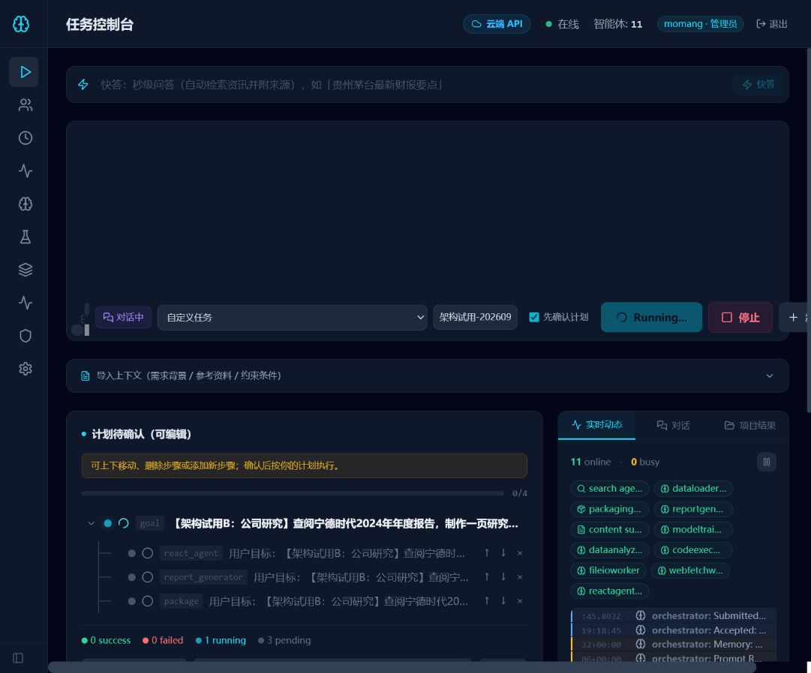
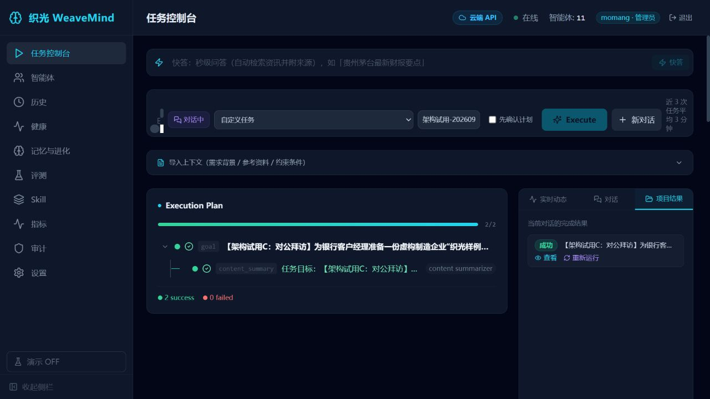
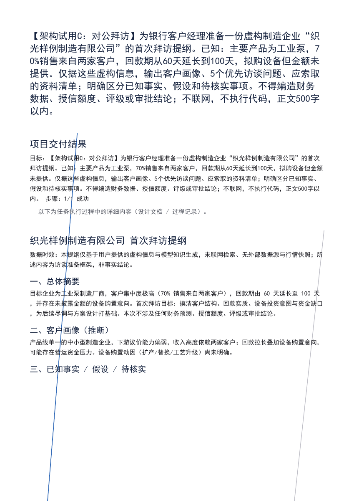
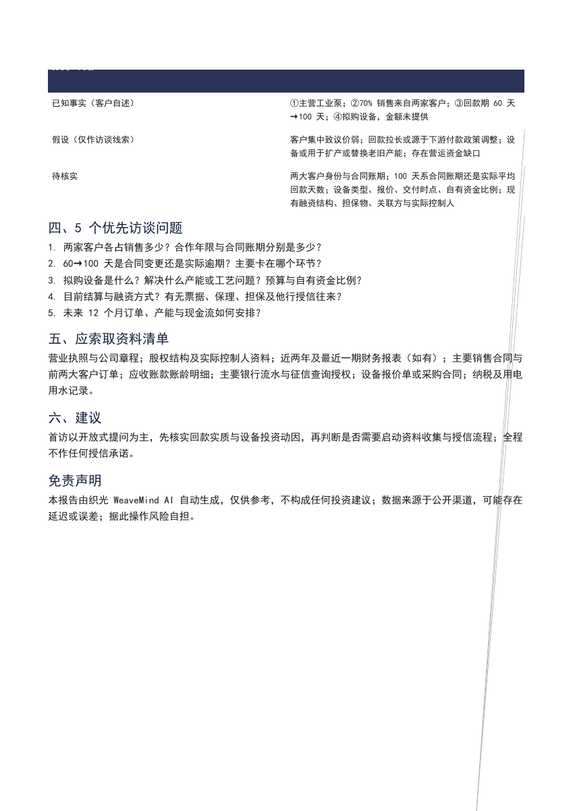

# 织光视觉与端到端实测报告

日期：2026-09-15；执行：Codex 架构监督。范围为本地个人配置的真实 UI 试用，面向个体工作者与银行投研/对公研究；不构成银行部署验收。实现仍交 DeepSeek。

## 结论

项目已经有可用的任务控制台、人工计划确认、智能体状态、历史/项目归档、报告阅读与 Markdown/PDF 下载链路。深色侧栏、青色状态和卡片分区整体统一，用户能观察任务分工。最值得保留的是“提出需求—确认计划—观察执行—查看交付—复核来源”的工作流。

当前主要瓶颈是交付可信度与成本控制：用户提供的数据被误判无来源、固定免责声明改变来源事实、反思用字数增长判断质量、简单任务出现多轮额外调用。前端仍更像开发者控制台；PDF 实际排版不合格。现阶段适合作为个人研究草稿工具和银行非敏感样例验证，不宜宣称银行生产可用。

## 环境与证据边界

- 测试地址 http://127.0.0.1:8080/；当前工作区 HEAD ab740b5 加未提交修复，非旧 8090 模拟实例。旧实例保留。
- 19:12:27 启动，19:12:37 启动器显示 16/16 服务存活；Redis 6379，WebUI PID 17052；前端为 frontend/dist 静态资源，未另起 Vite。后续进程快照见 evidence/20260915_live/process-after.json。
- 首次受限环境 Redis 因 Win32 error 5 无法创建 signal pipe；正常权限重试成功，未修改防火墙或安全设置。
- 用户自行登录；三个任务均经前端提交，使用虚构材料或公开年报需求。未读取凭据，未使用真实客户资料，未发布分享链接。
- dist/index.html SHA256：45C002D30D96DB2A239705AA91E0E648B3680D8CD49CC10DEF8FFC39862B8A41。
- 截图、UI 文本快照、启动日志、导出文件在 evidence/20260915_live。登录截图包含账户界面，不作为报告展示图。
- 本轮未重复全套测试、未验收 Docker 隔离/银行身份隔离/网络边界所有调用点；DeepSeek 自报测试不算本轮独立验收。

## 三个真实任务

| 场景 | 任务 ID | 输入约束与检验目标 | 观测结果 |
|---|---|---|---|
| A：内部材料口径核算 | ui-e80c33e6be | 两年虚构收入、成本、现金流；不联网、不执行代码；600字以内 | 首稿计算正确，来源验收为0%，反复修订并打包；前端停止后528秒收尾，显示FAILED，取消语义错误 |
| B：官方公司研究 | ui-5712f00b24 | 宁德时代2024年报，最多3个官方来源，三项财务指标及同比；800字以内 | 规划确认成功，检索未收敛；候选稿全部指标未核实，无官方原文；前端已请求停止反思，研究目标未通过 |
| C：银行对公拜访 | ui-6724969aff | 虚构工业泵企业，5个访谈问题、资料清单；区分事实/假设；500字以内 | 177秒终态 SUCCESS，1/1步骤成功；内容要求主要覆盖，但最终保留1033字符旧稿、来源声明错误；Markdown/PDF下载成功 |

A 的确定性预期与首稿一致：收入增长20%；毛利率30%降至25%，下降5个百分点；现金流/收入12%降至约6.67%；不能据此直接证明财务造假。以上仅为样例计算，不是现实公司的财务判断。

C 正文包含5个优先问题，能追问100天是合同账期还是实际回款，未生成具体授信额度、评级或审批决定，体现对公准备场景的价值。但“产品线单一”“中小型”并无输入依据，虽位于“推断”标题下，仍应改为待核实，避免画像显得已确定。

## 缺陷与架构决策

### P1：来源语义与质量门禁不一致

A 输入来源明确，日志 Acceptance 为0/31、0/30、0/32，三次同类失败。C 的“数据溯源”也将输入数字3项全部归为不可溯源，并把“两家客户”标为疑似虚假来源。统一格式规则只容纳外部引用/模型知识，缺少用户材料和派生计算类型；固定免责声明写“数据来源于公开渠道”，与 A/C 相冲突。不能通过放宽所有数字阈值或关闭验收修复。

应建立来源类型及证据绑定：用户输入/上传材料、外部文献、模型知识、派生计算；计算记录公式和输入证据，期间区分2024/2025与抓取时间。免责声明据真实来源生成；不把用户材料改名为模型知识。未知材料可标注未核实真实性，但不等于没有来源。

证据：orchestrator_v2.py 第166、170行附近强制格式；日志任务 A 三次验收；C 数据溯源 UI 和下载正文。

### P1：修订选择以更长为更好

C 日志明确“重做后 best_report 未改善（1033 -> 504 字符），提前终止反思”。orchestrator_v2.py 第3649和3947行附近直接比较 len(cand) > len(best_report)。最终仍交付旧长稿。简洁、纠错和删除不实内容反而可能被丢弃。

采用可解释的硬约束/质量结果选择版本，并保证页面、下载、检查点、验收报告对应同一版本。不能简单改成一律选短稿，也不能只修一个分支。

### P1：退化与重复调用缺少统一收敛

A 初稿约2分钟已有正确计算，后续反思118秒、120秒失败后仍因相同验收缺口继续重做。A/B/C 均有 Critic 30秒 timeout 后 proceeding；这次是本地配置，不能据此推断银行模式同样放行，但银行策略必须明确。Embedding 402 已回退关键词检索，随后写记忆/改进记录仍多次请求失败；“经验复用失效”健康文案又与实际关键词回退不一致。

沿既定 L02 推进根任务预算、取消信号、各层重试共享限额，计入路由、评审、反思、Embedding及嵌套工具。相同不可修复缺口不要无限加提示词。银行必需评审不可把超时当通过；个人模式可明确退化交付。停止请求应阻止后续派发，当前不可中断请求的最大等待须说明。

### P2：界面表达和可见性

- 首屏输入框提交后仍占大块空白，任务目的、下一步和交付不够突出；在窄屏尤其明显。
- Execute / Running / Execution Plan / success / worker 名称与中文混排。高级执行详情默认暴露重复目标、原始提示词和无关历史教训，增加阅读负担；应默认呈现职责、进展和产物，原始调试信息折叠。
- LiveActivity.tsx 第32行使用 timestamp.slice(-8)，导致 `:35.117Z`、`82+00:00`；同一时间线混入UTC与本地时间。应解析时间并统一时区，非法值显示未知。
- 完成任务仍在顶部显示任务输入和执行图，项目结果只是侧边入口。优先显示交付结论、限制、来源与下载。
- 结论速览直接截取首表前4行，出现“60天→1”式截断，可能损害含义。财务值与单位不可硬截断。
- 新页面状态加载前短暂显示“本地LoRA”再变云端，加载态应为未知/读取中。
- ZIP文案包含服务端目录白名单等实现细节；用户需要知道能下载哪些文件和为何缺失，不需要了解路由约束。

### P2：PDF 导出真实渲染有缺陷

C 的 Markdown 下载到 report.md（3442字节），PDF下载到 ui-6724969aff.pdf（5274162字节，2页）。使用 Poppler 渲染两页后确认：首屏重复整段用户需求作为大标题，70%跨行被拆开；第一页第三节标题与表格分页分离；第二页深色表头文字不可读；两页出现贯穿正文的异常斜线。下载成功不等于可对外交付。修复入口 web_ui.py 的 _task_pdf_bytes 与 report_pdf.py，保留可复现导出样本，逐页视觉验收。

## 已试用功能与未验证项

已操作：任务提交、项目字段、先确认计划、执行进度、项目结果、数据溯源、Markdown下载、PDF下载、健康与指标页、停止请求。C 下载内容已核对，PDF两页已视觉检查。页面 console 抽查未见 warn/error，不代表全链无错误。

健康页能显示工作进程与供应商/Embedding告警；指标页能区分终态447与运行3，并解释成功率分母。但耗时/P95、能力成功率等仍出现未知，未验证历史数据补齐。显示的全局费用不是本轮独立成本计量。

未验证：B财务数值与官方原文一致性；所有网络调用严格只访问授权来源；银行真实认证、租户隔离、权限、审计完整性；高并发、崩溃恢复、真实Docker隔离；PDF其他模板；所有取消边界。未执行分享发布、删除数据、设置修改或模型切换。

## 视觉证据

实施顺序与最小验收标准见 DeepSeek任务规划_视觉实测_20260915.md。

## 收尾增量

- A 在19:26:23结束，页面耗时528秒。取消请求后约92秒才收尾，日志明确“任务被用户取消”，但最终卡片显示 FAILED 而非取消。停止后的本轮观察未见新worker派发，不能据此证明所有取消边界。V2补上取消终态语义回归。
- B 的 ReAct 在19:27:49显示 Step SUCCESS，紧接“未收敛，自动降级为 content_summary”；流式区直接输出原始tool JSON。同一CATL PDF地址出现三次抓取，抓取成功与内容真实性尚未确认。尤其B的计划中已注入刚刚A产生的“不联网、虚构数据”历史教训，与B官方检索目标冲突。V1需增加跨任务经验相关性与约束优先级过滤，避免新产生的错误经验立即传播。
- 19:25左右进程快照16/16仍存活，templates.json保护指纹未变。evals/cases/auto_grown.json因本轮任务自动生长发生变化，属运行副作用，未清理或混入实现提交。
- B在19:30:51产出2815字符候选稿：三项财务数值和同比均未核实，无可核验来源URL；未用模型数字填空，值得保留，但未达到研究交付目标。正文重复数据时效/两张指标表并添加未要求的毛利率；验收失败后开始反思。19:32左右经前端停止本轮有界试用，避免继续付费重做。它并非完成了真实财报核验，本报告不引用其任何公司财务事实。
- 已实际打开历史页，三个试用任务均可见；A历史也显示失败，与用户取消语义不符。Markdown与PDF成功落地已核对，不以步骤SUCCESS或全部进程存活认定研究任务通过。
- 19:34收尾检查：B仍显示已请求停止，反思内部19:33:15出现HTTP504、attempt 1/2失败，尚未确认终态。取消信号未能及时结束内部模型等待/重试，是V2直接证据；不强杀共享orchestrator，避免影响其他任务。8080服务保持运行。
