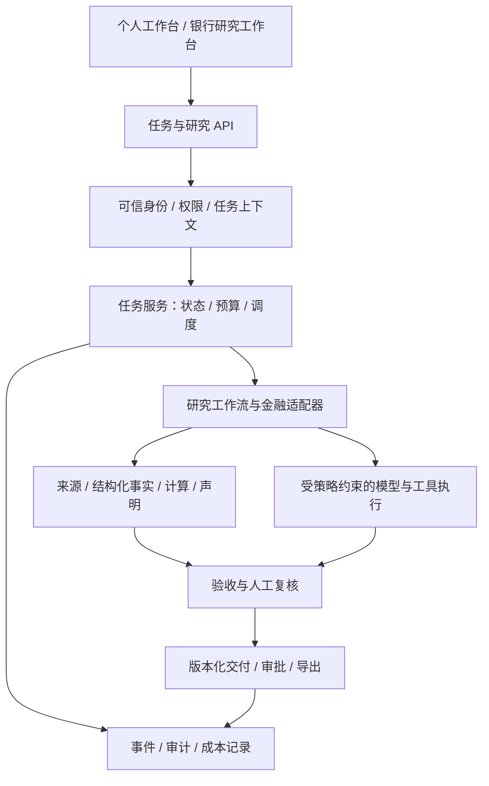

# 织光长期代码规划：个体工作者与银行

日期：2026-09-15。代码基线：`c600943`。用户已确认同时服务个体工作者和银行，银行首发为**投研与对公客户研究**。本文件是架构决策与实施计划，不代表列出的能力已经完成；具体修复证据见《架构监督记录》。本次 Codex 只修改规划文档，未部署或推送。规划结束时确认 DeepSeek 已按用户 09:09 的“继续”恢复工作；正在修改的前端批次尚未纳入本计划验收基线。

## 1. 产品决策

织光的核心交付是：把资料和数据变成**有来源、可复核、可修改的研究报告与客户分析包**。个体版提高一人的产出效率；银行版让多人在权限、审批和审计约束下完成同一条研究链。

| 维度 | 个体工作者 | 银行投研与对公客户研究 |
|---|---|---|
| 首批任务 | 单公司研究、同业比较、行业简报；随后扩展资料整理与咨询交付 | 客户经营分析、同业比较、行业跟踪、客户拜访准备 |
| 用户路径 | 选模板/上传资料 → 确认时间与费用上限 → 获取可编辑成果 | 选择获授权资料 → 形成研究草稿 → 研究员复核 → 按行内流程审批和导出 |
| 成果 | 报告、数据表、图表、来源清单、任务费用 | 相同成果 + 资料权限、版本、审核意见、审批与导出记录 |
| 首要价值 | 减少找资料、整理和反复修改的时间 | 减少重复研究，同时能解释数据、结论和人工判断来自哪里 |
| 部署 | 本机优先；低并发、按需启动、简明中文配置 | 优先一行一实例，行内网络与模型网关、统一身份和运维体系 |

两种部署共享核心代码和金融领域模块，不维护两套长期分叉。差异集中在部署配置、身份接入、存储适配和策略配置；安全检查由后端执行，不能靠隐藏菜单实现。

个体用户的行业尚未完全细分，先以研究员、分析师及有资料分析需求的独立顾问为试用对象。通用文档能力可以复用，但首期不同时追求游戏、模型训练、自动交易等所有场景。银行研究结果先作为人工工作的辅助材料，自动授信、交易和对外客户推送另立需求及审批边界。

## 2. 基于当前代码的起点

| 当前能力/证据 | 长期处理 |
|---|---|
| React/Zustand 工作台、集中 DAG 编排、专业 Worker、结构化金融适配、报告和验收链已存在 | 保留纵向工作流；先打通契约，再拆模块 |
| 沙箱 d6505ef 的故障拒绝与 Worker 路径已通过 24 项定向测试；真实容器对抗隔离待验证 | 保留默认拒绝宿主回退；独立执行设施进入银行验收 |
| c600943 后端统计通过 7 项定向测试；演示接口遗漏、403 假成功提示和指标刷新失败仍待补修 | 作为当前发布阻断项收尾，不把 UI 文案当真实行为 |
| `task_state.py`、`db_paths.py`、部署清单和 CI 已有修复与扩充 | 按当前 SHA 验收，不沿用早期报告中“尚未接 CI”等过期结论 |
| `llm_client.py`、`ws_helpers.py`、Worker 的根任务身份和预算贯通仍有已记录缺口 | 建立统一调用上下文、模型请求入口及跨进程预算账本 |
| `acceptance_checker.py` 数字匹配不能充分绑定主体、期间与指标 | 升级为事实记录及声明引用，区分数值覆盖和事实正确性 |
| `kb_access_control.py` 用 CSV/文本标记过滤；缺身份或无标记内容可放行 | 银行部署改为可信身份、结构化权限元数据、默认拒绝；个人版也保留空间边界 |
| `audit_logger.py` 为本地 JSONL，写失败被忽略 | 增加可持久确认的审计事件；导出、授权变更等关键动作不可无痕成功 |

不能根据历史优化表的“已完成”勾选判断银行成熟度。统一使用“已实现、定向测试通过、集成验证通过、试点验收通过”四种证据状态。

## 3. 目标代码结构及迁移方式

目标仍是**模块化应用 + 独立 Worker/执行进程**。先保持一个仓库与一套版本，按边界提取模块。只有独立扩容、发布隔离或行方部署要求得到证明时，才拆成独立服务。

以下目录是目标位置，**本轮不创建空壳或批量搬文件**：

| 目标模块 | 从现有代码逐步提取 | 稳定职责 |
|---|---|---|
| `weavemind/contracts/` | `common.py`、`step_envelope.py`、`tool_contracts.py`、前端 types | 任务上下文、派发消息、事实和交付契约及版本 |
| `weavemind/tasks/` | `task_state.py`、`checkpointer.py`、`orchestrator_v2.py` | 任务接收、状态机、调度、重试、恢复、预算 |
| `weavemind/research/` | `finance_plugin.py`、`adapters/`、`structured_pipeline/` | 研究模板、主体解析、资料获取、财务口径 |
| `weavemind/evidence/` | `acceptance_checker.py`、`clean_data.py`、`chart_assembly.py` | 来源、事实、声明、计算关系与版本 |
| `weavemind/execution/` | `llm_client.py`、`worker_base.py`、`async_worker_base.py`、`code_sandbox.py` | 模型网关、工具策略、隔离执行、费用结算 |
| `weavemind/governance/` | `security.py`、`kb_access_control.py`、`audit_logger.py` | 身份、访问策略、审批、审计、保留与删除规则 |
| `weavemind/delivery/` | 报告/打包 Worker、`report_pdf.py`、`validators/` | 可编辑报告、附件清单、交付质量、人工复核版本 |
| `weavemind/storage/`、`migrations/` | `db_paths.py`、`data_paths.py`、各处 SQL/文件访问 | Repository、数据库迁移、对象存储和事务边界 |
| `weavemind/api/`、`frontend/src/features/` | `web_ui.py`、现有页面和 store | 薄路由、结构化错误、API 契约、任务/研究/治理页面 |

每次先提取一个被真实调用的服务与接口，旧模块暂作兼容转发；消费者迁移完成、回归通过后才移除旧入口。禁止同时保留两套写者、预算检查或鉴权逻辑。API 框架迁移可在路由边界清晰后单独评估，不与本轮安全修复混做。

## 4. 六个必须先稳定的契约

### 4.1 身份与任务上下文

`TaskExecutionContext` 至少包含 `schema_version, tenant_id, workspace_id, actor_id, root_task_id, step_id, dispatch_id, trace_id, deadline, budget_ref, policy_version`。数据分级与可执行能力引用已校验的策略。

`tenant_id` 表示客户/机构边界，`workspace_id` 表示个人或部门空间，不能把现有 `project` 字符串直接升级为租户权限。身份从服务端会话/SSO 生成，拒绝相信请求体里自报的角色或租户。个人本地模式由服务端创建明确的本地身份，也不采用“空身份拥有所有权限”。

跨进程通过版本化消息传递；跨线程复制上下文并校验显式字段。旧消息通过兼容解析器过渡；银行部署缺少必要身份字段应拒绝。根任务预算汇总所有派发、重试、重规划、评审及辅助模型调用。

### 4.2 任务状态与可靠执行

数据库是任务接收和终态的事实来源，Redis 用于队列、通知与缓存。任务创建与 outbox 事件同事务提交后才确认接收；提交请求携带幂等键，重复请求返回同一结果。

将当前易丢失的派发路径逐步迁为带确认的消费协议，优先评估现有 Redis 的 Streams consumer group，补租约、超时回收、重试上限、死信、取消和陈旧执行者隔离。采用“至少一次投递 + 幂等副作用”，不宣称消息中间件自动提供恰好一次业务执行。外部非幂等操作若超时且结果未知，应进入人工确认状态，不能盲目重试。Streams 的 pending/ack/claim 能力见 [Redis 官方文档](https://redis.io/docs/latest/develop/data-types/streams/)。

检查点引用已持久化的产物和版本。过期 lease 的 Worker 不能覆盖新尝试的结果；取消后到达的旧结果不能把任务改回成功。Pub/Sub 可保留作 UI 通知，断线后按事件序号补读。

### 4.3 成本、时限与模型入口

所有真实模型请求，包括直接 `LLMClient.call`、流式/异步、失败重试、备用供应商、Embedding、记忆摘要与评测，必须经过同一入口。请求前原子预留上限，请求后按实际用量结算；无用量回执保留保守预留并对账，不直接记零。

预算记录包括根任务、步骤、供应商、模型版本、价格版本、预留额、实际用量及请求结果。银行配额存储不可用时停止新增付费调用；个人版提示原因和剩余能力。超时/取消不代表供应商必然停止计费，需记录结果未知并禁止无限重试。新增模型以业务回归、费用和数据路由验证通过为准，不绑定单一厂商或未经验证的“最强模型”。

### 4.4 来源、事实与结论

建议建立 `SourceDocument → Fact → Calculation → Claim → ReportRevision`：

- `SourceDocument`：来源 URL/文件、内容 hash、发布时间、抓取时间、页码/表格定位、数据许可、访问范围、保留规则。受许可限制的来源保存获准的引用或证据指针，不一律复制全文。
- `Fact`：稳定主体 ID、指标、期间起止/时点、财年、单季或累计、币种、单位/缩放、合并或母公司等口径、Decimal 数值、来源定位、提取器版本、修订关系。期间、发布时间、系统获知时间分开，支持“截至某日可知”的研究。
- `Calculation`：输入事实 ID、公式与版本、转换规则；汇率、增长率与比率可重算，不让模型静默换单位或补缺失值。
- `Claim`：报告声明及事实/计算引用；区分已核验事实、推导、预测假设和研究判断。矛盾来源并列呈现，缺证据不自动补齐。
- `ReportRevision`：引用快照、生成模型/提示词/规则版本、编辑者、复核意见、审批版本与产物 hash。编辑后重新验收，旧审批不能自动覆盖新内容。

首期先支持财报、同业比较、客户研究三个固定结构，再扩展其他文档。美股已有 `adapters/sec_edgar.py`，先修复真实路由、财年/XBRL 口径及引用链，不重复创建另一套适配器。

### 4.5 权限、模型路由与工具边界

访问检查覆盖任务、历史、报告下载、分享链接、向量检索、缓存、日志、导出和后台 Worker；检索前过滤权限，检索后校验结果，不能只在生成文本末尾删敏感词。权限撤销应使旧缓存和下载访问失效。

模型、Embedding、OCR、搜索和外部工具都要按数据分类决定目的地。银行受限数据不因供应商故障自动流向公网备用服务。文档和工具返回中的指令属于不可信输入，不能取得新的权限。工具声明输入/输出类型、读取/写入/付费/外发副作用、允许目的地、超时与幂等能力，由后端调用层执行策略。

演示守卫是体验防护，不是授权边界。不得依赖 HTTP GET 就认定无费用；当前记忆摘要即为反例。生成代码与不可信文档解析采用独立执行环境、最小挂载、网络白名单和资源限额；缺设施时明确停用相应能力。个人核心工作台仍可无 Docker 启动。

### 4.6 审计、审批与交付

区分调试日志与审计事件。关键动作的待执行记录和状态变更可靠落库；外部审计接收端故障可用受控本地缓冲，但缓冲不可持久化时应阻断规定的关键操作，不能静默成功。事件包含操作者、授权依据、对象版本、动作、结果、时间、关联任务和策略版本；敏感正文和密钥不写入普通日志。

银行交付采用“草稿 → 复核 → 批准 → 导出/撤回”，配置双人复核及职责分离；批准绑定报告版本与 hash，导出时重新检查权限。采用独立受控审计存储/归档与防篡改核验，单纯本地 JSONL 或 hash 链不等于不可篡改。

交付模板应明确标识 AI 参与生成、所用资料时点、尚未核验的内容与人工复核状态；银行内部使用也应保留这些元数据。源文件、派生事实、向量、缓存和备份的留存/删除规则一并管理；归档或法定留存例外由行方策略明确，不能让“删除记忆”只删前端列表。

## 5. 两种部署配置与数据演进

| 能力 | 个人配置 | 银行配置 |
|---|---|---|
| 身份与空间 | 本地账户和个人空间，初期仍支持受信任小团队 | 接入行方身份系统，部门/项目/文档权限，服务身份与职责分离 |
| 事务存储 | SQLite，通过同一 Repository 接口 | PostgreSQL 等行方认可关系库；首个适配器优先 PostgreSQL |
| 队列与进程 | 复用 Redis，核心进程精简、Worker 按需启动，安装源有明确状态和替代指引 | 有确认与恢复机制的托管队列/Redis，独立执行节点，统一监控 |
| 文件与检索 | 本地文件与现有向量检索实现，显式授权目录 | 行方认可的对象存储/检索服务，数据分区与权限过滤、加密和密钥托管 |
| 模型 | 用户可配置模型；明确每一步数据是否外发与费用上限 | 行方模型网关/获准供应商；按分类限制路由，故障不突破出域策略 |
| 部署升级 | 中文诊断、一键启动、备份/恢复、锁定依赖；训练组件不默认安装 | 离线依赖/镜像包、SBOM、配置校验、签名制品、灰度升级和恢复演练 |

初期一行一实例，降低跨银行共享基础设施的隔离风险，但行内部权限仍必须落实。暂不以公共多租户 SaaS 作为银行第一交付形态。以后若扩展托管个人服务，应先完成同等级租户隔离验证。

数据库迁移采用“新增可兼容字段/表 → 回填与核对 → 切换唯一写入入口 → 观察 → 移除旧结构”。旧版回滚必须与新 schema 兼容；破坏性迁移前验证备份恢复，不能只保留一条向下迁移脚本。SQLite/PostgreSQL 共用契约测试；权限隔离可叠加 PostgreSQL RLS，但应用账户不能具有绕过策略的权限，具体限制见 [PostgreSQL 官方文档](https://www.postgresql.org/docs/17/ddl-rowsecurity.html)。

## 6. 长期里程碑

时间为规划窗口，不是交付承诺。按当前一个主执行者、架构师验收安排；银行试点另需行方业务、信息安全和运维人员参与。前一关未通过则顺延，不以日期替代验收。

| 窗口 | 交付里程碑 | 代码重点 | 进入下一阶段的关卡 |
|---|---|---|---|
| 0–2 周 | 当前版本可信收尾 | 演示/403/指标失效补修、门禁流程、当前 CI 与部署证据 | 已知阻断缺陷关闭；两种失败状态可复现；本地与 CI 结论绑定 SHA |
| 3–6 周 | 可控任务底座 | TaskExecutionContext、统一模型入口、预算预留/结算、幂等接收、空间身份 | 并发、线程/进程、重试与备用路径均归属根任务；无身份与越预算调用被拒绝 |
| 7–12 周 | 个人研究版封闭试用 | 事实/声明引用、三个研究模板、可编辑交付、按需启动和费用预览 | 完成冻结样本与用户实测；重大事实错误可阻断；能量化返工时间和每份合格交付成本 |
| 第 4–6 月 | 银行受控 PoC | SSO/授权、审计审批、行内模型路由、关系库/对象存储适配、可靠恢复 | 先公开/合成资料；通过权限和出域检查后，才接入获批的真实内部数据 |
| 第 7–12 月 | 银行生产候选版及个人稳定版 | 灾备、升级回滚、观测告警、容量验证、供应链制品、银行验收包 | 行方确认数据、模型、交付和运维边界，完成恢复演练及业务验收后再定生产 SLA |

投研模板、事实链和交付体验服务两端；SSO、审计归档等通过可替换适配器交付。建议每轮约六成精力用于共享可靠性/证据链，三成用于经用户验证的交付体验，一成用于必要探索；出现安全或事实正确性缺陷时优先清偿。

## 7. 给 DeepSeek 的可执行工作包

实施时每个工作包再拆成能独立验收的小提交。恢复编码后先完成 L00，不同时展开后续多个大包。

| 编号/顺序 | 首批改动位置 | 交付与定向验收 |
|---|---|---|
| L00 当前补修 | `frontend/src/lib/demoGuard.ts`、Memory/Agents/MetricsPage、门禁处理记录 | 覆盖 kill-worker、冷/热记忆摘要、URL 退出演示、403 无假成功、指标成功→失败→恢复；只用 mock，不调用真实删除或付费服务 |
| L01 统一上下文 | `llm_client.py`、`ws_helpers.py`、两种 Worker、编排消息 | 先增 TaskExecutionContext 与兼容解码；根任务/步骤/派发三层身份跨线程进程不丢失；缺身份策略显式 |
| L02 模型入口与预算 | `llm_client.py`、`costs.py`、直接调用点 | 所有出站模型调用统一校验；原子预留/结算、防双扣、超时对账、供应商回退不越数据策略 |
| L03 事实链首片 | `adapters/`、`structured_pipeline/`、验收器、报告 Worker | 单公司财报的收入/净利润/经营现金流贯穿来源→事实→报告；错期、错指标、币种/累计混淆及修订反例必须失败 |
| L04 持久任务与恢复 | `task_state.py`、`common.py`、`checkpointer.py`、编排/Worker | outbox、幂等、确认、lease；注入提交后断线、Worker 崩溃、迟到结果、取消竞争，验证不丢任务和不重复副作用 |
| L05 权限纵向切片 | `security.py`、`kb_access_control.py`、`web_ui.py`、`workspace.py`、记忆检索 | 先打通“登录→提交→检索→报告下载”；换任务 ID、分享链接、撤权后缓存都不能越权；银行 PoC 的前置项 |
| L06 人工复核交付 | 报告/打包 Worker、`report_pdf.py`、前端报告页 | 来源定位、可编辑文档、修改后重验、审批绑定版本、交付包编码与附件验证；两端共用 |
| L07 银行部署适配 | Repository、迁移、身份/模型/对象存储/审计适配器 | 同一业务测试跑两种存储；默认无公网出域；备份恢复后任务、引用与审批关系完整 |

L03 完成后再扩大财务指标及市场覆盖；L05 是任何银行内部资料接入的前置关卡，不等到“银行版本”最后才补。用户研究和用公开样本的银行需求验证可与底座开发并行。

## 8. 验收、回归与工作纪律

建立一个冻结的最小研究评测集：建议先 30 个公开资料任务及 30 个合成银行任务，覆盖财报分析、同口径比较、客户研究；数量是首批建设目标。与提示词/模板调优样本分开，由业务人员确认答案和可接受缺口，不能只依赖模型自评。

| 验收层 | 必须观察的结果 |
|---|---|
| 安全与隔离 | 固定对抗集中越权访问、被禁外发、缺设施宿主回退均为 0；通过只说明已测范围，不等于证明不存在漏洞 |
| 财务事实 | 固定严重错期/错主体/错指标反例全部拦截；关键数字可追到获准证据；未知与冲突明确展示 |
| 预算与恢复 | 并发预留不突破配置额度；失联请求保守记账；重投、进程退出与取消竞争不产生重复交付或副作用 |
| 产品价值 | 首次人工接受率、需要人工改的关键字段数、节省时间、每份合格交付的费用及 P50/P95 耗时 |
| 运维 | 干净环境安装、数据库升级/兼容回滚、备份恢复、无外网模式、审计接收端故障均有可复查证据 |

成功率分母包含哪些终态、是否排除用户取消必须展示并固定；不得用缩小样本、隐藏缺口或减少安全检查提高指标。性能、正确率与 SLA 数值在首轮基准和银行容量要求明确后确定，本计划不虚构已达到的水平。

PR 运行改动相关测试；核心契约变化扩大到调用链和两种配置。网络/真实模型/容器对抗测试独立分组，发布候选再做完整集成与业务验收。前端需把已发现的状态转换和演示副作用测试入库，不能只通过 TypeScript 构建就称行为正确。

继续由 DeepSeek 实现，Codex 审查与决策。每批汇报问题、提交、真实退出码、未验证范围和阻塞，正文约 20 行；相同失败路径两次后换诊断方向。按任务限制读取范围与模型使用，保留上下文摘要，避免每轮重读全仓和重复全量测试。门禁误报记录证据并走正常复核，不能靠停用门禁获得“全绿”。

## 9. 投入建议与立项边界

1. **先验证三种交付是否有人持续使用。** 邀请少量个体研究用户和一家银行的研究团队共创，观察真实返工与复用行为；暂不根据历史商业文档推定价格、转化率或银行采购周期。
2. **优先购买/接入获授权的数据，而不是不断换搜索源。** 数据提供方权限、时效和引用许可进入适配器契约；免费接口用于验证，不默认等于银行生产可用的数据授权。
3. **把金融口径和评测当作长期资产。** 模型可替换，正确的事实模型、计算公式、版本化研究模板及人工标注样本会持续复用。
4. **银行试点需要业务与运维共同参与。** 代码完成不能代替行方数据授权、模型准入、供应商评审、制度和操作责任确认。
5. **暂缓独立研发训练平台、全量微服务化和通用无人自治。** LoRA/进化机制保留为实验功能；拿到稳定评测和真实成本证据后再决定是否投入，银行默认不自动发布新提示词或模型版本。

## 10. 外部依据与适用范围

核查时间：2026-09-15。以下是与本方案直接相关的官方依据及工程映射，不是穷尽性法律清单；具体适用范围、数据等级和验收要求由合作银行确认。

| 官方依据 | 与本项目有关的要求 | 本计划的工程响应 |
|---|---|---|
| [《银行保险机构数据安全管理办法》，金规〔2024〕24号](https://app.www.gov.cn/govdata/gov/202412/29/523120/article.html) | 分类分级、业务必要授权、访问审计、委托处理与供应商管理 | 结构化权限、数据目的地策略、审计与受控供应商接口；不把私有部署直接等同安全达标 |
| [《银行业保险业人工智能安全开发应用的指导意见》，金发〔2026〕8号，商务部官方转载](https://policy.mofcom.gov.cn/claw/clawContent.shtml?id=106182) | 2026-06 发布；要求人机职责、系统/数据权限和模型准入。外部引入的生成式模型还涉及网信备案要求 | 银行先人工复核的研究流程；获准模型清单、版本与变更评测、供应商准入材料。实际采购与配置前核查模型备案及适用条件 |
| [《个人信息保护法》](https://www.cac.gov.cn/2021-08/20/c_1631050028355286.htm) | 处理自然人信息时需明确目的、合法依据、最小必要等；还涉及保留期限、委托处理和特定活动的影响评估 | 客户资料导入清单、用途/授权记录、受限字段、留存删除及委托处理接口；个体职业使用不自动视作纯个人事务 |

共享核心、数据库选型、原子预算和文件结构属于本项目的工程决策，并非上述规则指定的技术产品。银行投产还需要制度、人员职责和独立验收证据。Redis 与 PostgreSQL 技术依据已在相关段落直接引用。
